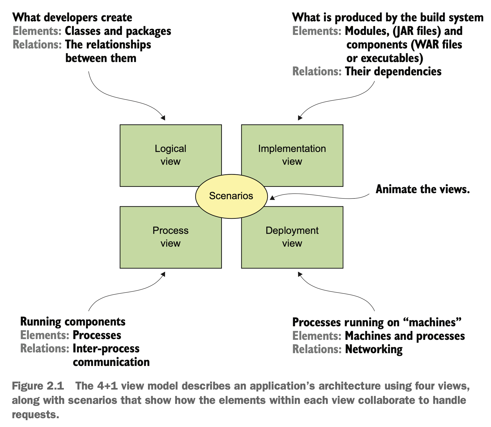
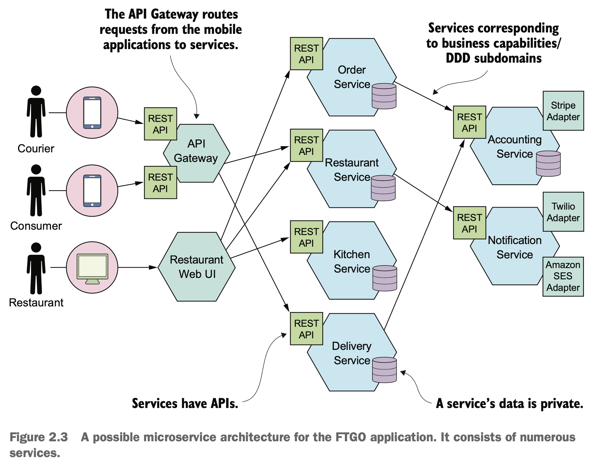
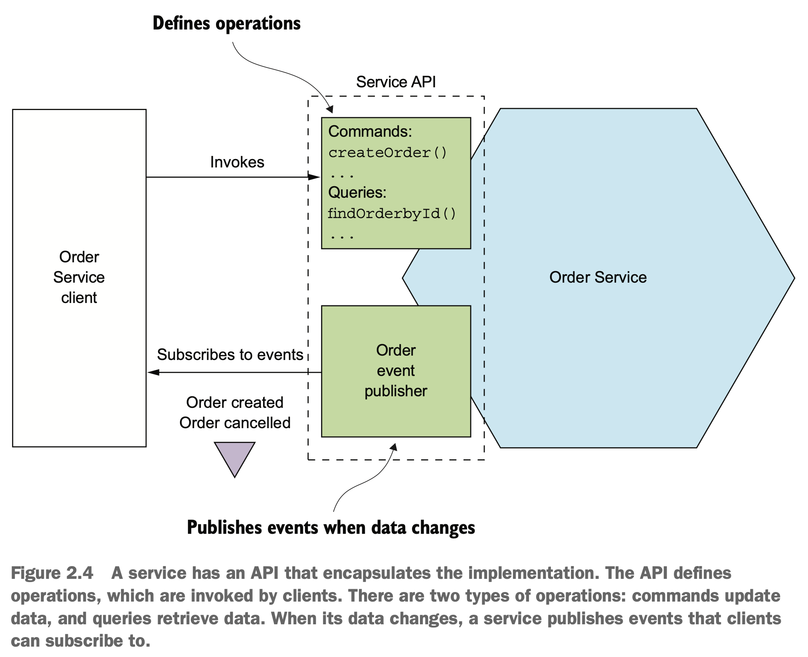

# 2장 분해 전략

## 이 장에서 다룰 핵심 내용

- 소프트웨어 아키텍처의 정의와 중요성
- 분해 패턴을 적용하여 비즈니스 능력 및 하위 도메인별로 애플리케이션을 서비스로 분해
- DDD의 경계 컨텍스트 개념을 활용하여 복잡하게 얽힌 데이터를 분해하기 더 쉽게 풀기

## 2.1 마이크로서비스 아키텍처란 무엇인가?

- 관리성, 테스트성, 배포성이 높은 애플리케이션을 구축하는 아키텍처 스타일

### 2.1.1 소프트웨어 아키텍처의 정의와 중요성

#### 소프트웨어 아키텍처의 정의

> 소프트웨어 엘리먼트와 그들 간의 관계, 그리고 이 둘의 속성으로 구성된 시스템을 추론하는 데 필요한 구조의 집합 <small>- 소프트웨어 아키텍처 문서화, 바스 등 </small>

- 여러 파트(엘리먼트)로의 분해와 이런 파트 간의 관계(연관성)
- 분해가 중요한 이유
  - 업무와 지식의 분리, 여러 팀이 함께 생산적으로 작업 가능
  - 소프트웨어 엘리먼트가 어떻게 상호 작용하는지 알 수 있음

#### 소프트웨어 아키텍처의 4+1 뷰 모델

- 논리 뷰
  - 개발자가 작성한 소프트웨어 엘리먼트
  - 상속, 연관, 의존 등 클래스와 패키지의 관계
- 구현 뷰
  - 빌드 시스템의 결과물
  - 모듈과 컴포넌트로 구성
  - 모듈 간 디펜던시와 컴포넌트/모듈 간 조합 관계
- 프로세스 뷰
  - 런타임 컴포넌트
  - 각 엘리먼트는 개별 프로세스, IPC는 프로세스 관계
- 배포 뷰
  - 프로세스가 머신에 매핑되는 방법
  - 엘리먼트는 머신 및 프로세스, 머신 간의 관계가 네트워킹
  - 프로세스와 머신 사이의 관계

- 시나리오
  - 특정 뷰 내에서 얼마나 다양한 아키텍처 요소가 협동하여 요청을 처리하는지 기술

#### 아키텍처의 중요성

- 애플리케이션 요건
  - 기능 요건
    - 애플리케이션이 해야 할 일을 정의
    - 아키텍처와는 거의 무관
  - 서비스 품질 요건
    - 아키텍처는 이 요건을 충족시킬 수 있게 설계해야 하므로 아주 중요
    - 확장성, 신뢰성 같은 런타임 품질 외에도 관리성, 테스트성, 배포성처럼 개발 시점의 품질도 해당

### 2.1.2 아키텍처 스타일 개요

> 아키텍처 스타일은 체계적인 조직의 관점에서 시스템 군을 정의한다. 좀 더 구체적으로 말하면, 아키텍처 스타일은 그 사트일로 만든 인스턴스에서 사용 가능한 컴포넌트와 커넥터의 보케블러리, 그리고 이들을 조합할 수 있는 제약 조건을 결정한다. <small>- 소프트웨어 아키텍처 개론 </small>

- 마이크로서비스 아키텍처는 애플리케이션을 느슨하게 결합된 여러 서비스로 구성하는 아키텍처 스타일

#### 계층화 아키텍처 스타일

- 3계층 아키텍처
  - 표현(프레젠테이션) 계층
    - 사용자 인터페이스 또는 외부 API가 구현된 계층
  - 비즈니스 로직 계층
    - 비즈니스 로직이 구현된 계층
  - 영속화(퍼시스턴스) 계층
    - DB 상호 작용 로직이 구현된 계층
- 계층화 아키텍처의 흠
  - 표현 계층이 하나뿐이다
  - 영속화 계층이 하나뿐이다
  - 비즈니스 로직 계층을 영속화 계층에 의존하는 형태로 정의한다

#### 육각형 아키텍처 스타일

- 계층화 아키텍처 스타일의 대안
- 인바운드 어댑터
  - 표현 계층 대신 비즈니스 로직을 호출하여 외부에서 들어온 요청을 처리
- 아웃바운드 어댑터
  - 영속화 계층 대신 비즈니스 로직에 의해 호출되고 외부 애플리케이션을 호출
- 포트
  - 비즈니스 로직이 자신의 외부 세계와 상호 작용하는 방법이 정의된 작업

- 비즈니스 로직이 표현/데이터 접근 로직에 의존하지 않음

### 2.1.3 마이크로서비스 아키텍처는 일종의 아키텍처 스타일이다

- 모놀리식 아키텍처
  - 애플리케이션을 실행/배포 가능한 단일 컴포넌트로 구성
- 마이크로서비스 아키텍처
  - 애플리케이션을 느슨하게 결합된, 독립적으로 배포 가능한 여러 서비스로 구성

#### 서비스란 무엇인가?

- 어떤 기능이 구현되어 단독 배포가 가능한 소프트웨어 컴포넌트
- 클라이언트가 자신이 서비스하는 기능에 접근할 수 있도록 커맨드, 쿼리, 이벤트로 구성된 API 제공
- 서비스 API는 내부 구현 상세를 캡슐화 함

#### 느슨한 결합

- 느슨하게 결합된 서비스
  - 유지보수성, 테스트성을 높이고 개발 시간을 단축
  - 서비스를 이해하고, 변경하고, 테스트하기 용이
- 영속적 데이터는 반드시 프라이빗으로 유지
  - DB 스키마 변경 시 다른 서비스 개발자와 조율할 필요 없음
  - 테이블을 서로 공유하지 않기 때문에 런타임 격리 향상

#### 공유 라이브러리의 역할

- 의도치 않은 서비스 간 결합도를 유발하지 않도록 조심해야 함
- 바뀔 일이 거의 없는 기능은 라이브러리화

#### 서비스 규모는 별로 중요하지 않다

- 크기보다는 작은 팀이 가장 짧은 시간에, 다른 팀과 협동하는 부분은 최소로 하여 개발 가능한 서비스를 설계해야 함
- 유지보수성, 테스트성, 배포성 등 개발 단계의 품질 속성 개선
- 소프트웨어를 더 빨리 개발할 수 있고, 확장성도 향상

## 2.2 마이크로서비스 아키텍처 정의

- 3단계 프로세스
  - 애플리케이션 요건을 핵심 요청으로 추출
  - 어떻게 여러 서비스로 분해할지 결정
  - 서비스별 API 정의
- 분해 과정의 장애물
  - 네트워크 지연
  - 서비스 간 동기 통신으로 인한 가용성 저하
  - 여러 서비스에 걸친 데이터 일관성 유지
  - 애플리케이션에 숨어 있는 만능 클래스

### 2.2.1 시스템 작업 식별

- 사용자 스토리와 이와 연관된 사용자 시나리오 등의 애플리케이션 요건이 시작점
- 2단계 프로세스 시스템 작업 정의
  - 시스템 작업을 기술하기 위해 필요한 보케블러리를 제공하는 핵심 클래스로 구성된 고수준의 도메인 모델 생성
  - 시스템 작업 식별 후 그 동작을 도메인 모델 관점에서 기술

#### 고수준 도메인 모델 생성

- 스토리에 포함된 명사를 분석하고 도메인 전문가와 상담하는 등 표준 기법을 활용하여 생성

주문하기 스토리
> **전제(Given)**
>  소비자가 있다.
>  음식점이 있다.
>  음식점은 소비자의 주소로 제시간에 음식을 배달할 수 있다.
>  주문 총액이 음식점의 최소 주문량 조건에 부합한다.
>   **조건(When)**
>  소비자가 음식점에 음식을 주문한다.
>   **결과(Then)**
>  소비자 신용카드가 승인된다.
>  주문이 PENDING_ACCEPTANCE 상태로 생성된다.
>  생성된 주문이 소비자와 연관된다.
>  생성된 주문이 음식점과 연관된다.

주문 접수 스토리
> **전제(Given)**
>  현재 주문은 PENDING_ACCEPTANCE 상태다.
>  주문 배달 가능한 배달원이 있다.
>   **조건(When)**
>  주문을 접수한 음식점은 언제까지 음식을 준비할 수 있다고 약속한다.
>   **결과(Then)**
>  주문 상태가 ACCEPTED로 변경된다.
>  주문의 promiseByTime 값을 음식점이 준비하기로 약속한 시간으로 업데이트한다.
>  주문을 배달할 배달원을 배정한다.

- Consumer: 소비자
- Order: 소비자가 한 주문, 어떤 주문인지 나타내며 상태 추적
- OrderLineItem: Order의 품목
- DeliveryInfo: 주문을 배달할 시간/장소
- Restaurant: 배달할 주문을 준비하는 음식점
- MenuItem: 음식점의 메뉴 항목
- Courier: 주문을 배달하는 배달원, 배달원의 가용성 및 현재 위치 추적
- Address: 소비자 또는 음식점의 주소
- Location: 배달원의 위치(위도/경도)

#### 시스템 작업 정의

- 어떤 요청을 처리할지 식별하는 단계
- 시스템 작업
  - 커맨드: 데이터 생성, 수정 삭제(CUD)
    - 사용자 스토리/시나리오에 포함된 동사 분석
    - 매개변수, 반환값, 동작 방식의 명세를 도메인 모델 클래스로 정의
    - 선행 조건(시나리오의 전제), 후행 조건(시나리오의 결과)으로 구성
  - 쿼리: 데이터 읽기(R)

### 2.2.2 서비스 정의: 비즈니스 능력 패턴별 분해

- 비즈니스 능력에 따라 서비스 정의

#### 비즈니스 능력은 곧 조직이 하는 일이다

- 비즈니스 능력을 보면 그 조직의 비즈니스가 무엇인지 알 수 있다

#### 비즈니스 능력 식별

- 조직의 목표, 구조, 비즈니스 프로세스를 분석하여 식별
- 입력, 출력, SLA 등 다양한 컴포넌트로 구성
- 비즈니스 객체에 집중하며, 여러 개의 하위 능력으로 분해할 수 있음

#### 비즈니스 능력을 여러 서비스로

- 서비스를 거의 변하지 않는 비즈니스 능력에 따라 구성하면 비교적 안정적인 아키텍처 구축 가능

### 2.2.3 서비스 정의: 하위 도메인 패턴별 분해

- DDD 하위 도메인별로 서비스 정의
- DDD는 도메인을 구성하는 각 하위 도메인마다 도메인 모델을 따로 정의
- 경계 컨텍스트
  - 도메인 모델의 범위, 각 서비스
  - 도메인 모델을 구현한 코드 아티팩트 포함

### 2.2.4 분해 지침

#### 단일 책임 원칙

- 각 소프트웨어 엘리먼트의 책임을 할당

> 클래스는 오직 하나의 변경 사유를 가져야 한다. <small>- 로버트 C. 마틴</small>

- SRP에 따라 단일 책임을 가진, 즉 변경 사유가 오직 하나인 클래스를 정의

#### 공동 폐쇄 원칙

> 패키지의 클래스들은 동일한 유형의 변경에 대해 닫혀 있어야 한다. 패키지에 영향을 주는 변경은 그 패키지에 속한 모든 클래스에 영향을 끼친다. <small>- 로버트 C. 마틴</small>

- CCP를 적용해서 동일한 사유로 변경되는 컴포넌트를 같은 서비스로 묶을 수 있음
- 가능하면 변경 영향도를 한 팀, 한 서비스에 국한시키는 것이 좋음

### 2.2.5 서비스 분해의 장애물

#### 네트워크 지연

- 서비스 간 왕복 횟수 급증으로 인한 문제
- 배치 API를 구현하거나, 값비싼 IPC를 언어 수준의 메서드나 함수 호출로 대체하는 등으로 지연 시간을 줄임

#### 동기 IPC로 인한 가용성 저하

- 비동기 메시징으로 강한 결합도를 제거하고 가용성을 높이는 방법이 좋음

#### 여러 서비스에 걸쳐 데이터 일관성 유지

- 사가 방식으로 트랜잭션 관리
  - 메시징을 이용한 일련의 로컬 트랜잭션

#### 일관된 데이터 뷰 확보

- 각 서비스의 DB가 일관적이라 해도 전역 범위에서 일관된 데이터 뷰는 확보할 수 없음

#### 만능 클래스는 분해의 걸림돌

- 만능 클래스는 애플리케이션의 여러 측면의 상태/동작을 보이지 않게 감싸고 있기 때문에 서비스로 분리하기 어려움

- DDD를 적용하여 각 서비스를 자체 도메인 모델을 갖고 있는 개별 하위 도메인으로 취급

### 2.2.6 서비스 API 정의

- 각각의 시스템 작업을 서비스로 매핑한 후, 어느 서비스가 서로 협동해야 할 지 파악

#### 시스템 작업을 서비스로 배정

- 대부분 시스템 작업은 서비스로 매핑되나, 간혹 매핑 관계가 분명하지 않을 수 있음
- 어떤 작업이 제공하는 정보가 필요한 서비스에 그 작업을 배정하는 것이 합리적

#### 서비스 간 협동 지원에 필요한 API 확정

- 서비스 API를 온전하게 정의하려면 각 시스템 작업을 면밀히 분석해서 서로 어떻게 협동해야 할지 결정해야 함

## 2.3 마치며

- 아키텍처는 애플리케이션 개발 속도에 직접 영향을 주는 갖가지 '~성'을 좌우
- 마이크로서비스 아키텍처는 애플리케이션의 관리성, 테스트성, 배포성을 높이는 아키텍처 스타일
- 마이크로서비스는 기술적 관심사보다 비즈니스 능력, 하위 도메인 등 비즈니스 관심사 위주로 구성
- 서비스 분해 패턴
  - 비즈니스 능력에 따른 분해: 비즈니스 아키텍처 기반
  - 하위 도메인에 따른 분해: DDD 개념 기반
- DDD를 적용하고 서비스마다 도메인 모델을 따로 설계하면, 만능 클래스를 제거할 수 있음