# 3장 프로세스 간 통신

## 이 장에서 다룰 핵심 내용

- 다양한 통신 패턴 적용: 원격 프로시저 호출, 회로 차단기, 클라이언트 쪽 디스커버리, 자가 등록, 서버 쪽 디스커버리, 서드파티 등록, 비동기 메시징, 트랜잭셔널 아웃박스, 트랜잭션 로그 테일링, 발행기(publisher, 퍼블리셔) 폴링
- 마이크로서비스 아키텍처에서 IPC의 중요성
- API 정의 및 발전
- 여러 가지 IPC와 각각의 트레이드오프
- 비동기 메시징으로 통신하는 서비스의 장점
- 메시지를 DB 트랜잭션에 태워 확실하게 전송

## 3.1 마이크로서비스 아키텍처 IPC 개요

### 3.1.1 상호 작용 스타일

- 상호 작용 스타일의 선택은 전체 애플리케이션의 가용성에 영향을 끼치며, 적합한 통합 테스트 전략을 수립하는 데에도 도움이 됨
- 클라이언트/서비스 상호 작용 스타일을 분류하는 두 가지 기준
  - 일대일/일대다
    - 일대일(one-to-one): 각 클라이언트 요청은 정확히 한 서비스가 처리
    - 일대다(one-to-many): 각 클라이언트 요청을 여러 서비스가 협동하여 처리
  - 동기/비동기
    - 동기(synchronous): 클라이언트는 서비스가 제시간에 응답하리라 기대하고 대기 도중 블로킹 할 수 있음
    - 비동기(asynchronous): 클라이언트가 블로킹하지 않음, 응답은 즉시 전송되지 않아도 됨

|서비스|작업|협동자|
|---|---|---|
|동기|요청/응답|-|
|비동기|비동기 요청/응답</br>단방향 알림|발행/구독</br>발행/비동기 응답|

- 일대일 상호 작용의 종류
  - 요청/응답(request/response)
    - 클라이언트는 서비스에 요청을 하고 응답을 기다림
    - 클라이언트는 응답이 제때 도착하리라 기대하고 대기 도중 블로킹할 수 있음
    - 서비스가 서로 강하게 결합되는 상호 작용 스타일
  - 비동기 요청/응답(asynchronous request/response)
    - 클라이언트는 서비스에 요청을 하고 서비스는 비동기적으로 응답
    - 클라이언트는 대기중 블로킹하지 않고, 서비스는 오랫동안 응답하지 않을 수 있음
  - 단방향 알림(one-way notification)
    - 클라이언트는 서비스에 일방적으로 요청만 하고 서비스는 응답을 보내지 않음
- 일대다 상호 작용의 종류
  - 발행/구독(publish/subscribe): 클라이언트는 알림 메시지를 발행하고, 여기에 관심 있는 0개 이상의 서비스가 메시지 소비
  - 발행/비동기 응답(publish/async response): 클라이언트는 요청 메시지를 발행하고 주어진 시간 동안 관련 서비스가 응답하길 기다림

### 3.1.2 마이크로서비스 API 정의

- 잘 설계된 인터페이스는 기능을 표출하되 구현체는 감추어져 있기 때문에 클라이언트에 영향을 미치지 않고 코드를 고칠 수 있음
- 서비스 API는 서비스와 클라이언트 간 약속
- 서비스 API를 IDL(Interface Definition Language)로 정확하게 정의해야 함
  - Open API
  - RAML
- API 우선 방식으로 서비스를 정의
  - 클라이언트 니즈에 부합한 서비스
  - 작동하는 애플리케이션

> **반드시 API를 먼저 설계하라**

### 3.1.3 API 발전시키기

- 마이크로 서비스 애플리케이션은 클라이언트를 다른 서비스 팀이 개발한 경우가 대부분이기 때문에 서비스 API를 변경하기 어려움

#### 시맨틱 버저닝

- 시맨틱 버저닝 명세(Semvers, Semantic Versioning specification)
  - API 버저닝에 관한 유용한 지침서
  - 원래 소프트웨어 버저닝 용도로 쓰였지만, 분산 시스템의 API 버저닝에도 사용할 수 있음
- 버전 번호 파트
  - MAJOR(메이저): 하위 호환되지 않는 변경분을 API에 적용 시
  - MINOR(마이너): 하위 호환되는 변경분을 API에 적용 시
  - PATCH(패치): 하위 호환되는 오류 수정 시
- REST API의 URL 경로 첫 번째 엘리먼트로 쓴다던지, 메시지에 버전 번호를 넣는 식으로 사용

#### 하위 호환되는 소규모 변경

- 옵션 속성을 요청에 추가
- 속성을 응답에 추가
- 새 작업을 추가성
- **견고성 원칙을 지켜야 함**
  - 요청 속성이 누락되어도 서비스는 기본값을 제공해야 함
  - 서비스가 필요한 것보다 더 많은 속성을 응답하더라도 클라이언트는 무시해야 함

#### 중대한 대규모 변경

- 기존 버전과 호환이 안 되는 변경을 API에 적용할 경우 신구 버전 API를 모두 지원
  - URL에 메이저 버전 번호 삽입하는 방법
  - MIME 타입 내부에 버전 번호를 끼워 넣는 방법

### 3.1.4 메시지 포맷

#### 텍스트 메시지 포맷

- JSON, XML 등 텍스트 기반 포맷
- 메시지 컨슈머는 자신이 관심 있는 값만 골라 쓰고 나머지는 무시하면 되므로 하위 호환성이 쉽게 보장됨
- 메시지가 다소 길다는 단점이 있음

#### 이진 메시지 포맷

- 프로토콜 버퍼, 아브로 등 이진 포맷
- 메시지 구조 정의에 필요한 타입 IDL을 제공하고, 컴파일러는 메시지를 직렬화/역직렬화하는 코드를 생성

## 3.2 동기 RPI 패턴 응용 통신

- 클라이언트가 서비스에 요청을 보내면 서비스가 처리 후 응답을 회신하는 IPC
- RPI의 작동 원리
  - 클라이언트 비즈니스 로직에서 프록시 인터페이스(RPI 프록시 어댑터 클래스로 구현) 호출
  - RPI 프록시가 서비스에 전달한 요청은 RPI 서버 어댑터 클래스가 접수
  - 서비스 인터페이스를 통해 비즈니스 로직 호출
  - RPI 프록시로 응답을 돌려주고 최종 결과는 클라이언트 비즈니스 로직에 반환됨
- 프록시 인터페이스는 하부(underlying) 통신 프로토콜 캡슐화

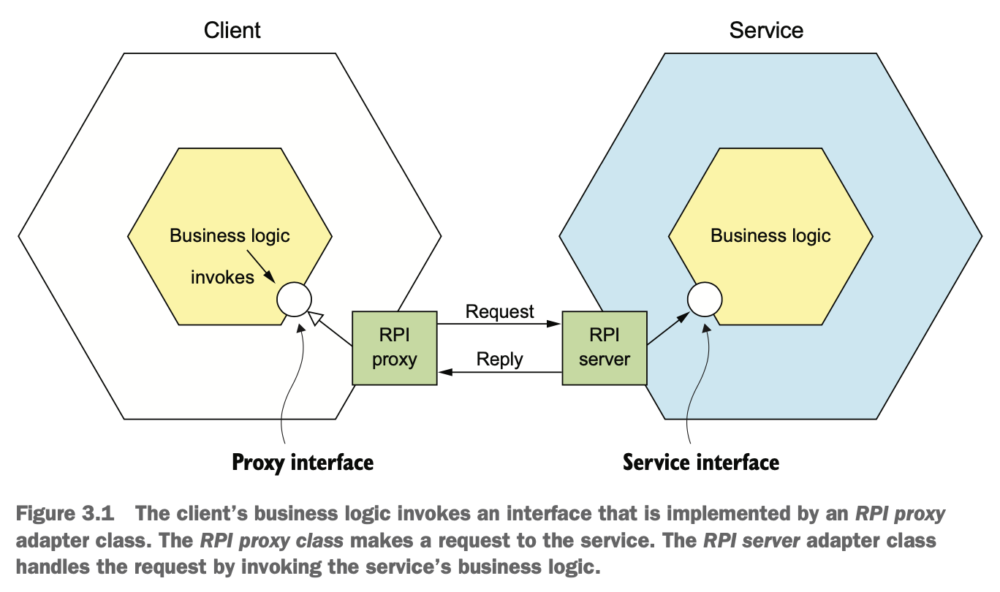

### 3.2.1 동기 RPI 패턴: REST

- HTTP로 소통하는 IPC

> REST는 컴포넌트 상호 작용의 확장성, 인터페이스 일반화, 컴포넌트의 독립적 배포, 상호 작용 지연을 줄이기 위해 중간 컴포넌트, 보안 강화, 레거시 시스템의 캡슐화에 역점을 둔 아키텍처 제약 조건 세트를 제공한다.</br><small>- 로이 필딩</small>

- 리소스는 비즈니스 객체를 의미하며 REST의 핵심 개념
- HTTP 동사를 사용해서 URL로 참조되는 리소스를 가공(조작)

#### REST 성숙도 모델

- 레벨 0
  - 클라이언트는 서비스별로 유일한 URL 끝점에 HTTP POST 요청을 하여 서비스 호출
  - 요청시마다 어떤 액션을 수행할지, 그 대상은 무엇인지 지정
  - 필요한 매개변수를 함께 전달
- 레벌 1
  - 서비스는 리소스 개념을 지원
  - 클라이언트는 수행할 액션과 매개변수가 지정된 POST 요청을 함
- 레벨 2
  - 서비스는 HTTP 동사를 이용해서 액션을 수행
  - 요청 쿼리 매개변수 및 본문, 필요 시 매개변수 지정
  - 서비스는 GET 요청을 캐싱하는 등 웹 인프라 활용 가능
- 레벨 3
  - 서비스를 HATEOAS(Hypertext As The Engine Of Application State) 원칙에 기반하여 설계
  - **HATEOAS**: GET 요청으로 반환된 리소스 표현형에 그 리소스에 대한 액션의 링크도 함께 보냄

#### REST API

- 스웨거(Swagger): REST API를 개발/문서화하는 도구 세트
- 오픈 API 명세(Open API Specification)가 REST IDL로서 보급됨
- 인터페이스 정의를 기반으로 클라이언트 스텁(stub), 서버 스켈레톤(skeleton)을 생성하는 툴 포함

#### 요청 한 번으로 많은 리소스를 가져오기 어렵다

- REST 리소스는 비즈니스 객체 중심이기 때문에 연관된 객체를 모두 가져오기 어려움

#### 작업을 HTTP 동사에 매핑하기 어렵다

- 수정 등 비즈니스 객체에 수행할 작업을 HTTP 동사에 어떻게 매핑할지도 고민거리
- 리소스의 특정 부위를 업데이트하는 하위 리소스를 정의하는 방법을 사용할 수 있음

#### REST의 장단점

- 장점
  - 단순하고 익숙함
  - 포스트맨, curl 등을 사용해서 간편하게 테스트할 수 있음
  - 요청/응답 스타일의 통신 직접 지원
  - 방화벽 친화적
  - 중간 브로커가 필요하지 않아 시스템 아키텍처가 단순해짐
- 단점
  - 요청/응답 스타일의 통신만 지원
  - 가용성이 떨어짐, 중간에서 메시지를 버퍼링하는 매개자 없이 클라이언트/서비스가 직접 통신하기 때문에 양 쪽 다 실행중이어야 함
  - 서비스 인스턴스의 위치(URL)를 클라이언트가 알고 있어야 함
  - 요청 한 번으로 여러 리소스를 가져오기 어려움
  - 다중 업데이트 작업을 HTTP 동사에 매핑하기 어려울 때가 많음

### 3.2.2 동기 RPI 패턴: gRPC

- 다양한 언어로 클라이언트/서버를 작성할 수 있는 프레임워크
- 이진 메시지 기반의 프로토콜이므로 API 우선 방식으로 설계할 수밖에 없음
- 프로토콜 버퍼(구조화 데이터를 직렬화하는 구글의 언어 중립적 메커니즘) 기반의 IDL로 정의
- 프로토콜 버퍼 컴파일러로 클라이언트 쪽 스텁 및 서버 쪽 스켈레톤을 생성할 수 있음
- 다양한 언어의 코드 생성 가능
- 클라이언트/서버는 프로토콜 버퍼 포맷의 이진 메시지를 HTTP/2를 통해 교환
- 하나 이상의 서비스와 요청/응답 메시지 데피니션으로 구성
  - 서비스 데피니션: 정적 타입 메서드를 모아 놓은 것
- 단순 요청/응답 RPC는 물론 스트리밍 RPC도 지원하므로 서버가 클라이언트에 메시지 스트림을 응답하는 것도 가능
- 클라이언트가 서버로 메시지 스트림을 보낼 수 있음
- 프로토콜 버퍼 메시지 포맷 사용
  - 간결하고 효율적인 이진 포맷
  - 각 필드마다 번호가 매겨지고 타입 코드가 할당됨
  - 필요한 필드만 추출하고 모르는 필드는 건너뛸 수 있어 하위 호환성 유지 용이

```
service OrderService {
  rpc createOrder(CreateOrderRequest) returns (CreateOrderReply) {}
  rpc cancelOrder(CancelOrderRequest) returns (CancelOrderReply) {}
  rpc reviseOrder(ReviseOrderRequest) returns (ReviseOrderReply) {}
  ...
}

message CreateOrderRequest {
  int64 restaurantId = 1;
  int64 consumerId = 2;
  repeated LineItem lineItems = 3;
  ...
}

message LineItem {
  string menuItemId = 1;
  int32 quantity = 2;
}

message CreateOrderReply {
  int64 orderId = 1;
}
...
```

- 장점
  - 다양한 업데이트 작업이 포함된 API 설계 용이
  - 큰 메시지를 교환할 때 콤팩트하고 효율적인 IPC
  - 양방향 스트리밍 덕분에 RPI, 메시징 두 가지 통신 방식 모두 가능
  - 다양한 언어로 작성된 클라이언트/서버 간 연동 가능
- 단점
  - 자바스크립트 클라이언트가 하는 일이 REST/JSON 기반 API 보다 많음
  - 구형 방화벽은 HTTP/2를 지원하지 않음

### 3.2.3 부분 실패 처리: 회로 차단기 패턴

- 연속 실패 횟수가 주어진 임계치를 초과하면 일정 시간 동안 호출을 즉시 거부하는 RPI 프록시

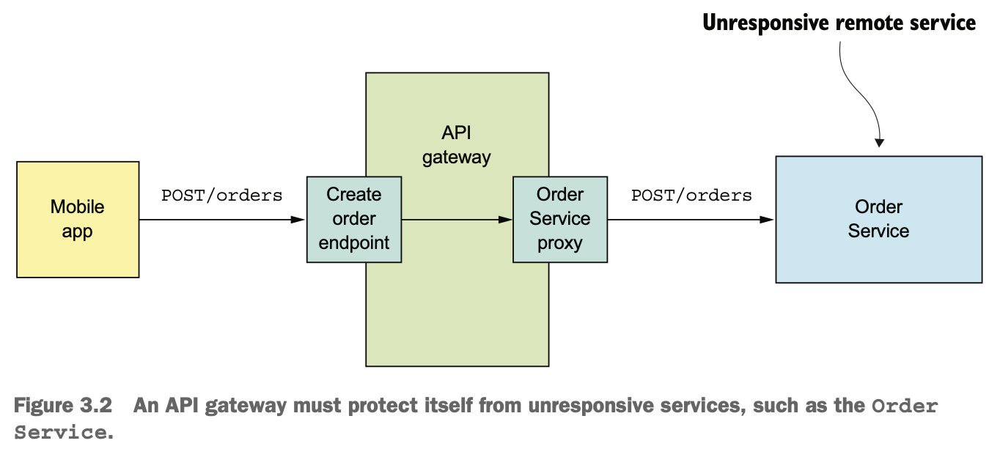

- 부분 실패가 애플리케이션 전체에 전파되지 않도록 서비스를 설계해야 함
  - 무응답 원격 서비스를 처리하기 위해 견고한 RPI 프록시 설계
  - 원격 서비스가 실패하면 어떻게 조치해야 할지 결정

#### 견고한 RPI 프록시 설계

- 네트워크 타임아웃: 응답 대기 중 무한정 블로킹하지 않도록 타임아웃 설정
- 미처리 요청 개수 제한: 클라이언트가 특정 서비스에 요청 가능한 미처리 요청의 최대 개수 설정
- 회로 차단기 패턴: 성공/실패 요청 개수를 지켜보다가 에러율이 주어진 임계치를 초과하면 그 이후 시도는 바로 실패 처리

#### 불능 서비스 복구

- 캐시된 버전의 데이터 또는 에러를 반환

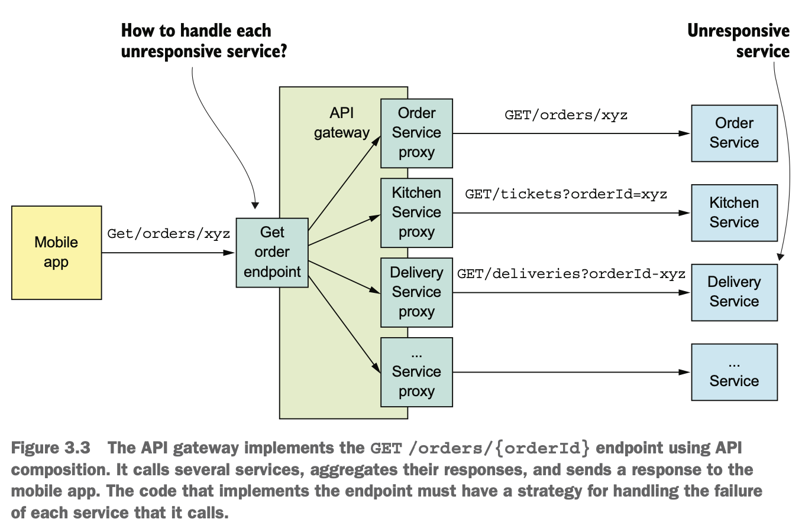

### 3.2.4 서비스 디스커버리

- 서비스 인스턴스마다 네트워크 위치가 동적 배정되고, 서비스 인스턴스는 자동 확장, 실패, 업그레이드 등 여러가지 사유로 계속 달라지므로 서비스 디스커버리가 필요함

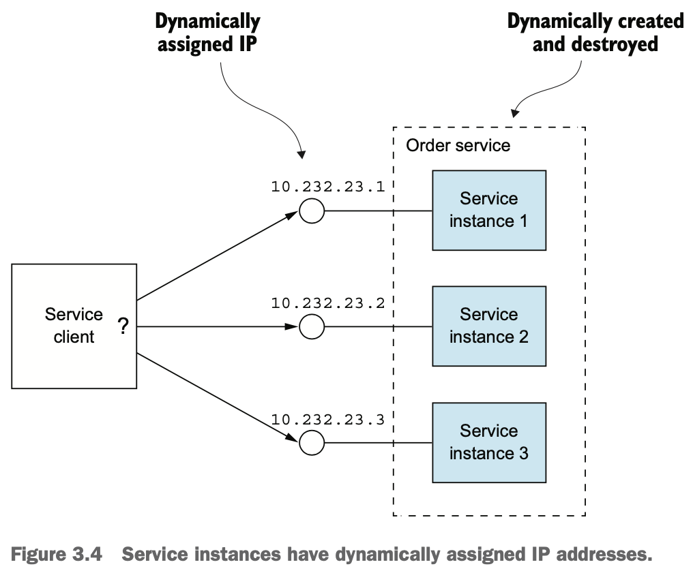

#### 서비스 디스커버리 개요

- 애플리케이션 서비스 인스턴스의 네트워크 위치를 DB화 한 서비스 레지스트리
  - 서비스 인스턴스가 시작/종료할 때마다 서비스 레지스트리 업데이트
  - 서비스 디스커버리가 서비스 레지스트리에어서 가용 서비스 인스턴스 목록을 가져오고, 그 중 한 서비스로 요청을 라우팅
- 서비스 디스커버리 구현 방법
  - 클라이언트/서비스가 직접 서비스 레지스트리와 상호 작용
  - 배포 인프라로 서비스 디스커버리 처리

#### 애플리케이션 수준의 서비스 디스커버리 패턴 적용

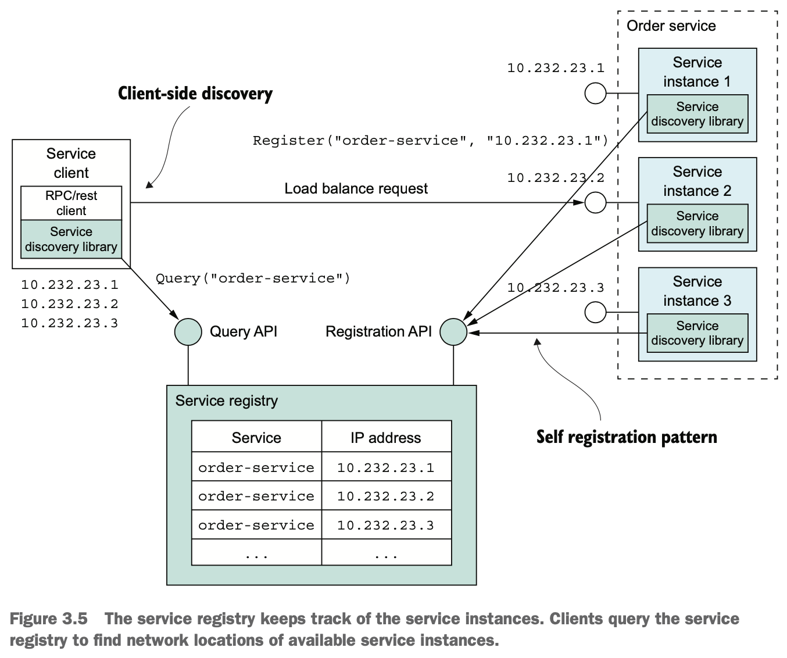

- 자가 등록 패턴: 서비스 인스턴스는 서비스 레지스트리에 자기 자신을 등록
- 디스커버리 패턴: 서비스 클라이언트는 서비스 레지스트리에 있는 가용 서비스 인스턴스 목록을 조회하고 부하 분산

#### 플랫폼에 내장된 서비스 디스커버리 패턴 적용

- 배포 플랫폼이 서비스 등록, 서비스 디스커버리, 요청 라우팅을 전부 관장

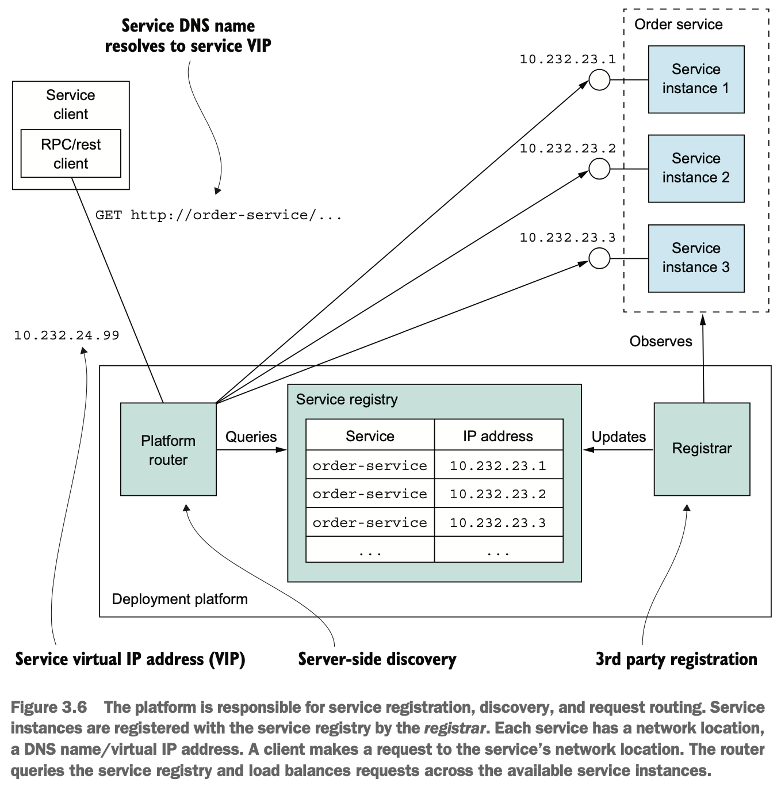

- 서드파티 등록 패턴: 서드파티가 서비스 인스턴스를 서비스 레지스트리에 자동 등록
- 디스커버리 패턴: 클라이언트가 서비스 디스커버리를 담당한 라우터에 요청

## 3.3 비동기 메시징 패턴 응용 통신

- 서비스가 메시지를 서로 비동기적으로 주고받는 통신 방식
- 클라이언트가 응답을 기다리며 블로킹하지 않음

### 3.3.1 메시징 개요

- 메시지 채널을 통해 메시지 교환
- 송신자가 채널에 메시지를 쓰면 수신자는 채널에서 메시지를 읽음

#### 메시지

- 헤더(header)와 본문(body)으로 구성
- 헤더
  - 송신된 데이터에 관한 메타데이터에 해당하는 키/값들로 구성
  - 송신자 또는 메시징 인프라에서 생성된 메시지 ID, 응답이 출력될 메시지 채널을 가리키는 반환 주소(옵션)
- 본문
  - 실제로 송신할 텍스트 또는 이진 포맷의 데이터
- 메시지 종류
  - 문서: 데이터만 포함된 제네릭한 메시지, 메시지를 어떻게 해석할지는 수신자가 결정
  - 커맨드: RPC 요청과 동등한 메시지, 호출할 작업과 전달할 매개변수가 지정되어 있음
  - 이벤트: 송신자에게 어떤 사건이 발생했음을 알리는 메시지

#### 메시지 채널

- 채널을 통해 메시지 교환
  - 송신자는 하부 통신 메커니즘을 캡슐화한 송신 포트 인터페이스 호출
  - 메시징 인프라를 추상한 메시지 채널을 통해 통신 수신자에게 메시지 전달
  - 수신자의 메시지 핸들러 어댑터 클래스는 메시지를 처리하기 위해 호출됨
  - 컨슈머 비즈니스 로직으로 구현된 수신 포트 인터페이스 호출

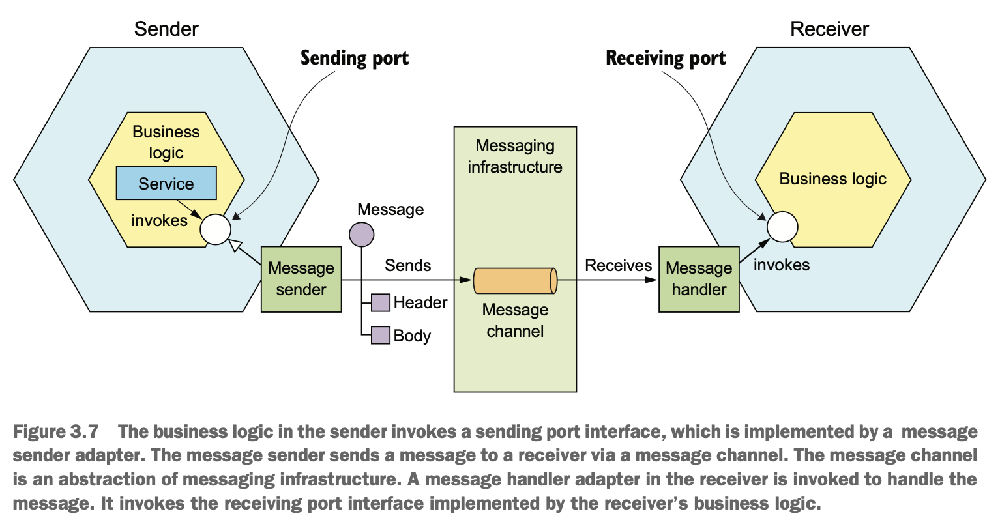

- 채널의 종류
  - 점대점(point-to-point) 채널: 채널을 읽는 컨슈머 중 딱 하나만 지정하여 메시지 전달
  - 발행-구독(publish-subscribe) 채널: 같은 채널을 바라보는 모든 컨슈머에게 메시지를 전달

### 3.3.2 메시징 상호 작용 스타일 구현

#### 요청/응답 및 비동기 요청/응답

- 클라이언트가 요청을 보내면 서비스는 응답을 반환

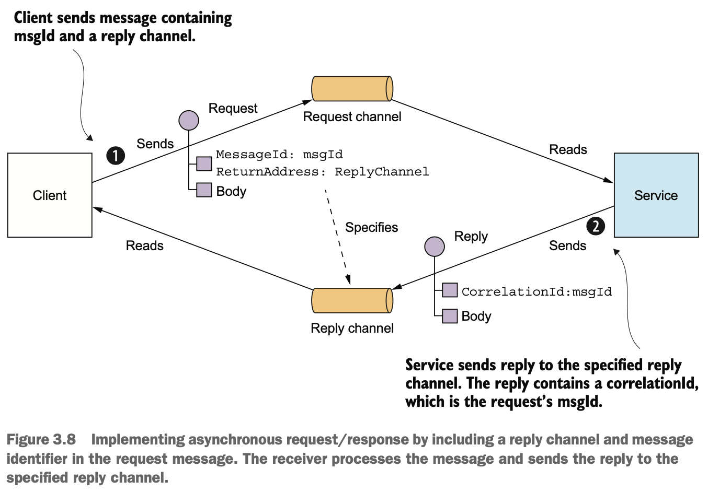

#### 단방향 알림

- 서비스가 소유한 점대점 채널로 클라이언트가 메시지를 보내면, 서비스는 이 채널을 구독해서 메시지를 처리

#### 발행/구독

- 클라이언트는 여러 컨슈머가 읽는 발행/구독 채널에 메시지 발행
- 서비스는 도메인 객체의 변경 사실을 알리는 도메인 이벤트 발행
- 서비스는 자신이 관심 있는 도메인 객체의 이벤트 채널을 구독

#### 발행/비동기 응답

- 클라이언트는 응답 채널 헤더가 명시된 메시지를 발행/구독 채널에 발행
- 컨슈머는 CorrelationId가 포함된 응답 메시지를 지정된 응답 채널에 씀
- CorrelationId를 이용해 요청과 응답을 매치

### 3.3.3 메시징 기반 서비스의 API 명세 작성

- 메시지 채널명, 각 채널을 통해 교환되는 메시지 타입과 포맷 명시
- 메시지 포맷은 JSON, XML, 프로토콜 버퍼 등 표준 포맷으로 기술
- 문서화 표준이 없으므로 자유롭게 기술

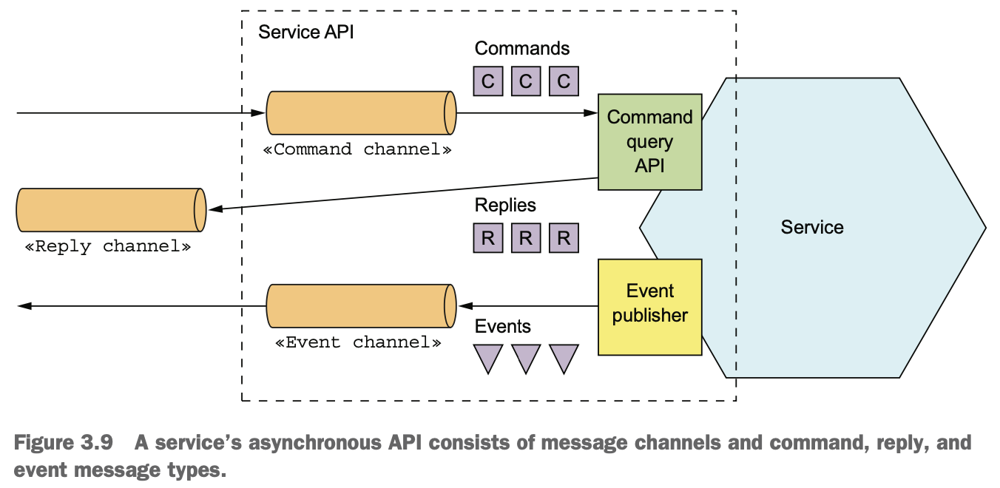

#### 비동기 작업 문서화

- 요청/비동기 응답 스타일 API: 서비스의 커맨드 메시지 채널, 서비스가 받는 커맨드 메시지의 타입과 포맷, 서비스가 반환하는 응답 메시지의 타입과 포맷으로 구성
- 단방향 알림 스타일 API: 서비스의 커맨드 메시지 채널, 서비스가 받는 커맨드 메시지의 타입과 포맷으로 구성

#### 발행 이벤트 문서화

- 이벤트 채널, 서비스가 채널에 발행하는 이벤트 메시지의 타입과 포맷으로 구성

### 3.3.4 메시지 브로커

- 서비스가 서로 통신할 수 있게 해주는 인프라 서비스

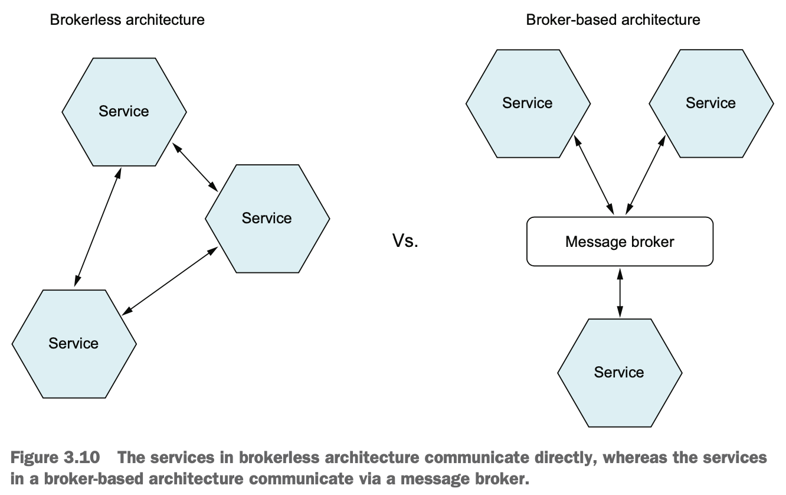

#### 브로커리스 메시징

- 메시지를 서로 직접 교환
- ZeroMQ: 브로커리스 메시징 기술, 자체가 명세이자 여러 언어를 지원하는 라이브러리 세트
- 장점
  - 송신자에서 수신자로 직접 전달되므로 네트워크 트래픽이 가볍고 지연 시간이 짧음
  - 메시지 브로커가 성능 병목점이나 SPOF(Single Point Of Failure)가 될 일이 없음
  - 메시지 브로커를 설정/관리할 필요가 없으므로 운영 복잡도가 낮음
- 단점
  - 서비스 디스커버리 메커니즘 중 하나를 사용해야 함
  - 메시지 교환 시 송신자/수신자 모두 실행중이어야 함
  - 전달 보장 같은 메커니즘을 구현하기 더 어려움

#### 브로커 기반 메시징 개요

- 메시지 브로커는 모든 메시지가 지나가는 중간 지점 역할
- 송신자가 메시지 브로커에 메시지를 쓰면 메시지 브로커는 메시지를 수신자에게 전달
- 송신자가 컨슈머의 네트워크 위치를 몰라도 됨
- 컨슈머가 메시지를 처리할 수 있을 때까지 메시지 브로커에게 메시지를 버퍼링할 수 있음
- 메시지 브로커 종류
  - ActiveMQ
  - RabbitMQ
  - 아파치 카프카
  - AWS 키네시스
  - AWS SQS
- 메시지 브로커 선택 시 고려 사항
  - 프로그래밍 언어 지원 여부
  - 메시징 표준 지원 여부
  - 메시지 순서
  - 전달 보장
  - 영속화
  - 내구성
  - 확장성
  - 지연 시간
  - 경쟁사 컨슈머

#### 메시지 브로커로 메시지 채널 구현

|메시지 브로커|점대점 채널|발행-구독 채널|
|---|---|---|
|JMS|큐|토픽|
|아파치 카프카|토픽|토픽|
|AMQP 브로커(예: RabbitMQ)|익스체인지 + 큐|팬아웃 익스체인지, 컨슈머 개별 큐|
|AWS 키네시스|스트림|스트림|
|AWS SQS|큐|-|

#### 브로커 기반 메시징의 장단점

- 장점
  - 느슨한 결합
  - 메시지 버퍼링
  - 유연한 통신
  - 명시적 IPC
- 단점
  - 성능 병목 가능성
  - 단일 장애점 가능성
  - 운영 복잡도 부가

### 3.3.5 수신자 경합과 메시지 순서 유지

1. 샤딩된 채널은 복수의 샤드로 구성되며, 각 샤드는 채널처럼 작동
2. 송신자는 메시지 헤더에 샤드 키 지정, 메시지 브로커는 메시지를 샤드 키별로 샤드/파티션에 배정
3. 메시징 브로커는 여러 수신자 인스턴스를 묶어 마치 동일한 논리 수신자처럼 취급, 메시지 브로커는 각 샤드를 하나의 수신자에 배정하고, 수신자가 시동/종료하면 샤드를 재배정

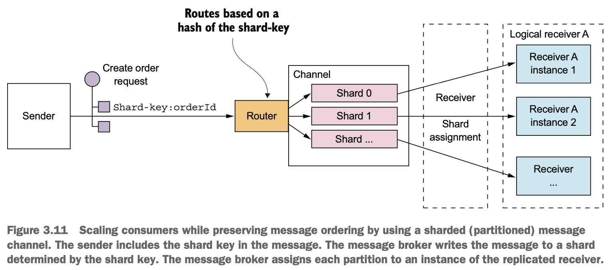

### 3.3.6 중복 메시지 처리

- **우리 회사는 at-most-once vs at-least-once vs exactly-once 중 at-least-once를 표준으로 함**

#### 멱등한 메시지 핸들러 작성

- 동일한 입력 값을 반복 호출해도 아무런 부수 효과가 없을 때 멱등하다고 말함
- 메시지 재전송 시 메시지 브로커가 순서를 유지한다는 전제하에 멱등한 메시지 핸들러는 여러 번 실행해도 문제가 없음
- 멱등한 애플리케이션 로직은 실제로 별로 없기 때문에 중복 메시지를 솎아 내는 메시지 핸들러가 필요
- **멱등: Math.abs(-1) == Math.abs(Math.abs(-1));**

#### 메시지 추적과 중복 메시지 솎아 내기

- 컨슈머가 메시지 ID를 이용하여 메시지 처리 여부를 추적하면서 중복 메시지를 솎아 낼 수 있음
- **우리 회사는 received_events 라는 테이블로 중복 메시지를 처리**

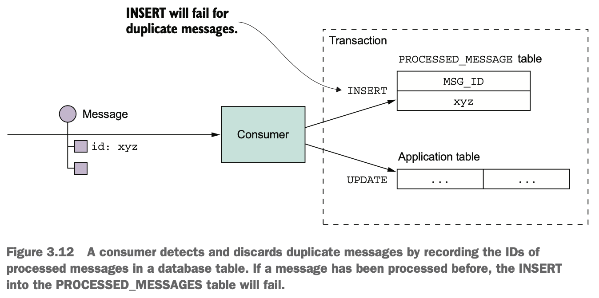

### 3.3.7 트랜잭셔널 메시징

- 서비스는 보통 DB 업데이트 트랜잭션의 일부로 메시지를 발행하기 때문에, 이 두 작업이 서비스에서 원자적으로 수행되어야 함

#### DB 테이블을 메시지 큐로 활용

- DB 테이블을 임시 메시지 큐로 사용하는 트랜잭셔널 아웃박스 패턴 사용
- 트랜잭셔널 아웃박스 패턴: 이벤트나 메시지를 DB에 있는 아웃박스에 저장해서 DB 트랜잭션의 일부로 발행
- **우리 회사는 outbox 대신 persistent_events 라는 테이블 사용**

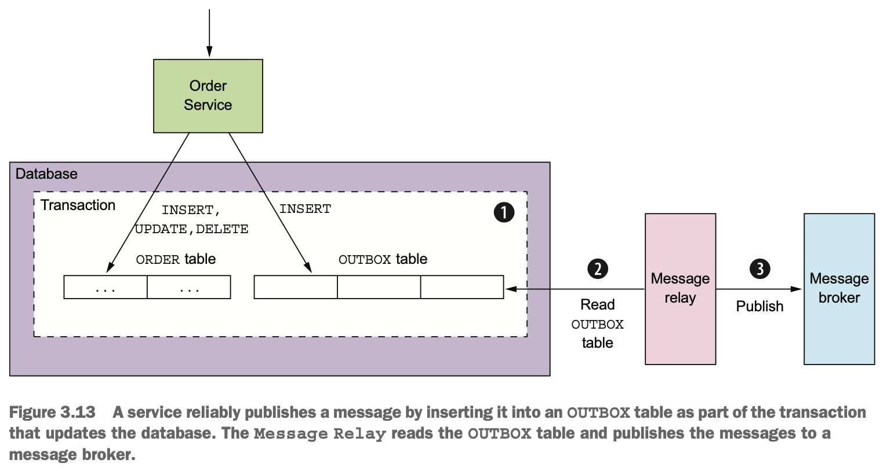

#### 이벤트 발행: 폴링 발행기 패턴

- 메시지 릴레이로 테이블을 폴링해서 미발행 메시지를 조회
- 조회한 메시지를 하나씩 각자의 목적지 채널로 보내서 메시지 브로커에 발행
- 발행된 메시지는 OUTBOX 테이블에서 삭제
- 폴링 발행기 패턴: DB에 있는 아웃박스를 폴링해서 메시지를 발행
- **릴레이는 일반적으로 ScheduledTask로 구현**

#### 이벤트 발행: 트랜잭션 로그 테일링 패턴

- 메시지 릴레이로 DB 트랜잭션 로그(커밋 로그)를 테일링하는 방법
- 트랜잭션 로그 마이너로 트랜잭션 로그를 읽어 변경분을 하나씩 메시지로 메시지 브로커에 발행
- 트랜잭션 로그 테일링 패턴: 트랜잭션 로그를 테일링하여 DB에 반영된 변경분을 발행

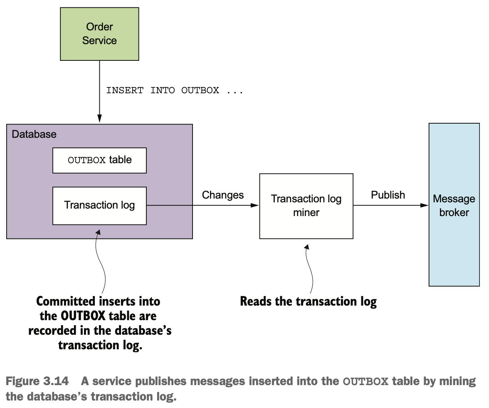

- 응용 사례
  - 디비지움(Debezium)
  - 링크드인 데이터버스(LinkedIn Databus)
  - DynamoDB 스트림즈
  - 이벤추에이트 트램(Eventuate Tram)

### 3.3.8 메시징 라이브러리/프레임워크

- 저수준 세부를 감추고 고수준의 상호 작용 스타일을 직접 지원하는 고수준 라이브러리 또는 프레임워크 필요
- 이벤추에이트 트램의 두 가지 메커니즘
  - 트랜잭셔널 메시징: 메시지를 DB 트랜잭션의 일부로 발행
  - 중복 메시지 감지: 컨슈머가 메시지를 한 번만 처리하도록 중복 메시지를 솎아냄

#### 기초 메시징

- MessageProducer
  - 프로듀서 서비스는 MessageProducer 인터페이스를 통해 메시지를 메시지 채널에 발행

``` java
MessageProducer messageProducer = ...;
String channel = ...;
String payload = ...;
messageProducer.send(destination, MessageBuilder.withPayload(payload).build())
```

- MessageConsumer
  - 컨슈머 서비스는 MessageConsumer 인터페이스를 통해 메시지를 구독

``` java
MessageConsumer messageConsumer;
messageConsumer.subscribe(subscriberId, Collections.singleton(destination),
     message -> { ... })
```

#### 도메인 이벤트 발행

- DomainEventPublisher 인터페이스를 이용하여 도메인 이벤트 발행

``` java
DomainEventPublisher domainEventPublisher;
String accountId = ...;
DomainEvent domainEvent = new AccountDebited(...);
domainEventPublisher.publish("Account", accountId, Collections.singletonList(
     domainEvent));
```

- DomainEventDispatcher 클래스로 도메인 이벤트 소비

``` java
DomainEventHandlers domainEventHandlers = DomainEventHandlersBuilder
            .forAggregateType("Order")
            .onEvent(AccountDebited.class, domainEvent -> { ... })
            .build();
new DomainEventDispatcher("eventDispatcherId",
            domainEventHandlers,
            messageConsumer);
```

#### 커맨드/응답 메시징

- 클라이언트는 CommandProducer 인터페이스를 이용하여 커맨드 메시지를 서비스에 송신

``` java
CommandProducer commandProducer = ...;
Map<String, String> extraMessageHeaders = Collections.emptyMap();
String commandId = commandProducer.send("CustomerCommandChannel",
        new DoSomethingCommand(),
        "ReplyToChannel",
        extraMessageHeaders);
```

- CommandDispatcher 클래스는 MessageConsumer 인터페이스를 통해 특정 이벤트를 구독하고 각 커맨드 메시지를 적절한 핸들러 메서드로 디스패치

``` java
CommandHandlers commandHandlers =CommandHandlersBuilder
            .fromChannel(commandChannel)
            .onMessage(DoSomethingCommand.class, (command) -
     > { ... ; return withSuccess(); })
.build();

CommandDispatcher dispatcher = new CommandDispatcher("subscribeId",
             commandHandlers, messageConsumer, messageProducer);
```

## 3.4 비동기 메시징으로 가용성 개선

### 3.4.1 동기 통신으로 인한 가용성 저하

- 서비스가 동기 프로토콜로 통신하면 서비스가 응답할 때까지 클라이언트가 기다려야 하기 때문에 가용성이 저하될 수 밖에 없음

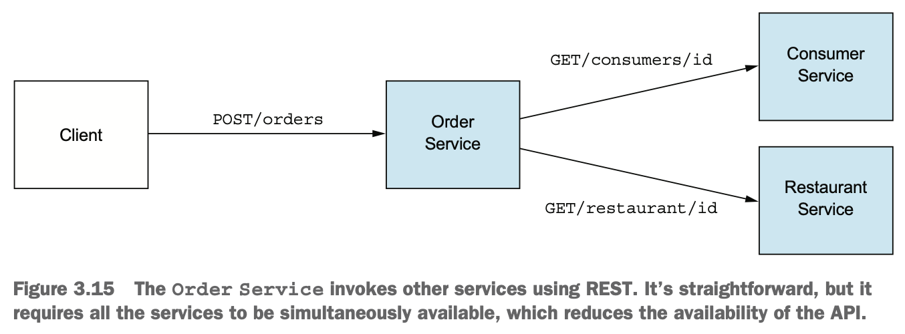

- 더 많은 서비스가 요청 처리에 개입할수록 가용성은 더 낮아짐

### 3.4.2 동기 상호 작용 제거

#### 비동기 상호 작용 스타일

- 비동기 상호 작용 스타일로 처리하여 응답을 대기하며 블로킹되지 않게 함

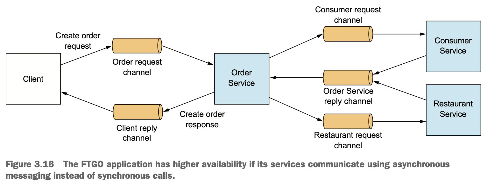

#### 데이터 복제

- 서비스 요청 처리에 필요한 데이터의 레플리카를 유지하는 방법

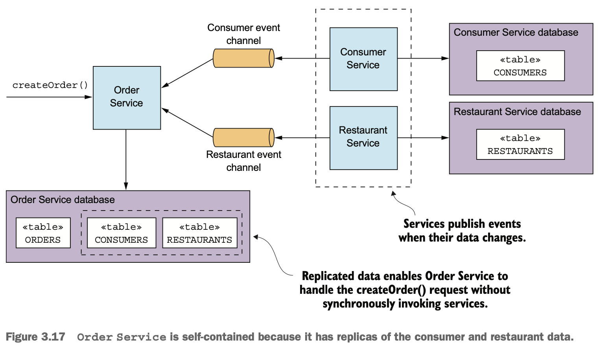

- 데용량 데이터의 레플리카를 만드는 것은 비효율적
- 다른 서비스가 소유한 데이터를 업데이트하는 문제를 해결할 수 없음

#### 응답 반환 후 마무리

- 요청 처리 도중 동기 통신을 제거하기 위한 처리 순서
  - 로컬에서 가용한 데이터만 갖고 요청을 검증
  - 메시지를 OUTBOX 테이블에 삽입하는 식으로 DB 업데이트
  - 클라이언트에 응답 반환
- 요청 처리 중에 다른 서비스와 동기적 상호 작용을 하지 않고 메시지를 비동기 전송

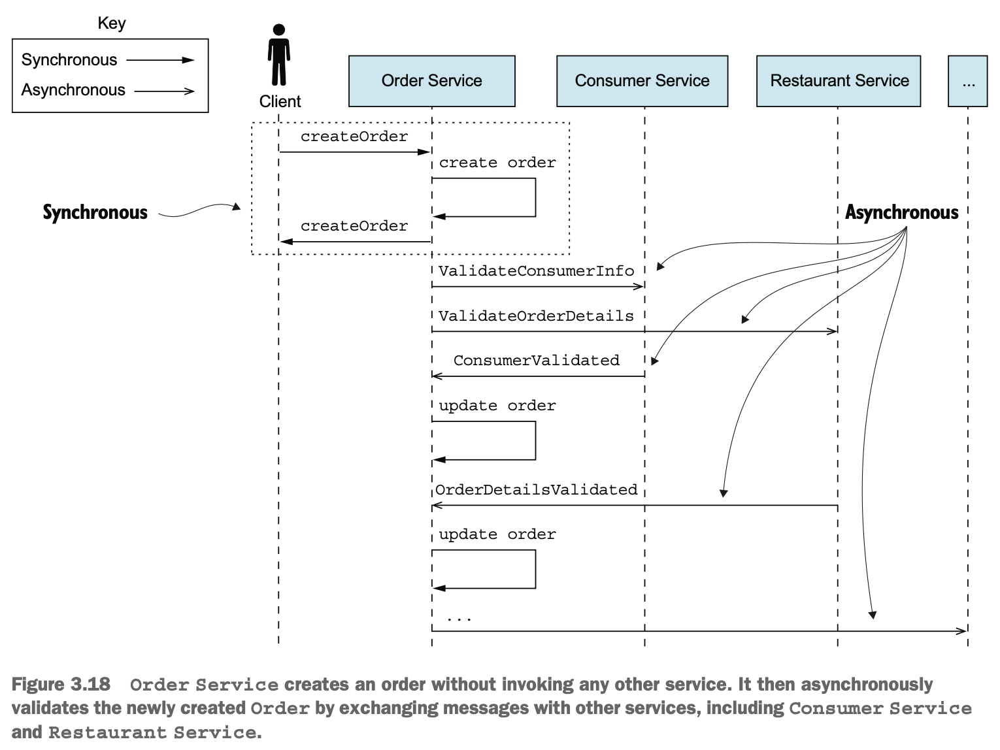

## 3.5 마치며

- 마이크로서비스 아키텍처는 분산 아키텍처이므로 IPC가 중요
- API 변경 시 하위 호환되면 클라이언트에 영향을 끼치지 않아 적용이 쉬우며, 변경이 많을 경우 신구 버전 둘 다 지원이 필요
- 동기 RPC 패턴과 비동기 메시징 패턴 중 어떤 패턴을 사용하느냐는 사용성, 가용성 등을 고려하여 결정해야 함
- 시스템 전체에 실패가 전파되는 현상을 방지하기 위해 부분 실패를 처리할 수 있게 설계되어야 함(타임아웃, 회로 차단기)
- 클라이언트가 서비스 인스턴스 네트워크 위치를 찾을 수 있도록 서비스 디스커버리 장치가 필요
- 메시징 기반 아키텍처 설계 시 하부 메시징 시스템의 세 부분을 추상한 메시지와 채널 모델 사용
- 트랜잭셔널 아웃박스 패턴에 따라 메시지를 DB 트랜잭션의 일부로 DB에 쓰고, 별도 프로세스가 폴링 발행기 또는 트랜잭션 로그 테일링 패턴으로 메시지 발행