# 4장 트랜잭션 관리: 사가
## 이 장에서 다룰 핵심 내용

- 요즘 애플리케이션에 분산 트랜잭션이 잘 어울리지 않는 이유
- 사가 패턴을 마이크로서비스 아키텍처에 적용하여 데이터 일관성 유지
- 코레오그래피/오케스트레이션 방식으로 사가 편성
- 비격리 문제 조치 대책

## 4.1 마이크로서비스 아키텍처에서의 트랜잭션 관리

### 4.1.1 분산 트랜잭션의 필요성

- 마이크로서비스 아키텍처에서는 여러 서비스에 있는 데이터에 접근해야 하기 때문에 트랜잭션이 복잡함
- 서비스마다 DB가 따로 있기 때문에 여러 DB에 걸쳐 데이터 일관성을 유지할 수 있는 수단이 필요함

### 4.1.2 분산 트랜잭션의 문제점

- X/Open DTP(Distributed Transaction Processing) 모델(X/Open XA)
  - 분산 트랜잭션 관리의 사실상 표준
  - 2단계 커밋(2PC)을 이용하여 전체 트랜잭션 참여자가 반드시 커밋 아니면 롤백을 하도록 보장
- XA 호환 기술 스택 구성
  - XA 호환 DB
  - 메시지 브로커
  - DB 드라이버
  - 메시징 API
  - XA 전역 트랜잭션 ID를 전파하는 프로세스 간 메커니즘
- SQL DB는 대부분 XA와 호환되며 메시지 브로커도 일부 제품은 호환됨

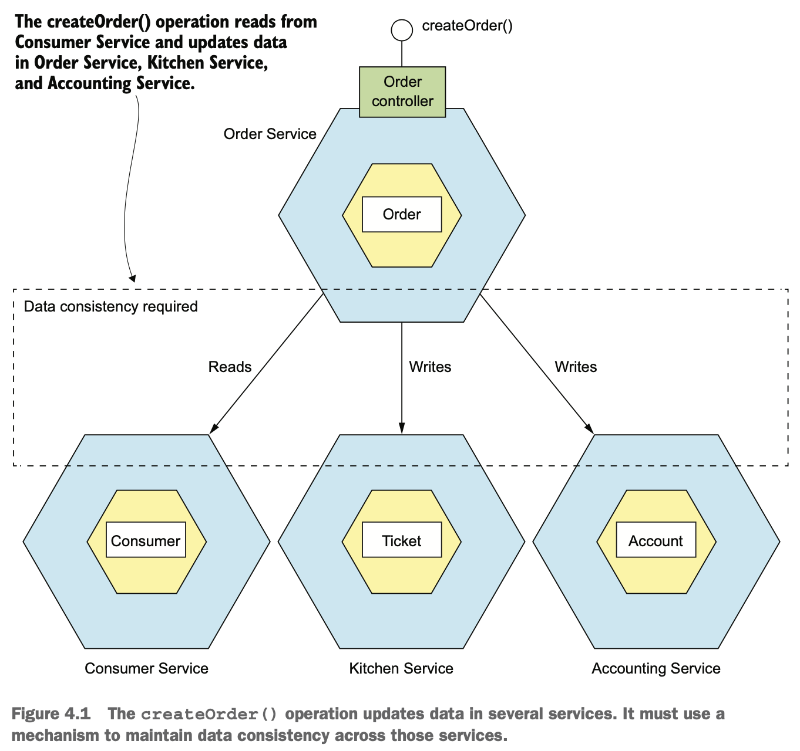

- 분산 트랜잭션의 문제점
  - NoSQL DB, 현대 메시지 브로커(RabbitMQ, 아파치 카프카 등)는 분산 트랜잭션을 지원하지 않음
  - 동기 IPC 형태이기 때문에 가용성이 떨어짐

> 시스템은 일관성(consistency), 가용성(availability), 분할 허용성(partition tolerance) 중 두 가지 속성만 가질 수 있다.</br><small>-에릭 브루어의 CAP 정리</small>

- 마이크로서비스 아키텍처에서 데이터 일관성을 유지하려면, 느슨하게 결합된 비동기 서비스 개념을 토대로 메커니즘이 필요함

### 4.1.3 데이터 일관성 유지: 사가 패턴

- 마이크로서비스 아키텍처에서 분산 트랜잭션 없이 데이터 일관성을 유지하는 메커니즘
- 여러 서비스의 데이터를 업데이트하는 시스템 커맨드마다 사가를 하나씩 정의
- 일련의 로컬 트랜잭션으로, ACID(원자성(Atomicity), 일관성(Consistency), 격리성(Isolation), 지속성(Durability)) 트랜잭션 프레임워크/라이브러리를 이용하여 서비스별 데이터를 업데이트함
- 비동기 메시징을 이용하여 편성한 일련의 로컬 트랜잭션으로, 서비스 간 데이터 일관성을 유지
- 사가와 ACID 트랜잭션의 차이점
  - ACID 트랜잭션에 있는 격리성(I)이 사가에는 없음
  - 사가는 로컬 트랜잭션마다 변경분을 커밋하므로 보상 트랜잭션을 걸어 롤백해야 함

#### 예제: 주문 생성 사가

- 첫 번째 로컬 트랜잭션은 외부 요청에 의해 시작됨
- 나머지 로컬 트랜잭션은 각자 자신의 선행 트랜잭션이 완료되면 트리거됨

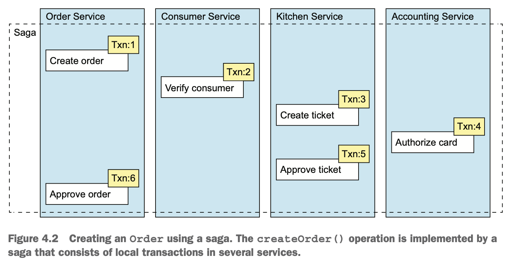

- 주문 생성 사가의 로컬 트랜잭션 구성
  - 주문 서비스: 주문을 APPROVAL_PENDING 상태로 생성
  - 소비자 서비스: 주문 가능한 소비자인지 확인
  - 주방 서비스: 주문 내역을 확인하고 티켓을 CREATE_PENDING 상태로 생성
  - 회계 서비스: 소비자 신용카드를 승인
  - 주방 서비스: 티켓 상태를 AWAITING_ACCEPTANCE로 변경
  - 주문 서비스: 주문 상태를 APPROVED로 변경
- 각 서비스는 로컬 트랜잭션이 완료되면 메시지를 발행하여 다음 사가 단계를 트리거함
- 메시지를 통해 사가 참여자를 느슨하게 결합하고 사가가 반드시 완료되도록 보장
- 메시지 수신자가 일시 불능 상태라면, 메시지 브로커는 다시 메시지를 전달할 수 있을 때까지 메시지를 버퍼링함

#### 사가는 보상 트랜잭션으로 변경분을 롤백한다

- 사가는 단계마다 로컬 DB에 변경분을 커밋하므로 자동 롤백이 불가능함
- 보상 트랜잭션(compensating transaction)을 미리 작성해야 함
- (n + 1)번째 사가 트랜잭션이 실패하면 이전 n개의 트랜잭션을 언두해야 함
- 단계 T<sub>i</sub>에는 T<sub>i</sub>의 작용(effect)을 언두하는 보상 트랜잭션 C<sub>i</sub>가 대응되며, 처음 n개 단계의 작용을 언두하려면 사가는 각 C<sub>i</sub>를 역순으로 실행
- T<sub>1</sub> ∙∙∙ T<sub>n</sub> 순서로 트랜잭션이 실행되다가 T<sub>n+1</sub>에서 실패할 경우 T<sub>1</sub> ∙∙∙ T<sub>n</sub>을 언두하고 C<sub>n</sub> ∙∙∙ C<sub>1</sub>을 순서대로 실행

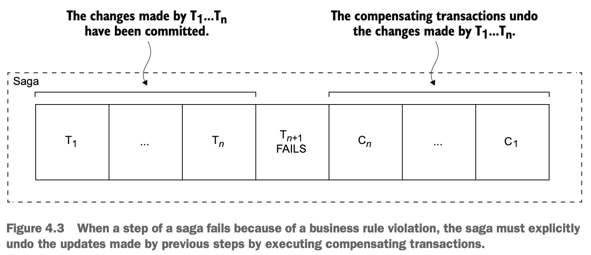

- 사가는 트랜잭션이 진행하는 반대 방향(C<sub>n</sub> ∙∙∙ C<sub>1</sub>)으로 보상 트랜잭션 실행
- C<sub>i</sub>와 T<sub>i</sub>는 순서화 원리가 동일하므로 C<sub>i</sub>가 끝나면 C<sub>i-1</sub> 실행이 트리거됨
- 읽기 전용 단계나, 항상 성공하는 단계 다음에 이어지는 단계는 보상 트랜잭션이 필요 없음

|단계|서비스|트랜잭션|보상 트랜잭션|
|---|---|---|---|
|1|주문 서비스|createOrder()|rejectOrder()|
|2|소비자 서비스|verifyConsumerDetails()|-|
|3|주방 서비스|createTicket()|rejectTicket()|
|4|회계 서비스|authorizeCreditCard()|-|
|5|주방 서비스|approveTicket()|-|
|6|주문 서비스|approveOrder()|-|

- 소비자의 신용카드 승인이 실패하면 작동하는 보상 트랜잭션 순서
  - 주문 서비스: 주문을 APPROVAL_PENDING 상태로 생성
  - 소비자 서비스: 소비자가 주문을 할 수 있는지 확인
  - 주방 서비스: 주문 내역을 확인하고 티켓을 CREATE_PENDING 상태로 생성
  - 회계 서비스: 소비자의 신용카드 승인 요청이 거부됨
  - 주방 서비스: 티켓 상태를 CREATE_REJECTED로 변경
  - 주문 서비스: 주문 상태를 REJECTED로 변경

## 4.2 사가 편성

- 사가 편성 로직의 종류
  - 코레오그래피(choreography): 의사 결정과 순서화를 사가 참여자에게 맡김, 주로 이벤트 교환 방식으로 통신
  - 오케스트레이션(orchestration): 사가 편성 로직을 사가 오케스트레이터에 중앙화, 사가 오케스트레이터는 사가 참여자에게 커맨드 메시지를 보내 수행할 작업을 지시

### 4.2.1 코레오그래피 사가

- 사가 참여자가 서로 이벤트를 구독해서 그에 따라 반응

#### 주문 생성 사가 구현: 코레오그래피 스타일

- 사가 참여자는 서로 이벤트를 주고받으며 소통, 각 참여자는 자신의 DB를 업데이트하고 다음 참여자를 트리거하는 이벤트를 발행

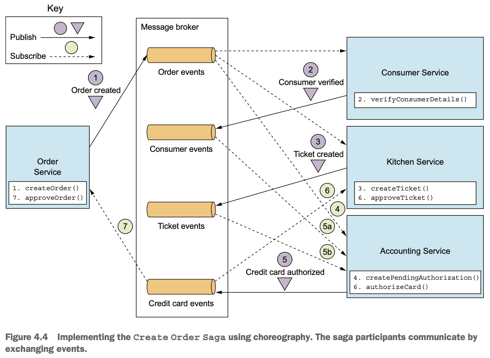

- 정상 동작 순서
  - 주문 서비스: 주문을 APPROVAL_PENDING 상태로 생성 &rightarrow; 주문 생성 이벤트 발행
  - 소비자 서비스: 주문 생성 이벤트 수신 &rightarrow; 소비자가 주문을 할 수 있는지 확인 &rightarrow; 소비자 확인 이벤트 발행
  - 주방 서비스: 주문 생성 이벤트 수신 &rightarrow; 주문 내역 확인 &rightarrow; 티켓을 CREATE_PENDING 상태로 생성 &rightarrow; 티켓 생성됨 이벤트 발행
  - 회계 서비스: 주문 생성 이벤트 수신 &rightarrow; 신용카드 승인을 PENDING 상태로 생성
  - 회계 서비스: 티켓 생성 및 소비자 확인 이벤트 수신 &rightarrow; 소비자 신용카드 과금 &rightarrow; 신용카드 승인됨 이벤트 발행
  - 주방 서비스: 신용카드 승인 이벤트 수신 &rightarrow; 티켓 상태를 AWAITING_ACCEPTANCE로 변경
  - 주문 서비스: 신용카드 승인됨 이벤트 수신 &rightarrow; 주문 상태를 APPROVED로 변경 &rightarrow; 주문 승인됨 이벤트 발행
- 회계 서비스에서 소비자 신용카드가 승인 거부된 경우 동작 순서
  - 주문 서비스: 주문을 APPROVAL_PENDING 상태로 생성 &rightarrow; 주문 생성 이벤트 발행
  - 소비자 서비스: 주문 생성 이벤트 수신 &rightarrow; 소비자가 주문을 할 수 있는지 확인 &rightarrow; 소비자 확인 이벤트 발행
  - 주방 서비스: 주문 생성 이벤트 수신 &rightarrow; 주문 내역 확인 &rightarrow; 티켓을 CREATE_PENDING 상태로 생성 &rightarrow; 티켓 생성됨 이벤트 발행
  - 회계 서비스: 주문 생성 이벤트 수신 &rightarrow; 신용카드 승인을 PENDING 상태로 생성
  - 회계 서비스: 티켓 생성 및 소비자 확인 이벤트 수신 &rightarrow; 소비자 신용카드 과금 &rightarrow; 신용카드 승인 실패 이벤트 발행
  - 주방 서비스: 신용카드 승인 실패 이벤트 수신 &rightarrow; 티켓 상태를 REJECTED로 변경
  - 주문 서비스: 신용카드 승인 실패 이벤트 수신 &rightarrow; 주문 상태를 REJECTEDfh qusrud

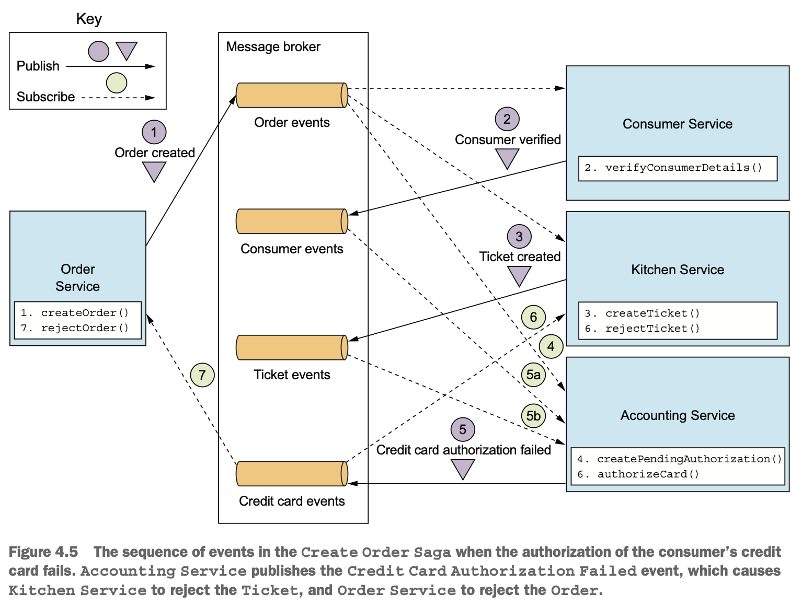

#### 확실한 이벤트 기반 통신

- 코레오그래피 방식으로 사가를 구현할 때 고려할 통신 이슈
  - 사가 참여자가 자신의 DB를 업데이트하고, DB 트랜잭션의 일부로 이벤트를 발행하도록 해야 함(DB 업데이트와 이벤트 발행이 원자적으로 일어나야 함, 트랜잭셔널 메시징)
  - 사가 참여자는 자신이 수신한 이벤트와 자신이 가진 데이터를 연관 지을 수 있어야 함(상관관계 ID가 포함된 이벤트를 발행해야 함)

#### 코레오그래피 사가의 장단점

- 장점
  - 단순함: 비즈니스 객체를 생성, 수정, 삭제할 때 서비스가 이벤트를 발행
  - 느슨한 결합: 참여자는 이벤트를 구독할 뿐 서로를 직접 알지 못함
- 단점
  - 이해하기 어렵다: 오케스트레이션 사가와 달리, 사가를 어느 한곳에 정의한 것이 아니라서 여러 서비스에 구현 로직이 흩어져 있기 때문에 이해하기 어려움
  - 서비스 간 순환 의존성: 참여자가 서로 이벤트를 구독하는 특성상, 순환 의존성이 발생하기 쉬움
  - 단단히 결합될 위험성: 사가 참여자는 각자 자신에게 영향을 미치는 이벤트를 모두 구독해야 함

### 4.2.2 오케스트레이션 사가

- 사가 참여자가 할 일을 알려 주는 오케스트레이터 클래스를 정의함
- 사가 단계를 실행하기 위해 해당 참여자가 무슨 일을 해야 하는지 메시지에 적어 커맨드/비동기 응답 상호 작용을 하며 참여자와 통신
- 사가 참여자가 작업을 마치고 응답 메시지를 오케스트레이터에 주면, 오케스트레이터는 응답 메시지를 처리한 후 다음 사가 단계를 어느 참여자가 수행할지 결정

#### 주문 생성 사가 구현: 오케스트레이션 스타일

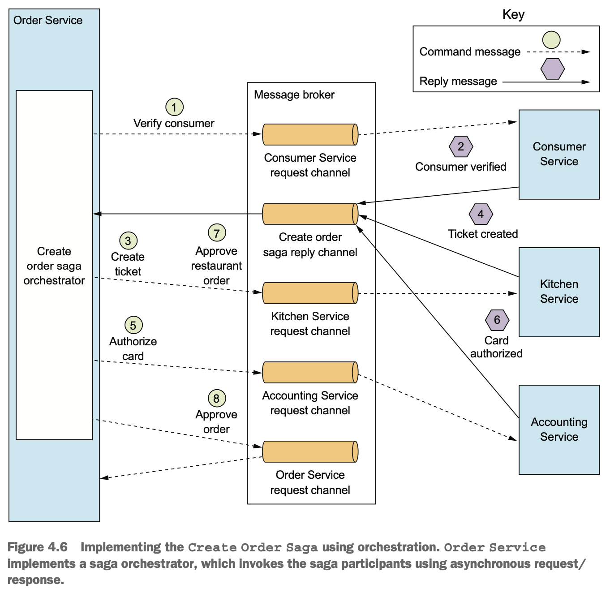

- 정상 동작 순서
  - 사가 오케스트레이터가 소비자 확인 커맨드를 소비자 서비스에 전송
  - 소비자 서비스는 소비자 확인 메시지를 응답
  - 사가 오케스트레이터는 티켓 생성 커맨드를 주방 서비스에 전송
  - 주방 서비스는 티켓 생성 메시지를 응답
  - 사가 오케스트레이터는 신용카드 승인 메시지를 회계 서비스에 전송
  - 회계 서비스는 신용카드 승인됨 메시지를 응답
  - 사가 오케스트레이터는 티켓 승인 커맨드를 주방 서비스에 전송
  - 사가 오케스트레이터는 주문 승인 커맨드를 주문 서비스에 전송

#### 사가 오케스트레이터를 상태 기계로 모델링

- 상태 기계(state machine)는 상태(state)와 이벤트에 의해 트리거되는 상태 전이(transition)로 구성
- 전이가 발생할 때마다 액션(action)이 일어남, 사가의 액션은 사가 참여자를 호출하는 작용
- 상태 간 전이는 사가 참여자가 로컬 트랜잭션을 완료하는 시점에 트리거되고, 로컬 트랜잭션의 상태와 결과에 따라 상태 전이를 어떻게 하고 어떤 액션을 취할지 결정됨
- 멀티 인스턴스로 떠있는 서비스들이 상태에 따라 동작을 일관성으로 유지할 수 있는 방법은? &rightarrow; **상태를 DB에 저장한다!**


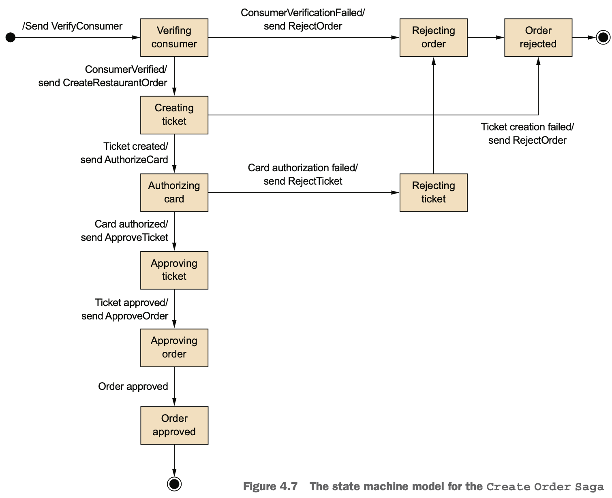

#### 사가 오케스트레이션과 트랜잭셔널 메시징

- 오케스트레이션 사가는 DB를 업데이트하는 서비스와 메시지를 발행하는 서비스가 단계마다 있음
- 서비스는 트랜잭셔널 메시지를 사용해서 DB 업데이트와 메시지 발행 작업을 원자적으로 처리해야 함

#### 오케스트레이션 사가의 장단점

- 장점
  - 의존 관계 단순화: 오케스트레이터는 참여자를 호출하지만 참여자는 오케스트레이터를 호출하지 않으므로 순환 의존성이 발생하지 않음
  - 낮은 결합도: 각 서비스는 오케스트레이터가 호출하는 API를 구현할 뿐, 사가 참여자가 발행하는 이벤트는 몰라도 됨
  - 관심사를 더 분리하고 비즈니스 로직을 단순화: 사가 편성 로직이 사가 오케스트레이터 한곳에만 있으므로 도메인 객체는 더 단순해지고 자신이 참여한 사가에 대해서는 알지 못함
- 단점
  - 비즈니스 로직이 오케스트레이터에 과도하게 중앙화되면 서비스는 깡통이 될 수 있음

## 4.3 비격리 문제 처리

- ACID의 격리성: 동시에 실행 중인 여러 트랜잭션의 결과가 어떤 순서대로 실행된 결과와 동일함을 보장하는 속성
- 사가에 격리성이 빠져있어 발생되는 문제
  - 한 사가가 실행 중에 접근하는 데이터를 도중에 다른 사가가 바꿔치기할 수 있음
  - 한 사가가 업데이트를 하기 이전 데이터를 다른 사가가 읽을 수 있어 데이터 일관성이 깨질 수 있음
- 사가는 ACD 트랜잭션으로 보아야 함
  - 원자성(Atomicity): 사가는 트랜잭션을 모두 완료하거나 모든 변경분을 언두해야 함
  - 일관성(Consistency): 서비스 내부의 참조 무결성(referential integrity)은 로컬 DB가, 여러 서비스에 걸친 참조 무결성은 서비스가 처리
  - 지속성(Durability): 로컬 DB로 처리

### 4.3.1 비정상 개요

- 소실된 업데이트(lost updates): 한 사가의 변경분을 다른 사가가 미처 못 읽고 덮어 씀
- 더티 읽기(dirty reads): 사가 업데이트를 하지 않은 변경분을 다른 트랜잭션이나 사가가 읽음
- 퍼지/반복 불가능한 읽기(fuzzy/nonrepeatable reads): 한 사가의 상이한 두 단계가 같은 데이터를 읽어도 결과가 달라지는 현상

#### 소실된 업데이트

- 한 사가의 변경분을 다른 사가가 덮어 쓸 때 일어남

#### 더티 읽기

- 한 사가가 업데이트 중인 데이터를 다른 사가가 읽을 때 발생

### 4.3.2 비격리 대책

- 비격리로 인한 비정상을 방지하고 비즈니스에 미치는 영향을 최소화하는 방향으로 사가를 작성해야 함
  - 예: *_PENDING 상태 사용
- 트랜잭션 비격리 문제를 처리하는 방법
  - 시맨틱 락(semantic lock): 애플리케이션 수준의 락
  - 교환적 업데이트(commutative updates): 업데이트 작업은 어떤 순서로 실행해도 되게끔 설계
  - 비관적 관점(pessimistic view): 사가 단계 순서를 재조정하여 비즈니스 리스크를 최소화
  - 값 다시 읽기(reread value): 데이터를 덮어 쓸 때 그 전에 변경된 내용은 없는지 값을 다시 읽고 확인하여 더티 쓰기를 방지
  - 버전 파일(version file): 순서를 재조정할 수 있게 업데이트를 기록
  - 값에 의한(by value): 요청별 비즈니스 위험성을 기준으로 동시성 메커니즘을 동적 선택

#### 사가의 구조

- 보상 가능 트랜잭션(compensatable transaction): 보상 트랜잭션으로 롤백 가능한 트랜잭션
- 피봇 트랜잭션(pivot transaction): 사가의 진행/중단 지점으로, 피봇 트랜잭션이 커밋되면 사가는 완료될 때까지 실행됨
- 재시도 가능 트랜잭션(retriable transaction): 피봇 트랜잭션 직후의 트랜잭션으로, 반드시 성공함

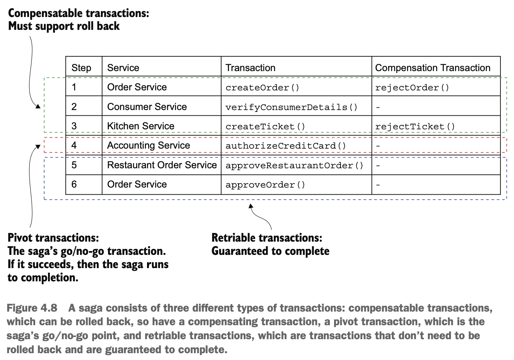

#### 대책: 시맨틱 락

- 보상 가능 트랜잭션이 생성/수정하는 레코드에 무조건 플래그를 세팅하는 대책
- 플래그는 재시도 가능 트랜잭션(사가 완료) 또는 보상 트랜잭션(사가 롤백)에 의해 해제됨

#### 대책: 교환적 업데이트

- 업데이트를 어떤 순서로도 실행 가능하게 설계하면 소실된 업데이트 문제를 방지할 수 있음
- 예: 인출(debit)과 입금(credit)은 서로 교환적인 작업

#### 대책: 비관적 관점

- 더티 읽기로 인한 비즈니스 리스크를 최소화하기 위해 사가 단계의 순서를 재조정하는 것

#### 대책: 값 다시 읽기

- 소실된 업데이트를 방지하는 대책으로, 사가가 레코드를 업데이트하기 전에 값을 다시 읽어 값이 변경되지 않았는지 확인
- 일종의 낙관적 오프라인 락(Optimistic Offline Lock) 패턴

#### 대책: 버전 파일

- 레코드에 수행한 작업을 하나하나 기록하는 대책
- 비교환적(noncommutative) 작업을 교환적(commutative) 작업으로 변환하는 방법

#### 대책: 값에 의한

- 비즈니스 위험성을 기준으로 동시성 메커니즘을 선택하는 것
- 애플리케이션 차원에서 각 요청의 속성을 보고 사가를 쓸지, 아니면 분산 트랜잭션을 쓸지 판단

## 4.4 주문 서비스 및 주문 생성 사가 설계

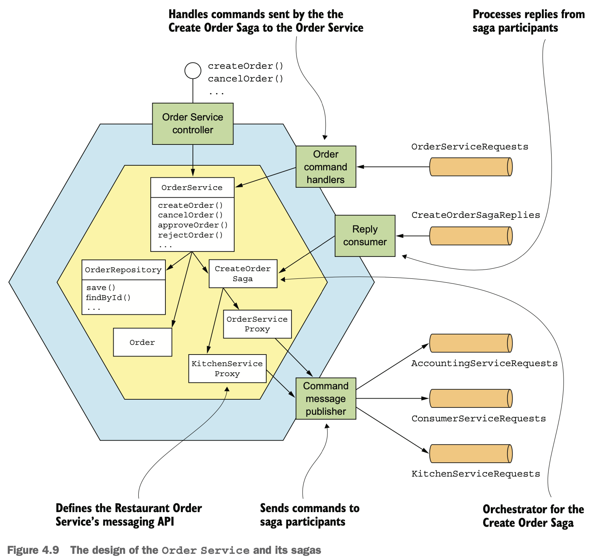

### 4.4.1 OrderService 클래스

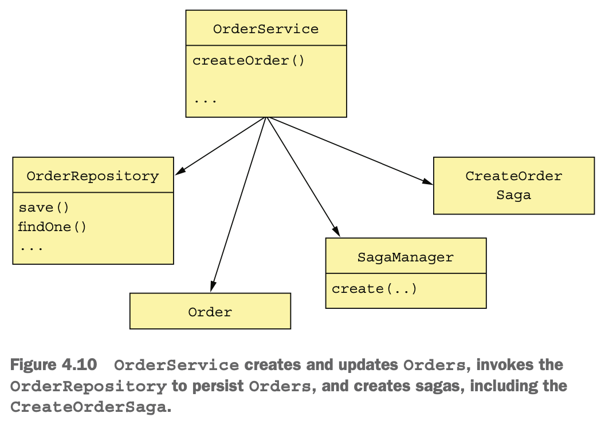

```java
@Transactional  // Ensure that service methods are transactional.
public class OrderService {

  @Autowired
  private SagaManager<CreateOrderSagaState> createOrderSagaManager;
  
  @Autowired
  private OrderRepository orderRepository;
  
  @Autowired
  private DomainEventPublisher eventPublisher;

  public Order createOrder(OrderDetails orderDetails) {
    ...
    ResultWithEvents<Order> orderAndEvents = Order.createOrder(...); // Create the Order.
    Order order = orderAndEvents.result;
    orderRepository.save(order);  // Persist the Order in the database.

    eventPublisher.publish(Order.class,
            Long.toString(order.getId()),
            orderAndEvents.events);  // Publish domain events.
    
    CreateOrderSagaState data =
            new CreateOrderSagaState(order.getId(), orderDetails);  // Create a CreateOrderSaga.
    createOrderSagaManager.create(data, Order.class, order.getId());
    
    return order;
  }
  ...
}
```

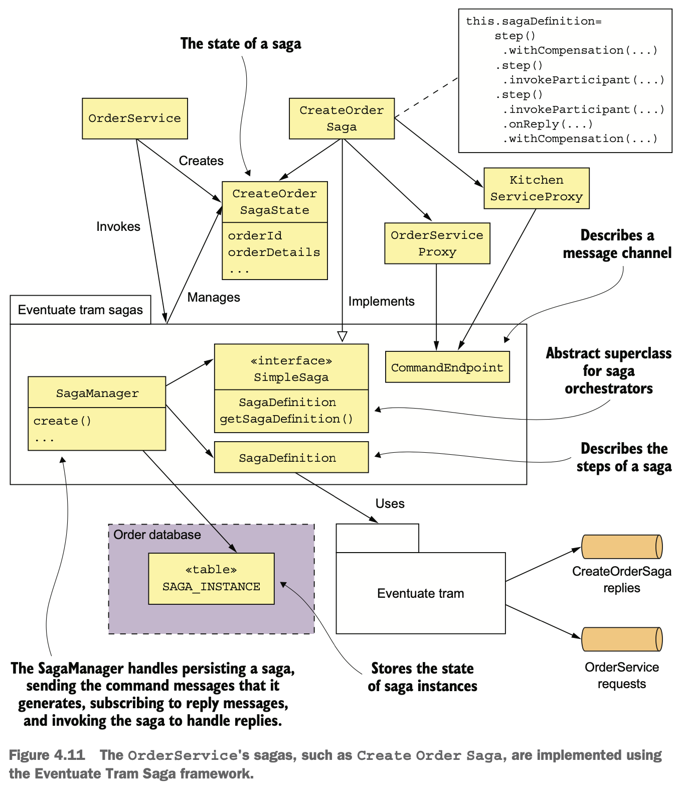

### 4.4.2 주문 생성 사가 구현

#### CreateOrderSaga 오케스트레이터

```java
public class CreateOrderSaga implements SimpleSaga<CreateOrderSagaState> {

  private SagaDefinition<CreateOrderSagaState> sagaDefinition;

  public CreateOrderSaga(
          OrderServiceProxy orderService,
          ConsumerServiceProxy consumerService,
          KitchenServiceProxy kitchenService,
          AccountingServiceProxy accountingService) {
    this.sagaDefinition =
            step()
                    .withCompensation(orderService.reject,
                            CreateOrderSagaState::makeRejectOrderCommand)
                    .step()
                    .invokeParticipant(
                            consumerService.validateOrder,
                            CreateOrderSagaState::makeValidateOrderByConsumerCommand)
                    .step()
                    .invokeParticipant(kitchenService.create,
                            CreateOrderSagaState::makeCreateTicketCommand)
                    .onReply(CreateTicketReply.class, CreateOrderSagaState::handleCreateTicketReply)
                    .withCompensation(
                            kitchenService.cancel,
                            CreateOrderSagaState::makeCancelCreateTicketCommand)
                    .step()
                    .invokeParticipant(
                            accountingService.authorize, CreateOrderSagaState::makeAuthorizeCommand)
                    .step()
                    .invokeParticipant(
                            kitchenService.confirmCreate,
                            CreateOrderSagaState::makeConfirmCreateTicketCommand)
                    .step()
                    .invokeParticipant(orderService.approve,
                            CreateOrderSagaState::makeApproveOrderCommand)
                    .build();
  }

  @Override
  public SagaDefinition<CreateOrderSagaState> getSagaDefinition() {
    return sagaDefinition;
  }
}
```

```java
public class CreateOrderSaga ...

public CreateOrderSaga(...,KitchenServiceProxy kitchenService,
        ...){
      ...
      .step()
        .invokeParticipant(kitchenService.create,
            CreateOrderSagaState::makeCreateTicketCommand) //Define the forward transaction.
        .onReply(CreateTicketReply.class,
            CreateOrderSagaState::handleCreateTicketReply)  // Call handleCreateTicketReply() when a successful reply is received.
        .withCompensation(kitchenService.cancel, //Define the compensating transaction.
            CreateOrderSagaState::makeCancelCreateTicketCommand)
      ...
    ;
```

#### CreateOrderSagaState 클래스

```java
public class CreateOrderSagaState {

  private Long orderId;
  private OrderDetails orderDetails;
  private long ticketId;

  public Long getOrderId() {
    return orderId;
  }

  private CreateOrderSagaState() {
  }

  public CreateOrderSagaState(Long orderId,
          OrderDetails orderDetails) { // Invoked by the OrderService to instantiate a CreateOrderSagaState
    this.orderId = orderId;
    this.orderDetails = orderDetails;
  }

  CreateTicket makeCreateTicketCommand() {  // Creates a CreateTicket command message
    return new CreateTicket(getOrderDetails().getRestaurantId(),
            getOrderId(), makeTicketDetails(getOrderDetails()));
  }

  void handleCreateTicketReply(
          CreateTicketReply reply) { // Saves the ID of the newly created Ticket
    logger.debug("getTicketId {}", reply.getTicketId());
    setTicketId(reply.getTicketId());
  }

  CancelCreateTicket makeCancelCreateTicketCommand() {  // Creates CancelCreateTicket command message
    return new CancelCreateTicket(getOrderId());
  }
  ...
```

### KitchenServiceProxy 클래스

```java
public class KitchenServiceProxy {

  public final CommandEndpoint<CreateTicket> create =
          CommandEndpointBuilder.forCommand(CreateTicket.class)
                  .withChannel(KitchenServiceChannels.kitchenServiceChannel)
                  .withReply(CreateTicketReply.class)
                  .build();
  
  public final CommandEndpoint<ConfirmCreateTicket> confirmCreate =
          CommandEndpointBuilder.forCommand(ConfirmCreateTicket.class)
                  .withChannel(KitchenServiceChannels.kitchenServiceChannel)
                  .withReply(Success.class)
                  .build();
  
  public final CommandEndpoint<CancelCreateTicket> cancel =
          CommandEndpointBuilder.forCommand(CancelCreateTicket.class)
                  .withChannel(KitchenServiceChannels.kitchenServiceChannel)
                  .withReply(Success.class)
                  .build();
}
```

#### 이벤추에이트 트램 사가 프레임워크

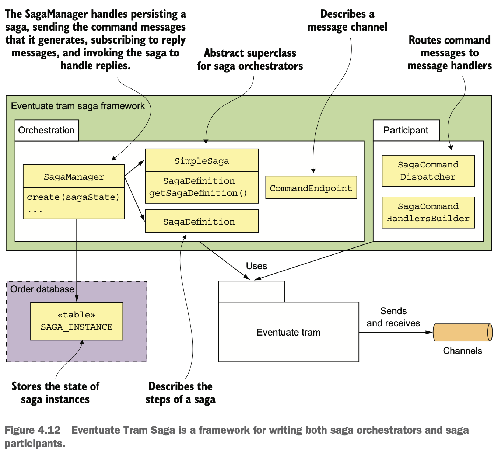

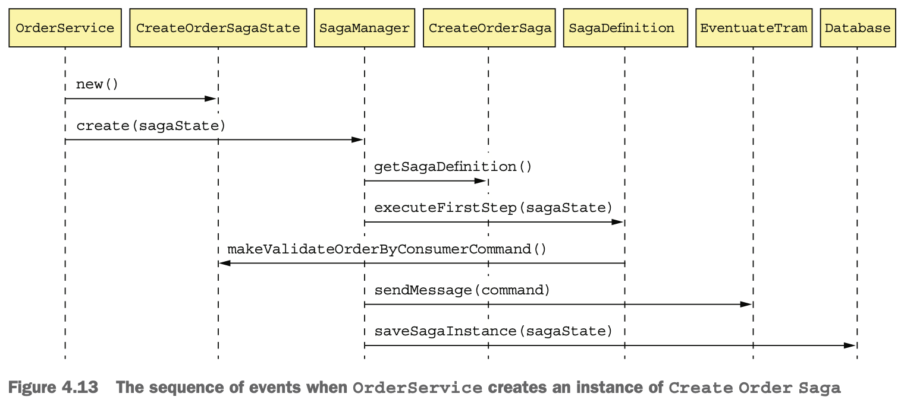

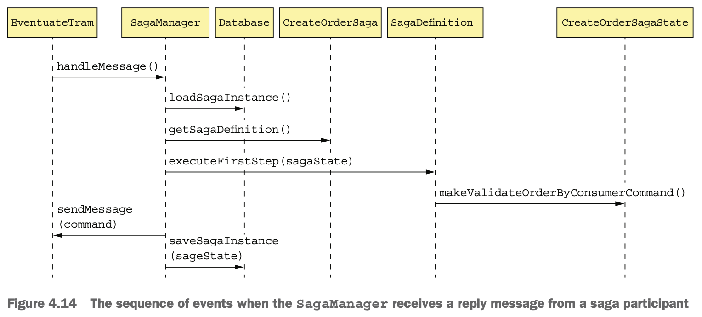

### 4.4.3 OrderCommandHandlers 클래스

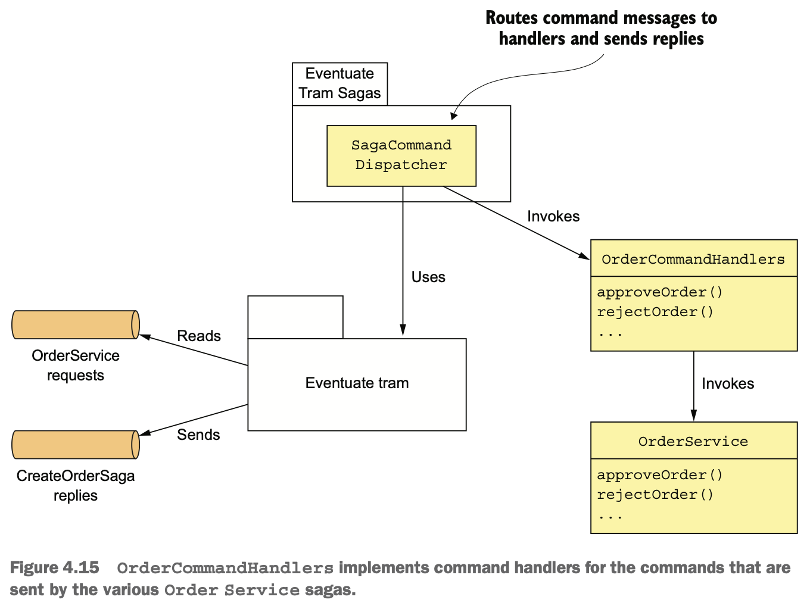

```java
public class OrderCommandHandlers {

  @Autowired
  private OrderService orderService;

  public CommandHandlers commandHandlers() {  // Route each command message to the appropriate handler method.
    return SagaCommandHandlersBuilder
          .fromChannel("orderService")
          .onMessage(ApproveOrderCommand.class, this::approveOrder)
          .onMessage(RejectOrderCommand.class, this::rejectOrder)
          ...
          .build();
  }
  
  public Message approveOrder(CommandMessage<ApproveOrderCommand> cm) {
    long orderId = cm.getCommand().getOrderId();
    orderService.approveOrder(orderId); // Change the state of the Order to authorized.
    return withSuccess();  // Return a generic success message.
  }

  public Message rejectOrder(CommandMessage<RejectOrderCommand> cm) {
    long orderId = cm.getCommand().getOrderId();
    orderService.rejectOrder(orderId);  // Change the state of the Order to rejected.
    return withSuccess();
  }
```

### 4.4.4 OrderServiceConfiguration 클래스

```java

@Configuration
public class OrderServiceConfiguration {

  @Bean
  public OrderService orderService(RestaurantRepository restaurantRepository,
                                ...
          SagaManager<CreateOrderSagaState>
                  createOrderSagaManager,
                                ...) {
    return new OrderService(restaurantRepository,
                        ...
                        createOrderSagaManager
                        ...);
  }

  @Bean
  public SagaManager<CreateOrderSagaState> createOrderSagaManager(CreateOrderS
          aga saga) {
    return new SagaManagerImpl<>(saga);
  }

  @Bean
  public CreateOrderSaga createOrderSaga(OrderServiceProxy orderService,
          ConsumerServiceProxy consumerService,
                                        ...) {
    return new CreateOrderSaga(orderService, consumerService, ...);
  }

  @Bean
  public OrderCommandHandlers orderCommandHandlers() {
    return new OrderCommandHandlers();
  }

  @Bean
  public SagaCommandDispatcher orderCommandHandlersDispatcher(OrderCommandHan
          dlers orderCommandHandlers) {
    return new SagaCommandDispatcher("orderService", orderCommandHandlers.comma
            ndHandlers());
  }

  @Bean
  public KitchenServiceProxy kitchenServiceProxy() {
    return new KitchenServiceProxy();
  }

  @Bean
  public OrderServiceProxy orderServiceProxy() {
    return new OrderServiceProxy();
  }
  ...
}
```

## 4.5 마치며

- 사가는 메시징으로 편성한 일련의 로컬 트랜잭션
- 로컬 트랜잭션 각자가 한 서비스에 있는 데이터를 수정 후 커밋하기 때문에 비즈니스 규칙에 위배되어 사가를 롤백시켜야 할 경우, 보상 트랜잭션을 실행하여 변경분을 명시적으로 되돌림
- 사가 단계를 편성하는 방식
  - 코레오그래피: 로컬 트랜잭션이 이벤트를 발행하여 다른 참여자가 로컬 트랜잭션을 실행하도록 트리거함
  - 오케스트레이션: 중앙의 사가 오케스트레이터가 참여자에게 로컬 트랜잭션을 실행하라고 커맨드 메시지를 보내 지시
    - 사가 오케스트레이터를 상태 기계로 모델링하면 개발/테스트가 단순해짐
- 비격리 ACD 트랜잭션 모델로 인한 동시 비정상은 대체 설계 전략을 적용하여 방지할 수 있음