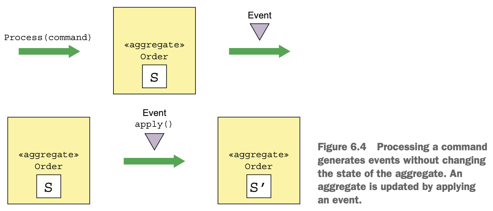
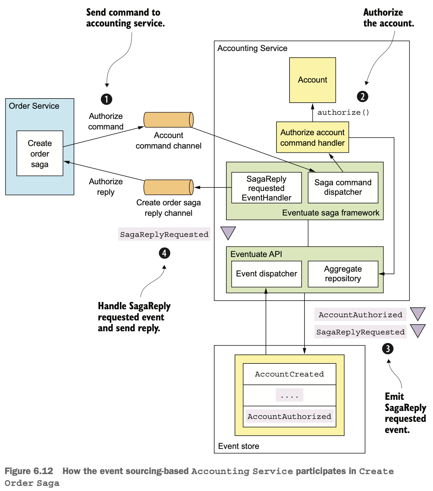

# 6장 비즈니스 로직 개발: 이벤트 소싱

## 이 장에서 다룰 핵심 내용

- 이벤트 소싱 패턴을 응용한 비즈니스 로직 개발
- 이벤트 저장소 구현
- 사가와 이벤트 소싱 기반의 비즈니스 로직 연계
- 이벤트 소싱을 응용한 사가 오케스트레이터 구현

## 6.1 이벤트 소싱 응용 비즈니스 로직 개발

- 이벤트 소싱 패턴
  - 상태 변화를 나타내는 일련의 도메인 이벤트로 애그리거트를 저장
- 이벤트 소싱의 장점
  - 애그리거트 이력이 보존되므로 감사/통제 용도의 가치가 있음
  - 도메인 이벤트를 확실하게 발행할 수 있음
- 이벤트 소싱의 단점
  - 학습 시간이 필요
  - 이벤트 저장소를 쿼리하기가 쉽지 않아 CQRS 패턴을 적용해야 함

### 6.1.1 기존 영속화의 문제점

- 기존 영속화 방식
  - 클래스-DB 테이블
  - 클래스 필드-테이블 컬럼
  - 클래스 인스턴스-테이블 각 로우


#### 객체-관계 임피던스 부정합

- 테이블 형태의 관계형 스키마와 관계가 복잡한 리치 도메인 모델의 그래프 구조는 근본적인 개념부터 다름

#### 애그리거트 이력이 없다

- 기존 영속화 메커니즘은 현재 애그리거트의 상태만 저장
- 이력 관리를 위해 직접 코드를 구현해야 하고, 비즈니스 로직과 동기화해야 하는 코드를 중복 생성하게 됨

#### 감사 로깅은 구현하기 힘들고 오류도 자주 발생한다

- 감사 로깅은 구현하는 데 시간이 걸림
- 감사 로깅 코드 및 비즈니스 로직이 계속 분화하기 때문에 버그가 날 가능성이 높음

#### 이벤트 발행 로직이 비즈니스 로직에 추가된다

- 도메인 이벤트 발행을 지원하지 않음
- ORM 프레임워크는 데이터 객체가 변경될 때 애플리케이션이 제공한 콜백을 호출할 수 있지만, 데이터를 업데이트하는 트랜잭션의 일부로 메시지를 자동 발행하는 기능은 없음
- 이벤트 생성 로직을 추가해야 하며, 비즈니스 로직과 동기화되지 않을 위험이 있음

### 6.1.2 이벤트 소싱 개요

- 이벤트 위주로 비즈니스 로직을 구현하고, 애그리거트를 DB에 일련의 이벤트로 저장하는 기법

#### 이벤트를 이용하여 애그리거트를 저장

- 도메인 이벤트 개념에 기반하여 애그리거트를 DB에 있는 이벤트 저장소에 일련의 이벤트로 저장
- Order 애그리거트를 EVENTS 테이블의 여러 로우로 저장


- 애그리거트 생성/수정 시 애그리거트가 발생시킨 이벤트를 EVENTS 테이블에 삽입
- 애그리거트를 로드할 때 이벤트 저장소에서 이벤트를 가져와 재연
  - 애그리거트의 이벤트를 로드
  - 기본 생성자를 호출하여 애그리거트 인스턴스 생성
  - 이벤트를 하나씩 순회하며 apply() 호출(폴드 또는 리듀스 작업)

> **리듀스(reduce)</br>**
> 연산(operation)과 누산기(accumulator)로 컬렉션에 있는 값들을 처리하여 더 작은 컬렉션이나 단일 값을 생성하는 작업

```java
Class aggregateClass = ...;
Aggregate aggregate = aggregateClass.newInstance();
for (Event event : events) {
  aggregate = aggregate.applyEvent(event);
}
// use aggregate...
```

- 이벤트를 가져와 재연하는 방식으로 애그리거트의 인-메모리 상태를 다시 살려내는 작업

#### 이벤트는 곧 상태 변화

- 도메인 이벤트는 애그리거트의 변경을 구독자에게 알리는 장치
- 이벤트에 무엇을 전달할지는 주로 애그리거트에 의해 이벤트 및 구조가 결정됨
- 모든 애그리거트의 상태 변화를 도메인 이벤트로 나타내며, 애그리거트는 상태가 바뀔 때마다 반드시 이벤트를 발생시킴
- 이벤트는 애그리거트가 상태 전이를 하기 위해 필요한 데이터를 갖고 있어야 함


#### 애그리거트 메서드의 관심사는 오직 이벤트

- 비즈니스 로직은 애그리거트의 업데이트 요청을 애그리거트 루트에 있는 커맨드 메서드를 호출하여 처리
- 이벤트 소싱을 사용하면 커맨드 메서드가 반드시 이벤트를 발생시킴



- 이벤트 소싱은 커맨드 메서드 하나를 둘 이상의 메서드로 리팩터링함
  - 요청을 나타낸 커맨드 객체를 매개변수로 받아 상태를 어떻게 변경해야 할지 결정
  - 정해진 이벤트 타입을 매개변수로 받아 애그리거트를 업데이트함


- 애그리거트 생성 순서
  - 기본 생성자로 애그리거트 루트를 초기화
  - process()를 호출하여 새 이벤트 발생
  - 새 이벤트를 하나씩 순회하면서 apply()를 호출하여 애그리거트 업데이트
  - 이벤트 저장소에 새 이벤트 저장
- 애그리거트 업데이트 순서
  - 이벤트 저장소에서 애그리거트 이벤트를 로드
  - 기본 생성자로 애그리거트 루트를 초기화
  - 가져온 이벤트를 하나씩 순회하며 애그리거트 루트의 apply()를 호출
  - process()를 호출하여 새 이벤트 발생
  - 새 이벤트를 순회하면서 apply()를 호출하여 애그리거트 업데이트
  - 이벤트 저장소에 새 이벤트 저장

#### 이벤트 소싱 기반의 Order 애그리거트

```java
public class Order {

  private OrderState state;
  private Long consumerId;
  private Long restaurantId;
  private OrderLineItems orderLineItems;
  private DeliveryInformation deliveryInformation;
  private PaymentInformation paymentInformation;
  private Money orderMinimum;

  public Order() {
  }

  // Validates the command and returns an OrderCreatedEvent
  public List<Event> process(CreateOrderCommand command) {
   ...validate command ...
    return events(new OrderCreatedEvent(command.getOrderDetails()));
  }

  // Apply the OrderCreatedEvent by initializing the fields of the Order.
  public void apply(OrderCreatedEvent event) {
    OrderDetails orderDetails = event.getOrderDetails();
    this.orderLineItems = new OrderLineItems(orderDetails.getLineItems());
    this.orderMinimum = orderDetails.getOrderMinimum();
    this.state = APPROVAL_PENDING;
  }
```

- process()는 CreateOrderCommand를 받아 OrderCreatedEvent를 발생시킴
- apply()는 OrderCreatedEvent를 받아 Order의 각 필드를 초기화함

```java
public class Order {

  // Verify that the Order can be revised and that the revised order meets the order minimum.
  public List<Event> process(ReviseOrder command) {
    OrderRevision orderRevision = command.getOrderRevision();
    switch (state) {
      case APPROVED:
        LineItemQuantityChange change =
                orderLineItems.lineItemQuantityChange(orderRevision);
        if (change.newOrderTotal.isGreaterThanOrEqual(orderMinimum)) {
          throw new OrderMinimumNotMetException();
        }
        return singletonList(new OrderRevisionProposed(orderRevision,
                change.currentOrderTotal, change.newOrderTotal));
      default:
        throw new UnsupportedStateTransitionException(state);
    }
  }

  // Change the state of the Order to REVISION_PENDING.
  public void apply(OrderRevisionProposed event) {
    this.state = REVISION_PENDING;
  }

  // Verify that the revision can be confirmed and return an Order- Revised event.
  public List<Event> process(ConfirmReviseOrder command) {
    OrderRevision orderRevision = command.getOrderRevision();
    switch (state) {
      case REVISION_PENDING:
        LineItemQuantityChange licd =
                orderLineItems.lineItemQuantityChange(orderRevision);
        return singletonList(new OrderRevised(orderRevision,
                licd.currentOrderTotal, licd.newOrderTotal));
      default:
        throw new UnsupportedStateTransitionException(state);
    }
  }

  // Revise the Order.
  public void apply(OrderRevised event) {
    OrderRevision orderRevision = event.getOrderRevision();
    if (!orderRevision.getRevisedLineItemQuantities().isEmpty()) {
      orderLineItems.updateLineItems(orderRevision);
    }
    this.state = APPROVED;
  }
```

### 6.1.3 동시 업데이트: 낙관적 잠금

- 이벤트 저장소도 낙관적 잠금 기법으로 동시 업데이트를 처리할 수 있음
  - 이벤트에 딸려온 버전 정보를 각 애그리거트 인스턴스마다 두고, 애플리케이션이 이벤트를 삽입할 때 이벤트 저장소가 버전 변경 여부를 체크함

### 6.1.4 이벤트 소싱과 이벤트 발행

#### 이벤트 발행: 폴링

- 이벤트 발행기는 새 이벤트를 계속 폴링하면서 메시지 브로커에 발행함


- 이벤트를 건너뛰지 않게 하기 위해 플래그를 추가하여 처리할 수 있음
  - SELECT * FROM EVENTS WHERE PUBLISHED = 0 ORDER BY EVENT_ID ASC 쿼리로 미발행 이벤트 검색
  - 메시지 브로커에 이벤트 발생
  - UPDATE EVENTS SET PUBLISHED = 1 WHERE EVENT_ID = ? 쿼리로 이벤트가 발행된 것으로 표시

#### 이벤트 발행: 트랜잭션 로그 테일링

- 이벤트 발행을 확실히 보장하면서 성능/확장성이 우수함(6.2절)

### 6.1.5 스냅샷으로 성능 개선

- 수명이 긴 애그리거트는 이벤트 수가 많아서 로드/폴드하기가 쉽지 않음
- 주기적으로 애그리거트 상태의 스냅샷을 저장하고, 가장 최근에 뜬 스냅샷과 그 이후 발생한 이벤트만 가져오는 식으로 애그리거트 상태를 복원


```java
Class aggregateClass = ...;
Snapshot snapshot = ...;
Aggregate aggregate = recreateFromSnapshot(aggregateClass, snapshot);
for (Event event : events) {
  aggregate = aggregate.applyEvent(event);
}
// use aggregate...
```

- 스냅샷을 사용할 경우, 기본 생성자가 아닌 스냅샷을 이용하여 애그리거트 인스턴스를 재생성함
- 복잡한 애그리거트는 메멘토 패턴으로, 단순하고 직렬화하기 쉬운 애그리거트는 JSON 직렬화 형태로 스냅샷을 뜰 수 있음


### 6.1.6 멱등한 메시지 처리

#### RDBMS 이벤트 저장소 사용

- 메시지 ID는 PROCESSED_MESSAGES 테이블에, 이벤트는 EVENTS 테이블에 삽입하는 트랜잭션의 일부로 삽입

#### NoSQL 이벤트 저장소 사용

- 메시지 컨슈머가 메시지 처리 도중 생성된 메시지 ID를 저장하고, 해당 메시지 ID가 애그리거트의 이벤트에 있는지 확인하여 중복 메시지 여부를 알 수 있음

### 6.1.7 도메인 이벤트 발전시키기

- 이벤트 구조는 시간이 흐름에 따라 계속 달라지기 때문에, 애플리케이션은 잠재적으로 여러 버전의 이벤트를 처리해야 함

#### 이벤트 스키마

- 이벤트 소싱에 기반한 애플리케이션 스키마 구성
  - 하나 이상의 애그리거트로 구성
  - 각 애그리거트가 발생시키는 이벤트를 정의
  - 이벤트 구조를 정의

|수준|변경|하위 호환성|
|---|---|---|
|스키마|새 애그리거트 타입 정의|예|
|애그리거트 삭제|기존 애그리거트 삭제|아니요|
|애그리거트 개명|애그리거트 타입명 변경|아니요|
|애그리거트|새 이벤트 타입 추가|예|
|이벤트 삭제|이벤트 타입 삭제|아니요|
|이벤트 개명|이벤트 타입명 변경|아니요|
|이벤트|새 필드 추가|예|
|필드 삭제|필드 삭제|아니요|
|필드 개명|필드명 변경|아니요|
|필드 타입 변경|필드 타입 변경|아니요|

- 도메인 모델이 발전함에 따라 변경이 발생하면, 하위 호환성이 보장되지 않을 수 있음

#### 업캐스팅을 통한 스키마 변화 관리

- 이벤트 소싱 프레임워크에서는 업캐스터(upcaster) 컴포넌트가 개별 이벤트를 구 버전에서 신 버전으로 업데이트함

### 6.1.8 이벤트 소싱의 장점

#### 도메인 이벤트를 확실하게 발행

- 애그리거트 상태가 변경될 때마다 확실히 이벤트를 발행
- 변경을 일으킨 사용자 신원을 이벤트마다 저장, 정확한 감사 로그 제공
- 이벤트 스트림은 사용자에게 알림 메시지를 보내거나, 애플리케이션 통합/분석/모니터링 등의 용도로 활용 가능

#### 애그리거트 이력 보존

- 애그리거트마다 전체 이력이 그대로 보존되고, 과거 상태를 임시 쿼리로 쉽게 조회할 수 있음

#### O/R 임피던스 불일치 문제를 거의 방지

- 애그리거트와 애그리거트를 직렬화한 표현형 사이를 한 수준 더 간접화(indirection)할 수 있음

#### 개발자에게 타임 머신 제공

- 이벤트 소싱은 애플리케이션 가동 중 발생한 모든 일을 기록함

### 6.1.9 이벤트 소싱의 단점

#### 새로운 프로그래밍 모델을 배우려면 시간이 걸린다

- 초기 학습 시간이 어느 정도 필요함

#### 메시징 기반 애플리케이션은 복잡하다

- 메시지 브로커가 적어도 1회 이상 전달하기 때문에 멱등하지 않은 이벤트 핸들러는 중복 이벤트를 감지해 걸러 내야 함

#### 이벤트를 발전시키기 어렵다

- 이벤트 스키마의 발전에 따라 버전마다 분기 처리하는 코드로 애그리거트가 도배될 가능성이 높음

#### 데이터를 삭제하기 어렵다

- 애그리거트의 이력 보존은 이벤트 소싱의 주요 목표 중 하나이기 때문에 데이터는 의도적으로 영구 저장됨
- 이벤트를 삭제하지 않고 특정 정보를 망각하는 방법 &rightarrow; 암호화

#### 이벤트 저장소를 쿼리하기 어렵다

- 특정 정보를 찾기 위해서는 업데이트한 이벤트를 폴드해서 알아내야 함
- SELECT 문이 중첩된 매우 복잡하고 비효율적인 쿼리를 써야 함
- NoSQL 이벤트 저장소일 경우 CQRS 방식으로 쿼리를 구현해야 함

## 6.2 이벤트 저장소 구현

- 이벤트 저장소 구현 방법
  - RDBMS에 이벤트를 저장하여 이벤트 저장소와 이벤트 소싱 프레임워크를 직접 구현
  - 성능/확장성이 우수한 다기능의 전용 이벤트 저장소 사용
    - 이벤트 스토어(Event Store): 닷넷 기반의 오픈 소스 이벤트 저장소
    - 라곰(Lagom): 타입세이프(Typesafe)가 전신인 라이트벤드(Lightbend)사가 개발한 마이크로서비스 프레임워크
    - 액손(Axon): 이벤트 소싱 및 CQRS를 사용하는 이벤트 주도형 애플리케이션을 위한 오픈 소스 자바 프레임워크
    - 이벤추에이트(Eventuate): 클라우드 서비스, 아파치 카프카/RDBMS 기반의 오픈 소스 프로젝트 두 가지 버전이 있음

### 6.2.1 이벤추에이트 로컬 이벤트 저장소의 작동 원리

- 이벤트는 MySQL 등의 DB에 저장
- 애그리거트 이벤트를 기본키로 조회/삽입하고, 아파치 카프카 등의 메시지 브로커에서 이벤트를 가져와 소비함
- 트랜잭션 로그 테일링 장치가 DB에서 메시지 브로커로 이벤트를 발행


#### 이벤추에이트 로컬의 이벤트 DB 스키마

- 테이블 구성
  - events: 이벤트를 저장
  - entities: 엔터티당 로우 하나
  - snapshots: 스냅샷을 저장

- events 테이블
  - triggering_event: 중복 이벤트/메시지를 발견하는 용도의 컬럼, 이벤트를 생성한 메시지/이벤트 ID를 저장

```sql
create table events (
  event_id varchar(1000) PRIMARY KEY,
  event_type varchar(1000),
  event_data varchar(1000) NOT NULL,
  entity_type VARCHAR(1000) NOT NULL,
  entity_id VARCHAR(1000) NOT NULL,
  triggering_event VARCHAR(1000)
);
```

- entities 테이블
  - 엔터티별 현재 버전 저장, 낙관적 잠금을 구현하는 용도
  - 엔터티가 생성되면 이 테이블에 한 로우가 삽입되고, 엔터티가 업데이트될 때마다 entity_version 컬럼 업데이트

```sql
create table entities (
  entity_type VARCHAR(1000),
  entity_id VARCHAR(1000),
  entity_version VARCHAR(1000) NOT NULL,
  PRIMARY KEY(entity_type, entity_id)
);
```

- snapshots 테이블
  - 엔터티별 스냅샷 저장
  - entity_type, entity_id 컬럼으로 스냅샷 엔터티 지정
  - snapshot_json 컬럼은 스냅샷을 직렬화한 표현형, snapshot_type 컬럼은 그 타입을 가리킴
  - entity_version은 스냅샷 엔터티의 버전

```sql
create table snapshots (
  entity_type VARCHAR(1000),
  entity_id VARCHAR(1000),
  entity_version VARCHAR(1000),
  snapshot_type VARCHAR(1000) NOT NULL,
  snapshot_json VARCHAR(1000) NOT NULL,
  triggering_events VARCHAR(1000),
  PRIMARY KEY(entity_type, entity_id, entity_version)
)
```

- find()
  - snapshots 테이블에서 가장 최근 스냅샷을 조회
  - 스냅샷이 존재하면 events 테이블을 뒤져 event_id가 스냅샷의 entity_version보다 크거나 같은 이벤트를 모두 찾음
  - 스냅샷이 존재하지 않으면 주어진 엔터티의 이벤트를 모두 조회, entity 테이블에서 엔터티 현재 버전을 가져옴
- create()
  - entities 테이블에 새 로우를 삽입하고 events 테이블에 이벤트 삽입
- update()
  - events 테이블에 이벤트 삽입
  - UPDATE 문으로 entities 테이블에 있는 언터티 버전을 업데이트해서 낙관적 잠금 체크를 수행

#### 이벤추에이트 로컬의 이벤트 브로커를 구독하여 이벤트 소비

- 아파치 카프카로 구현된 이벤트 브로커를 구독해서 이벤트 소비
- 애그리거트 종류마다 토픽이 있음

#### 이벤추에이트 로컬 이벤트 릴레이가 이벤트를 DB에서 메시지 브로커로 전파

- 이벤트 DB에 삽입된 이벤트를 이벤트 브로커로 전파
- EVENTS 테이블에 이벤트가 삽입되면 해당 아파치 카프카 토픽으로 발행

### 6.2.2 자바용 이벤추에이트 클라이언트 프레임워크


#### 애그리거트 정의: ReflectiveMutableCommandProcessingAggregate 클래스

- 두 타입 매개변수(애그리거트 구상 클래스 및 애그리거트 커맨드 클래스의 상위 클래스)를 받는 제네릭 클래스
- 리플렉션을 이용하여 커맨드 및 이벤트를 적절한 메서드에 디스패치함
- 커맨드는 process(), 이벤트는 apply()에 디스패치됨

```java
public class Order extends ReflectiveMutableCommandProcessingAggregate<Order,
        OrderCommand> {

  public List<Event> process(CreateOrderCommand command) { ... }

  public void apply(OrderCreatedEvent event) { ... }
  ...
}
```

#### 애그리거트 커맨드 정의

- 주어진 애그리거트의 기초 인터페이스(이 인터페이스도 Command 인터페이스를 상속)를 상속해야 함

```java
public interface OrderCommand extends Command {
}

public class CreateOrderCommand implements OrderCommand { ... }
```

#### 도메인 이벤트 정의

- 메서드가 하나도 없는 마커 인터페이스 Event를 상속

```java
interface OrderEvent extends Event {
}

public class OrderCreated extends OrderEvent { ... }
```

#### AggregateRepository 클래스로 애그리거트 생성, 검색, 수정

- 애그리거트 클래스, 애그리거트의 기초 커맨드 클래스를 타입 매개변수로 받는 제네릭 클래스
  - save(): 애그리거트 생성
  - find(): 애그리거트 검색
  - update(): 애그리거트 수정

```java
public class OrderService {
  private AggregateRepository<Order, OrderCommand> orderRepository;

  public OrderService(AggregateRepository<Order, OrderCommand> orderRepository) {
    this.orderRepository = orderRepository;
  }

  public EntityWithIdAndVersion<Order> createOrder(OrderDetails orderDetails) {
    return orderRepository.save(new CreateOrder(orderDetails));
  }
}
```

#### 도메인 이벤트 구독

- @EventSubscriber로 이벤트를 처리할 스프링 빈 지정
- @EventHandlerMethod는 이벤트 핸들러로 식별하는 애너테이션

```java

@EventSubscriber(id = "orderServiceEventHandlers")
public class OrderServiceEventHandlers {

  @EventHandlerMethod
  public void creditReserved(EventHandlerContext<CreditReserved> ctx) {
    CreditReserved event = ctx.getEvent();
    ...
  }
```

## 6.3 사가와 이벤트 소싱을 접목

- 사가 생성: 사가를 시작한 서비스는 원자적으로 애그리거트를 생성/수정하고 사가 오케스트레이터를 생성해야 함
- 사가 오케스트레이션: 원자적으로 응답을 소비하고, 자신의 상태를 업데이트한 후 커맨드 메시지를 전송해야 함
- 사가 참여자: 원자적으로 메시지를 소비하고, 중복 메시지를 솎아 내고, 애그리거트를 생성/수정하고, 응답 메시지를 전송해야 함

### 6.3.1 코레오그래피 사가 구현: 이벤트 소싱

- 애그리거트가 업데이트되면 사가가 이벤트를 발생시킴
- 배정된 이벤트 핸들러는 해당 이벤트를 소비한 후 애그리거트를 업데이트
- 이벤트의 목적이 이원화되는 단점이 있음
  - 애그리거트는 상태 변화가 없어도 무조건 이벤트를 발생시켜야 함

### 6.3.2 오케스트레이션 사가 생성

#### 사가 오케스트레이터 작성: RDBMS 이벤트 저장소 사용 서비스

- 이벤트 저장소를 업데이트하고 사가 오케스트레이터를 생성하는 작업을 한 트랜잭션으로 묶음

```java
class OrderService {

  @Autowired
  private SagaManager<CreateOrderSagaState> createOrderSagaManager;

  @Transactional  // Ensure the createOrder() executes within a database transaction.
  public EntityWithIdAndVersion<Order> createOrder(OrderDetails orderDetails) {
    EntityWithIdAndVersion<Order> order = orderRepository.save(new CreateOrder(orderDetails));  // Create the Order aggregate.

    CreateOrderSagaState data =
            new CreateOrderSagaState(order.getId(), orderDetails);  // Create the CreateOrderSaga.
    
    createOrderSagaManager.create(data, Order.class, order.getId());
    
    return order;
  }
...
```

#### 사가 오케스트레이터 작성: NoSQL 이벤트 저장소 사용 서비스

- 이벤트 저장소를 업데이트하고 사가 오케스트레이터를 생성하는 액션을 원자적으로 수행할 수 없음
  - NoSQL DB 특성상 트랜잭션 모델이 제한적이므로 애플리케이션에서 상이한 두 객체를 원자적으로 생성/수정할 수 없음
- 애그리거트가 발생시킨 도메인 이벤트에 반응하여 사가 오케스트레이터를 생성하는 이벤트 핸들러를 갖고 있어야 함


### 6.3.3 이벤트 소싱 기반의 사가 참여자 구현

#### 커맨드 메시지를 멱등하게 처리

- 메시지를 처리할 때 생성되는 이벤트에 메시지 ID를 기록, 사가 참여자가 애그리거트를 업데이트하기 전에 메시지 ID를 보고 처리한 적이 있는지 확인할 수 있음

#### 응답 메시지를 원자적으로 전송

- 사가 커맨드 핸들러가 애그리거트를 생성/수정할 때, 애그리거트가 발생시킨 진짜 이벤트와 가짜 이벤트를 모두 이벤트 저장소에 저장
- 이벤트 핸들러는 이벤트에 포함된 데이터로 응답 메시지를 만들어 사가 오케스트레이터의 응답 채널에 출력

#### 예제: 이벤트 소싱 기반의 사가 참여자



- 주문 생성 사가가 계좌 인증 커맨드를 메시징 채널을 통해 회계 서비스로 보냄
- 사가 프레임워크의 SagaCommandDispatcher는 AccountingServiceCommandHandler를 호출하여 커맨드 처리
- AccountingServiceCommandHandler는 주어진 Accounting 애그리거트로 커맨드 전송
- 애그리거트가 AccountAuthorizedEvent와 SagaReplyRequestedEvent 두 이벤트를 발생시킴
- SagaReplyRequested 이벤트 핸들러는 주문 생성 사가에 응답 메시지를 전송하여 SagaReplyRequestedEvent를 처리

```java
public class AccountingServiceCommandHandler {

  @Autowired
  private AggregateRepository<Account, AccountCommand> accountRepository;

  public void authorize(CommandMessage<AuthorizeCommand> cm) {
    AuthorizeCommand command = cm.getCommand();
    accountRepository.update(command.getOrderId(),
            command,
            replyingTo(cm)
                    .catching(AccountDisabledException.class,
                            () -> withFailure(new AccountDisabledReply()))
                    .build());
  }
  ...
```

### 6.3.4 사가 오케스트레이터 구현: 이벤트 소싱

#### 이벤트 소싱으로 사가 오케스트레이터 저장

- 사가 오케스트레이터는 처음 생성된 다음부터는 사가 참여자의 응답에 반응하며 계속 업데이트됨

#### 커맨드 메시지를 확실하게 전송


- 사가 오케스트레이터 커맨드 전송 단계
  - 사가 오케스트레이터가 전송하려는 각 커맨드마다 SagaCommandEvent를 발생시킴
  - 이벤트 핸들러는 SagaCommandEvent 처리 후 커맨드 메시지를 목적지 메시지 채널로 보냄

#### 응답을 꼭 한 번만 처리

- 오케스트레이터가 응답 메시지 ID를 이벤트에 보관하면 중복 메시지를 쉽게 분간할 수 있음

## 6.4 마치며

- 이벤트 소싱은 애그리거트를 일련의 이벤트로 저장
- 각 이벤트는 애그리거트의 생성 또는 상태 변화를 나타냄
- 이벤트를 재생하면 특정 애그리거트 상태를 그대로 재생성할 수 있음
- 도메인 객체의 이력 및 감사 로그를 정확히 남기고 도메인 이벤트를 확실하게 발행할 수 있음
- 스냅샷은 재연해야 할 이벤트 개수를 줄여 성능을 향상시킴
- 이벤트는 DB와 메시지 브로커를 혼합한 형태인 이벤트 저장소에 저장됨
- 여러 버전의 이벤트를 처리하기 위해서, 이벤트 저장소에서 이벤트를 가져올 때 최근 버전으로 이벤트를 업그레이드하는 업캐스팅이 필요
- 이벤트 소싱 애플리케이션은 데이터를 삭제하기 까다롭기 때문에 암호화/가명화 등의 기법을 사용해야 함
- 이벤트 소싱을 이용하면, 이벤트 핸들러를 이용하여 코레오그래피 사가를 간단히 구현할 수 있음
- 이벤트 소싱은 사가 오케스트레이터를 구현하기 좋은 수단