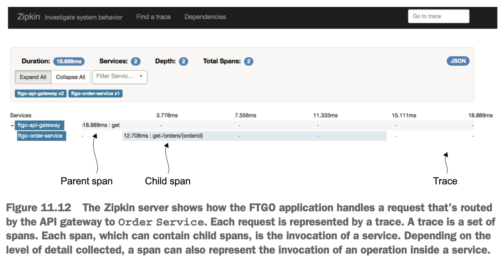

# 11장 프로덕션 레디 서비스 개발

## 이 장에서 다룰 핵심 내용

- 보안 서비스 개발
- 외부화 구성 패턴 적용
- 관측성 패턴 적용
  - 헬스 체크 API
  - 로그 수집
  - 분산 추적
  - 예외 추적
  - 애플리케이션 지표
  - 감사 로깅
- 마이크로서비스 섀시 패턴을 응용한 서비스 개발 단순화

## 11.1 보안 서비스 개발

- 구현해야 할 보안 요소
  - 인증(authentication): 애플리케이션에 접근하는 애플리케이션이나 사람(주체(principal))의 신원을 확인함
  - 인가(authorization): 주체가 어떤 데이터에 어떤 작업을 요청하여 수행할 수 있는 권한이 있는지 확인함
  - 감사(auditing): 보안 이슈 탐지, 컴플라이언스(compliance) 시행, 고객 지원을 위해 주체가 수행하는 작업을 추적함
  - 보안 IPC: 모든 서비스를 드나드는 통신이 TLS를 유지하는 것이 가장 이상적임

### 11.1.1 기존 모놀리식 애플리케이션의 보안

- 사용자 ID/패스워드 자격증명 후 클라이언트에 세션 토큰을 반환, 이후 모든 요청에 세션 토큰을 포함시켜 전송


- 주체의 ID와 역할은 세션에 보관하며, 세션 토큰으로 식별
- 현재 요청을 보낸 사용자 정보는 보안 컨텍스트에 저장


### 11.1.2 마이크로서비스 아키텍처에서의 보안 구현

- 마이크로서비스 아키텍처에서 해당되지 않는 보안 요소
  - 인-메모리 보안 컨텍스트(in-memory security context): 서비스는 메모리를 공유할 수 없으므로 인-메모리 보안 컨텍스트로 사용자 신원을 전달할 수 없음
  - 중앙화 세션(centralized session): 인-메모리 보안 컨텍스트가 의미가 없으므로 인-메모리 세션도 마찬가지

#### API 게이트웨이에서 인증 처리

- 요청을 서비스에 보내기 전에 API 게이트웨이가 요청을 인증
  - 보안 취약점 노출 가능성 감소
  - 복잡한 코드를 서비스에서 감출 수 있음

> 패턴: 액세스 토큰
> </br>API 게이트웨이는 신원, 역할 등 사용자 정보가 담긴 토큰을 자신이 호출하는 서비스에 전달한다.


#### 인가 처리

- 클라이언트가 요청한 작업을 할 수 있도록 허가되었는지 검사
- 서비스가 직접 역할 기반으로 URL과 메서드를 인가하고, ACL로 애그리거트 접근을 관리

#### JWT로 사용자 신원/역할 전달

- 난독화 토큰(opaque token): 보통 UUID를 많이 쓰며, 토큰 수신자가 토큰의 유효성을 검증하고 보안 서비스를 동기 RPC 호출하여 사용자 정보를 조회하기 때문에 성능 및 가용성이 떨어짐
- 투명 토큰(transparent token): JWT가 표준, 두 당사자 간의 사용자 신원/역할 등의 정보를 안전하게 표현하는 표준 수단
  - 사용자 정보, 만료일자 등 각종 메타데이터가 포함된 JSON 객체를 페이로드에 담아 JWT 생성자와 JWT 수신자만 알 수 있는 시크릿으로 서명
  - JWT 토큰이 탈취되어 악용되는 것을 막기 위해 유효 기간이 짧은 토큰을 발급할 수 있음

#### OAuth 2.0 응용

- 인증 서버(Authorization Server): 사용자 인증 및 액세스/리프레시 토큰 획득 API 제공
- 액세스 토큰(Access Token): 리소스 서버 접근을 허가하는 토큰
- 리프레시 토큰(Refresh Token): 클라이언트가 새 액세스 토큰을 얻기 위해 필요한 토큰, 수명은 길지만 취소 가능한(revocable) 토큰
- 리소스 서버(Resource Server): 액세스 토큰으로 접근을 허가하는 서비스
- 클라이언트: 리소스 서버에 접근하려는 클라이언트


- 클라이언트는 기본 인증을 이용하여 자격증명과 함께 요청
- API 게이트웨이는 OAuth 2.0 인증 서버에 패스워드 승인 요청
- 인증 서버는 API 클라이언트의 자격증명을 검증하고 액세스/리프레시 토큰 반환
- API 게이트웨이는 서비스에 요청을 할 때마다 발급받은 액세스 토큰을 넣어 보내고, 서비스는 액세스 토큰을 이용하여 요청을 인증


- 로그인 기반의 클라이언트가 자격증명을 API 게이트웨이에 POST
- API 게이트웨이의 로그인 핸들러는 OAuth 2.0 인증 서버에 패스워드 승인 요청
- 인증 서버는 클라이언트의 자격증명을 검증 후, 액세스/리프레시 토큰 반환
- API 게이트웨이는 인증 서버에서 받은 두 토큰을 클라이언트에 반환
- 클라이언트는 액세스/리프레시 토큰을 API 게이트웨이에 요청할 때마다 실어 보냄
- API 게이트웨이의 세션 인증 인터셉터는 액세스 토큰을 검증 후 서비스에 토큰을 넣어 보냄

## 11.2 구성 가능한 서비스 설계

- 배포 파이프라인을 통해 같은 서비스를 여러 환경에 한 번에 배포할 수 있어야 함(환경마다 다른 프로퍼티 값을 하드 코딩 없이)


> 패턴: 외부화 구성
> </br>런타임에 DB 자격증명, 네트워크 위치 등 구성 프로퍼티 값을 서비스에 제공한다.

- 외부화 구성 메커니즘 모델
  - 푸시 모델(push model): OS 환경 변수, 구성 파일 등을 통해 배포 인프라에서 서비스로 프로퍼티 값을 전달
  - 풀 모델(pull model): 서비스 인스턴스가 구성 서버에 접속해서 프로퍼티 값을 읽어옴

### 11.2.1 푸시 기반의 외부화 구성

- 배포 환경이 서비스 인스턴스가 생성될 때 프로퍼티 값을 제공


- 스프링 부트가 프로퍼티 값을 읽어올 수 있는 소스
  1. CLI 인수
  2. OS 환경 변수 또는 JSON 포맷으로 기술된 JVM 시스템 프로퍼티
  3. JVM 시스템 프로퍼티
  4. OS 환경 변수
  5. 현재 디렉터리의 구성 파일
- 프로퍼티명이 똑같을 경우 번호가 앞선 프로퍼티 값이 우선 적용됨
- 이미 실행 중인 서비스를 재구성하기는 어려움
- 배포 인프라 구조상, 실행 중인 서비스의 외부화 구성을 서비스를 재시동하지 않고서는 바꿀 수 없는 경우가 있음

### 11.2.2 풀 기반의 외부화 구성

- 서비스 인스턴스가 시동 시 자신이 필요한 값을 구성 전용 서버에 접속하여 읽는 방식
- 구성 서버 접속에 필요한 프로퍼티 값은 환경 변수 등의 푸시 구성 메커니즘을 통해 서비스 인스턴스에 제공
- 구성 서버 구현 방법
  - 버전 관리 시스템(예: 깃, SVN)
  - SQL/NoSQL DB
  - 전용 구성 서버(예: 스프링 클라우드 컨피그 서버), 자격증명 등 민감한 데이터를 보관하는 해시코프 볼트, AWS 파라미터 스토어


- 구성 서버의 장점
  - 중앙화 구성(centralized configuration): 모든 구성 프로퍼티를 한곳에서 관리하면 간편하고, 전역 기본값을 정의해서 서비스 단위로 재정의하는 식으로 중복 구성 프로퍼티를 제거할 수 있음
  - 민감한 데이터의 투명한 복호화(transparent decryption): DB 자격증명 등 민감한 데이터는 암호화를 하는 것이 최선인데, 암호화한 데이터를 서비스 인스턴스에서 복호화하려면 암호화 키가 필요하지만, 구성 서버는 프로퍼티를 자동 복호화해서 서비스에 전달함
  - 동적 재구성(dynamic reconfiguration): 수정된 프로퍼티 값을 폴링 등으로 감지해서 자동 재구성함

## 11.3 관측 가능한 서비스 설계

- 관측 가능한 서비스 설계 패턴
  - 헬스 체크(health check) API: 서비스 헬스를 반환하는 끝점을 표출
  - 로그 수집(log aggregation): 서비스 활동을 로깅하면서 검색/경고 기능이 구현된 중앙 로그 서버에 로그를 출력함
  - 분산 추적(distributed tracing): 각 외부 요청에 ID를 하나씩 붙여 서비스 사이를 드나드는 과정을 추적함
  - 예외 추적(exception tracking): 예외 중복 제거, 개발자 알림, 예외별 해결 상황 추적 등을 수행하는 예외 추적 서비스에 예외를 보고함
  - 애플리케이션 지표(application metric): 서비스는 카운터, 게이지 등 지표를 유지하고, 수집한 데이터를 지표 서버에 표출함
  - 감사 로깅(audit logging): 사용자 액션을 로깅함


### 11.3.1 헬스 체크 API 패턴

> 패턴: 헬스 체크 API
> </br>서비스는 서비스 상태를 반환하는 GET /heath 등의 헬스 체크 API 끝점을 표출한다.

- 배포 인프라가 호출 가능한 헬스 체크 끝점을 서비스에 구현(스프링 부터 액추에이터 등)
- 배포 인프라는 주기적으로 헬스 체크 끝점을 호출함


#### 헬스 체크 끝점 구현

- 스프링 부트 액추에이터는 /actuator/health 끝점을 호출하면 헬스 체크 실행 결과를 반환함
- HealthIndicator 인터페이스를 구현한 클래스를 정의해서 직접 헬스 체크 기능을 서비스에 구현할 수 있음

#### 헬스 체크 끝점 호출

- 서비스를 배포할 때 배포 인프라가 헬스 체크 끝점을 호출하도록 구성

### 11.3.2 로그 수집 패턴

> 패턴: 로그 수집
> </br>전체 서비스 로그를 중앙 DB에 수집하여 검색/알림 기능을 제공한다.

- 모든 서비스 인스턴스가 남긴 로그를 로그 수집 파이프라인을 통해 중앙 로깅 서버로 보냄


#### 서비스 로그 생성

- 적합한 로깅 라이브러리를 선택한 후, 로그를 남길 장소를 결정, 출력 결과를 갖고 뭘 할지는 배포 인프라가 결정

#### 로그 수집 인프라

- ELK 스택 구성
  - 일래스틱서치(Elasticsearch): 로깅 서버로 쓰이는 텍스트 검색 지향 NoSQL DB
  - 로그스태시(Logstash): 서비스 로그를 수집하여 일래스틱서치에 출력하는 로그 파이프라인
  - 키바나(Kibana): 일래스틱서치 전용 시각화 툴

### 11.3.3

> 패턴: 분산 추적
> </br>외부 요청마다 유일한 ID를 하나씩 부여해서 한 서비스에서 다음 서비스로 흘러가는 과정을 기록하고, 시각화/분석 기능을 제공하는 중앙화 서버에 자료를 남긴다.

- 요청을 처리할 때마다 서비스 호출 트리 정보(예: 시작 시간, 종료 시간 등)를 기록



- 외부 요청을 나타내는 트레이스는 하나 이상의 스팬(span)으로 구성됨
- 스팬은 작업을 나타내며, 작업명, 시작/종료 타임스탬프가 주요 속성
- 중첩된 작업은 하나 이상의 자식 스팬으로 나타낼 수 있음
- 각 외부 요청마다 부여되는 ID로 쉽게 추적 가능
- 분산 추적은 각 서비스에 쓰이는 인스트루멘테이션 라이브러리(instrumentation library)와 분산 추적 서버로 구성됨
  - 인스트루멘테이션 라이브러리: 트레이스와 스팬을 관리, 트래이스 ID, 부모 스팬 ID 등의 추적 정보를 아웃바운드 요청에 추가하고 분산 추적 서버에 트레이스를 보고함(X-B3-TraceId, X-B3-ParentSpanId 같은 헤더 사용)
  - 분산 추적 서버: 트레이스를 저장하고 UI로 시각화하여 표시하는 기능 제공


#### 인스트루멘테이션 라이브러리

- 스팬 트리를 만들어 분산 추적 서버로 보냄
- 인터셉터나 애스팩트 지향 프로그래밍(AOP) 사용
- 스프링 클라우드 슬루스(Spring Cloud Sleuth)는 AOP 메커니즘을 이용하여 분산 추적 기능을 서비스에 자동 연계함

#### 분산 추적 서버

- 인스트루멘테이션 라이브러리를 통해 전달받은 스팬을 서로 짜집기해서 완전한 트래이스 형태로 만든 후 DB에 저장함(예: Open Zipkin)

### 11.3.4 애플리케이션 지표 패턴

> 패턴: 애플리케이션 지표
> </br>서비스는 수집, 시각화, 알림 기능을 제공하는 중앙 서버로 지표를 보고한다.


- 지표 샘플의 세 가지 속성
  - name: 지표명(예: jvm_memory_max_bytes, placed_orders)
  - value: 수치 값
  - timestamp: 샘플링 시간
- 디멘션(dimension)이라는 임의의 이름-값 쌍을 지원하는 모니터링 시스템도 있음
  - 예: jvm_memory_max_bytes를 area="heap", id="PS Eden Space"와 area="heap", id="PS Old Gen" 같은 디멘션과 함께 보고

#### 서비스 수준의 지표 수집

- 마이크로미터 메트릭스(Micrometer Metric) 라이브러리
  - 기본 지표(예: JVM) 수집 가능
  - 특정한 지표를 수집하고 싶다면 마이크로미터 메트릭스 API를 직접 호출하는 코드를 서비스에 작성하면 됨

```java
public class OrderService {

  @Autowired
  private MeterRegistry meterRegistry;  // The Micrometer Metrics library API for managing application-specific meters

  public Order createOrder(...) {
    ...
    meterRegistry.counter("placed_orders").increment(); // Increments the placedOrders counter when an order has successfully been placed
    return order;
  }

  public void approveOrder(long orderId) {
    ...
    meterRegistry.counter("approved_orders").increment(); // Increments the approvedOrders counter when an order has been approved
  }

  public void rejectOrder(long orderId) {
    ...
    meterRegistry.counter("rejected_orders").increment(); // Increments the rejectedOrders counter when an order has been rejected
  }
```

#### 지표 서비스에 지표 전달

- 서비스는 수집한 지표를 푸시(push) 또는 풀(pull) 방식으로 메트릭스 서비스에 전달
  - 푸시 모델: 서비스 인스턴스가 API를 호출하여 메트릭스 서비스에 지표를 밀어 넣는 방법(예: AWS 클라우드워치)
  - 풀 모델: 메트릭스 서비스(또는 로컬에서 실행되는 에이전트)가 서비스 API를 호출하여 서비스 인스턴스에서 지표를 당겨 오는 방법(예: 프로메테우스)
- 스프링 부트에서 GET /actuator/prometheus를 호출하면 프로메테우스가 기대한 포맷으로 지표를 가져올 수 있음
- 프로메테우스 서버는 주기적으로 끝점을 폴링하여 지표를 가져오고, 그라파나로 조회할 수 있음

### 11.3.5 예외 추적 패턴

> 패턴: 예외 추적
> </br>서비스는 중복된 예외를 제거하고, 알림을 생성하고, 예외 해결 과정을 관리하는 중앙 서비스에 예외를 보고한다.

- 서비스에 예외가 발생하면 무조건 (REST API 등으로) 예외 추적 서비스에 보고하도록 구성
- 예외 추적 서비스에 내장된 클라이언트 라이브러리를 활용하는 것이 좋음


### 11.3.6 감사 로깅 패턴

> 패턴: 감사 로깅
> </br>고객 지원, 컴플라이언스 준수, 수상한 동작 감지를 위해 사용자 액션을 DB에 저장한다.

#### 감사 로깅 코드를 비즈니스 로직에 추가

- 서비스 메서드마다 감사 로그 항목을 생성하고 DB에 저장
- 비즈니스 로직과 섞여 관리가 쉽지 않고, 개발자가 직접 작성하기 때문에 에러의 위험이 있음

#### 애스팩트 지향 프로그래밍 활용

- AOP를 응용해서 각 서비스 메서드의 호출을 자동 인터셉트하는 어드바이스를 구성해서 감사 로그 항목을 저장
- 어떤 비즈니스 객체를 대상으로 액션이 이루어지는지 판단하거나 비즈니스 지향적인 감사 로그 항목을 만들기는 어려움

#### 이벤트 소싱 이용

- 이벤트 소싱을 이용하여 사용자 신원을 각각의 이벤트에 기록
- 쿼리는 기록하지 않기 때문에 별도 로그 항목으로 남겨야 할 경우 다른 방법 필요

## 11.4 서비스 개발: 마이크로서비스 섀시 패턴

> 패턴: 마이크로서비스 섀시
> </br>예외 추적, 로깅, 헬스 체크, 외부화 구성, 분산 추적 등의 횡단 관심사를 처리하는 프레임워크(들)를 기반으로 서비스를 구축한다.

- 횡단 관심사 처리에 특화된 프레임워크(들)로 횡단 관심사를 처리하는 코드를 서비스에 작성할 일이 거의 없음


### 11.4.1 마이크로서비스 섀시

- 마이크로서비스 섀시 프레임워크가 처리하는 관심사
  - 외부화 구성
  - 헬스 체크
  - 애플리케이션 지표
  - 서비스 디스커버리
  - 회로 차단기
  - 분산 추적

### 11.4.2 이제는 서비스 메시로

> 패턴: 서비스 메시
> </br>회로 차단기, 분산 추적, 서비스 디스커버리, 부하 분산, 룰 기반 트래픽 라우팅 등 다양한 관심사가 구현된 네트워킹 계층을 통해 서비스를 드나드는 모든 네트워크 트래픽을 라우팅한다.

- 서비스 메시
  - 한 서비스와 다른 서비스, 그리고 외부 애플리케이션 간의 소통을 조정하는 인프라
  - 서비스를 드나드는 네트워크 트래픽은 모두 회로 차단기, 분산 추적, 서비스 디스커버리, 부하 분산, 룰 기반 트래픽 라우팅 등 다양한 관심사가 구현된 서비스 메시를 통과
  - TLS 기반의 IPC로 서비스 간 IPC를 보안


> **서비스 메시의 현재 상태**
> </br>서비스 메시를 구현한 제품
> </br>- 이스티오(Istio)
> </br>- 링커드(Linkerd)
> </br>- 콘듀이트(Conduit)

## 11.5 마치며

- 서비스는 안전하고 구성 가능하며 관측 가능해야 함
- 일반적으로 API 게이트웨이에서 클라이언트를 인증, 서비스를 요청할 때마다 투명 토큰을 같이 보냄, OAuth 2.0은 보안을 구현하기에 좋은 수단
- 서비스 실행 환경마다 프로퍼티가 다르기 때문에 외부화 구성 패턴을 적용, 푸쉬/풀 모델이 있음
- 운영자는 관측성 인프라를 담당하고, 개발자는 관측 가능하도록 보장해야 함
- 개발 단순화/가속화를 위해서 마이크로서비스 섀시 기반으로 개발하는 것이 좋음

## 궁금했던 점 정리

- JWT 유효성 검사 방법
  - key-uri
    - GET https://apigateway.dev1.meshdev.io/uaa/oauth/token_key
  - jwk-set
    - GET https://apigateway.dev1.meshdev.io/uaa/.well-known/jwks.json
  - token-info-uri
    - POST https://apigateway.dev1.meshdev.io/uaa/oauth/check_token
- MSA 섀시 패턴
  - 보안 설정, 로깅 설정, 추적 패턴 등 새로운 애플리케이션 개발 시 초기에 필요함
  - 표준화시키고 애플리케이션을 빨리 개발할 수 있는 패턴
- 서비스 메시
  - 대부분(보안 설정, 로깅 설정, 추적 패턴 등)을 자동화하여 지원하는 것이라고 생각하면 됨