# 12장 마이크로서비스 배포

## 이 장에서 다룰 핵심 내용

- 4대 주요 배포 패턴의 작동 원리와 장단점
  - 언어별 패키징 포맷
  - 서비스를 가상 머신으로 배포
  - 서비스를 컨테이너로 배포
  - 서버리스 배포
- 쿠버네티스를 이용한 서비스 배포
- 서비스 메시를 이용한 배포와 릴리스를 구분
- AWS 람다를 이용한 서비스 배포
- 배포 패턴 선정


- 배포는 프로세스와 아키텍처 두 상호 연관된 개념의 조합
- 배포 프로세스는 소프트웨어를 프로덕션에 반영하기 위해 사람(개발/운영자)이 해야 하는 단계들로 구성됨
- 배포 아키텍처는 소프트웨어가 실행되는 환경의 구성을 정의함

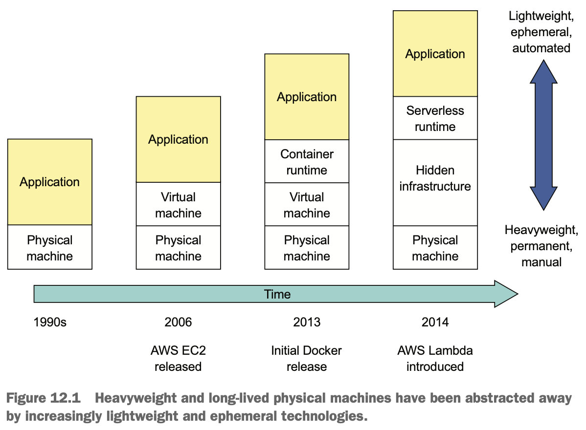

- 오늘날 가상 머신은 기본적으로 불변(immutable)
- 반려동물이 아닌 언제든지 처분 가능한 소처럼 취급
- 재구성(reconfiguration)을 하기보다는 폐기 후 재생성

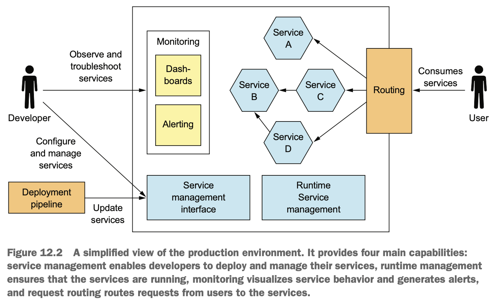

- 개발자는 서비스를 구성/관리하고, 배포 파이프라인은 새 버전의 서비스를 배포하고, 사용자는 구현된 서비스의 기능에 접근할 수 있음
- 프로덕션 환경의 4대 필수 기능
  - 서비스 관리 인터페이스(service management interface)
    - 개발자가 서비스를 생성, 수정, 구성할 수 있는 인터페이스를 제공
    - CLI이나 GUI 배포 툴에서 호출하는 REST API가 가장 좋음
  - 런타임 서비스 관리(runtime service management)
    - 서비스 인스턴스가 항상 적정한 개수만큼 실행되도록 함
    - 서비스 인스턴스가 깨지거나 요청을 처리할 수 없을 때, 프로덕션 환경은 해당 인스턴스를 재시동해야 함
    - 머신 자체가 깨질 경우, 서비스 인스턴스를 다른 머신에서 재시동해야 함
  - 모니터링(monitoring)
    - 서비스가 무슨 일을 하고 있는지, 로그 파일 및 지표를 개발자가 관찰할 수 있게 함
    - 프로덕션 환경은 문제가 있으면 지체 없이 개발자에게 알려야 함
  - 요청 라우팅(request routing)
    - 사용자 요청을 서비스로 보냄
- 네 가지 주요 배포 옵션
  - 언어에 특정한 패키지(예: JAR/WAR 파일)로 서비스를 배포
  - 서비스를 가상 머신으로 배포: 서비스를 가상 머신 이미지로 묶어 배포하는 방식, 서비스의 기술 스택을 캡슐화할 수 있음
  - 서비스를 컨테이너로 배포: 컨테이너는 가상 머신보다 가벼움, 도커 오케스트레이션 프레임워크인 쿠버네티스를 이용하여 배포
  - 서비스를 서버리스 배포 기술로 배포: AWS 람다로 배포

## 12.1 서비스 배포: 언어에 특정한 패키징 포맷 패턴

> 패턴: 언어에 특정한 패키징 포맷
> </br>언어에 특정한 패키지 형태로 프로덕션에 배포한다.

- 서비스를 프로덕션에 자동 배포하는 배포 파이프라인을 구축하는 것이 가장 이상적
- 패키지 파일을 빌드하고, 프로덕션 환경의 서비스 관리 인터페이스를 호출해서 새 버전의 서비스를 배포함

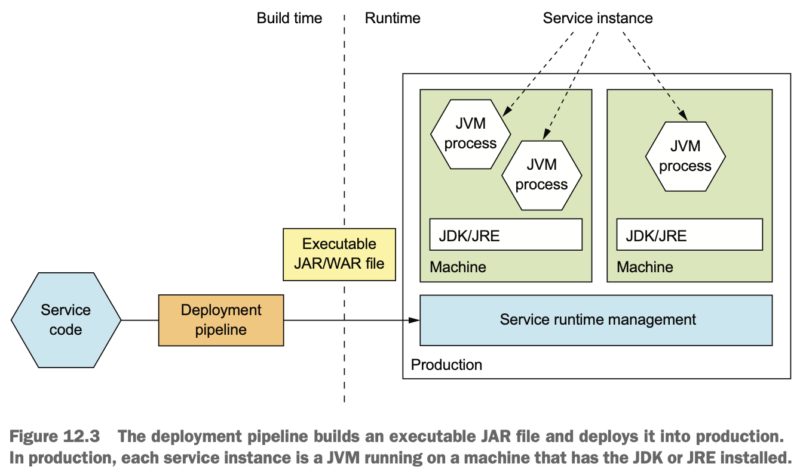

- 서비스 인스턴스는 대부분 단일 프로세스이지만, 여러 프로세스로 구성할 때도 있음
- 머신 하나에 여러 JVM을 띄워 놓고, JVM당 하나의 서비스 인스턴스를 가동시킬 수도 있음

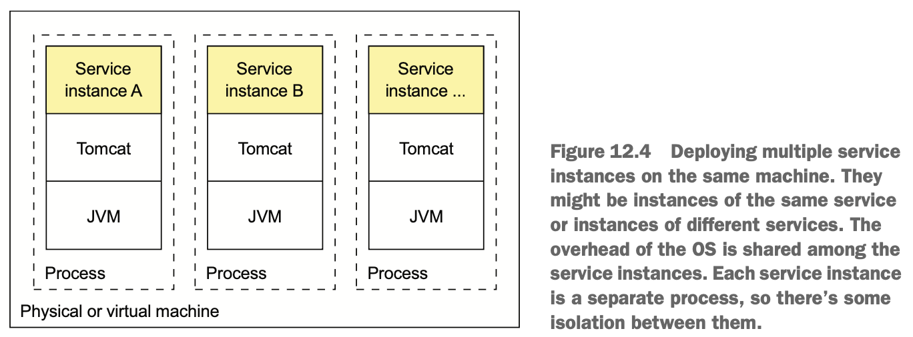

- 단일 프로세스에 여러 서비스 인스턴스를 실행하는 경우도 있음

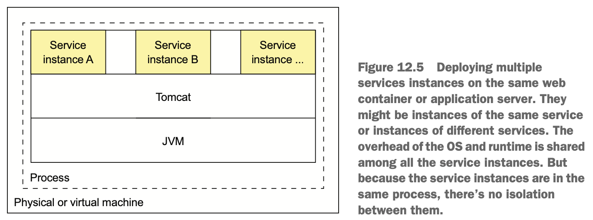

### 12.1.1 언어에 특정한 패키징 포맷 패턴의 장점

- 배포가 빠름
- 리소스를 효율적으로 활용할 수 있음(특히 같은 머신이나 같은 프로세스 내에서 여러 인스턴스를 실행할 때)

#### 배포가 빠르다

- 호스트에 서비스를 복사해서 그냥 시동하면 되기 때문에 서비스 인스턴스를 배포하는 속도가 가장 빠름
- 오버헤드가 없어서 서비스가 빨리 시동되는 편

#### 리소스를 효율적으로 활용할 수 있다

- 서비스 인스턴스가 머신과 OS를 공유하므로 리소스를 효율적으로 활용할 수 있음
- 여러 서비스 인스턴스가 같은 프로세스에서 실행되면(예: 여러 웹 애플리케이션이 같은 아파치 톰캣 서버와 JVM을 공유) 훨씬 더 효율적

### 12.1.2 언어에 특정한 패키징 포맷 패턴의 단점

- 기술 스택을 캡슐화할 수 없음
- 서비스 인스턴스가 소비하는 리소스를 제한할 방법이 없음
- 여러 서비스 인스턴스가 동일 머신에서 실행될 경우 서로 격리할 수 없음
- 서비스 인스턴스를 어디에 둘지 자동으로 결정하기 어려움

#### 기술 스택을 캡슐화할 수 없다

- 서비스별로 런타임 버전이 정해져 있고(예: 자바 웹 애플리케이션은 실행 가능한 아파치 톰캣, JDK 버전이 정해져 있음), 필요한 소프트웨어 패키지 버전이 상이할 수 있으므로 정확히 구분해서 설치해야 함

#### 서비스 인스턴스가 소비하는 리소스를 제한할 방법이 없다

- 리소스를 제한할 방법이 없어 한 프로세스가 전체 CPU/메모리를 다 소모하면 다른 서비스 인스턴스와 OS 리소스는 부족할 수 있음

#### 여러 서비스 인스턴스가 동일 머신에서 실행될 경우 서로 격리할 수 없다

- 여러 인스턴스를 서로 격리할 수 없어 어느 서비스 인스턴스가 오작동하면 다른 서비스 인스턴스에도 영향을 끼칠 수 있음

#### 서비스 인스턴스를 어디에 둘지 자동으로 결정하기 어렵다

- CPU, 메모리 등 리소스는 한정되어 있고 각 서비스 인스턴스는 일정량의 리소스가 필요하기 때문에 머신을 효율적으로 활용하는 방향으로 인스턴스를 배정해야 함

## 12.2 서비스 배포: 가상 머신 패턴

> 패턴: 서비스를 VM으로 배포
> </br>서비스를 VM 이미지로 묶어 프로덕션에 배포한다. 각 서비스 인스턴스가 하나의 VM이다.

- 서비스를 AMI(Amazon Machine Image)로 묶어 배포
- 각 서비스 인스턴스는 AMI로부터 생성된 EC2 인스턴스이며, AWS 오토 스케일링(Auto Scaling) 그룹으로 관리함
- 서비스의 배포 파이프라인은 VM 이미지 빌더를 실행해서 서비스 코드 및 소프트웨어 실행에 필요한 각종 라이브러리가 포함된 VM 이미지를 생성함
- VM 이미지 빌더는 리눅스 init 시스템(예: upstart)을 이용하여 VM 부팅 시 애플리케이션이 실행되도록 VM 이미지 머신을 구성함

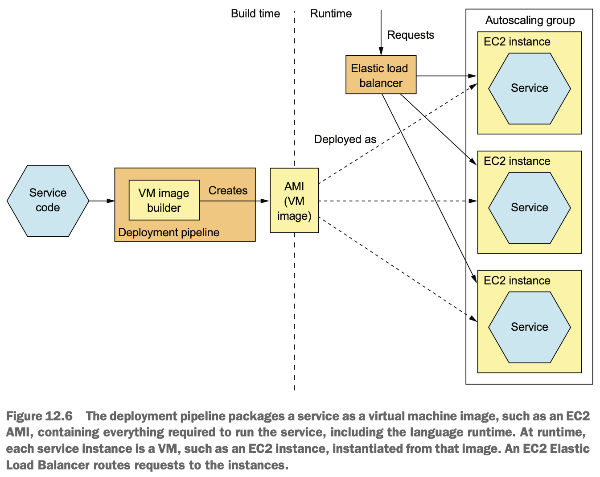

> **일래스틱 빈스토크**
> </br>일래스틱 빈스토크는 실행 코드를 WAR 파일로 묶어 업로드하면, 서비스를 부하 분산된 하나 이상의 매니지드(managed) EC2 인스턴스로 배포함
> </br>애플리케이션을 VM으로 배포하지만 AMI를 빌드하는 것이 아니라, 시동 시 애플리케이션을 설치하는 기초 이미지를 사용함
> </br>도커 컨테이너로도 배포할 수 있으며, 각 EC2 인스턴스는 하나 이상의 컨테이너를 실행함
> </br>도커 오케스트레이션 프레임워크와 달리, 확장 단위는 컨테이너가 아니라 EC2 인스턴스임

### 12.2.1 가상 머신 패턴의 장점

- VM 이미지로 기술 스택을 캡슐화함
- 서비스 인스턴스가 격리됨
- 성숙한 클라우드 인프라를 활용함

#### VM 이미지로 기술 스택을 캡슐화한다

- 서비스와 연관된 디펜던시를 모두 VM 이미지에 담을 수 있음
- VM 이미지는 따로 수정할 필요 없이 어디라도 배포할 수 있으며, 서비스 배포 API가 곧 VM 관리 API라서 더 간단하고 확실하게 배포할 수 있음

#### 서비스 인스턴스가 격리된다

- 각 서비스 인스턴스가 서로 완전히 떨어져 동작함
- 정해진 CPU/메모리 리소스가 가상 머신마다 배정되므로 다른 서비스에 있는 리소스를 빼앗아 올 수 없음

#### 성숙한 클라우드 인프라를 활용한다

- 고도로 자동화한 클라우드 인프라를 활용할 수 있음(VM 스케줄링, VM 간 부하 분산, 자동 확장 등)

### 12.2.2 가상 머신 패턴의 단점

- 리소스를 효율적으로 활용할 수 없음
- 배포가 비교적 느림
- 시스템 관리 오버헤드가 발생함

#### 리소스를 효율적으로 활용할 수 없다

- 서비스 인스턴스마다 OS를 포함한 전체 가상 머신의 오버헤드가 있음
- 퍼블릭 IaaS 가상 머신은 대부분 VM 크기가 한정되어 있어 활용하기 어려움

#### 배포가 비교적 느리다

- VM 이미지는 대부분 크기가 커서 빌드 시간이 몇 분 정도 걸리고 네트워크를 통해 이동하는 데이터양도 많음
- VM 이미지에서 VM 인스턴스를 생성할 때 다소 시간이 걸림

#### 시스템 관리 오버헤드가 발생한다.

- OS/런타임 패치를 해야 함

## 12.3 서비스 배포: 컨테이너 패턴

> 패턴: 서비스를 컨테이너로 배포
> </br>서비스를 컨테이너 이미지로 묶어 프로덕션에 배포한다. 각 서비스 인스턴스가 곧 하나의 컨테이너다.

- OS 수준에서 가상화한 메커니즘
- 컨테이너는 다른 컨테이너들과 격리된 샌드박스에서 하나(때로 여러 개)의 프로세스로 실행됨
- 컨테이너는 자체 머신에서 실행되는 것처럼 실행됨
- 고유한 IP 주소를 갖고 있으므로 포트 충돌 가능성이 없으며, 컨테이너마다 자체 루트 파일 시스템을 갖고 있음
- 컨테이너 런타임은 OS 메커니즘을 이용하여 컨테이너를 서로 격리시킴

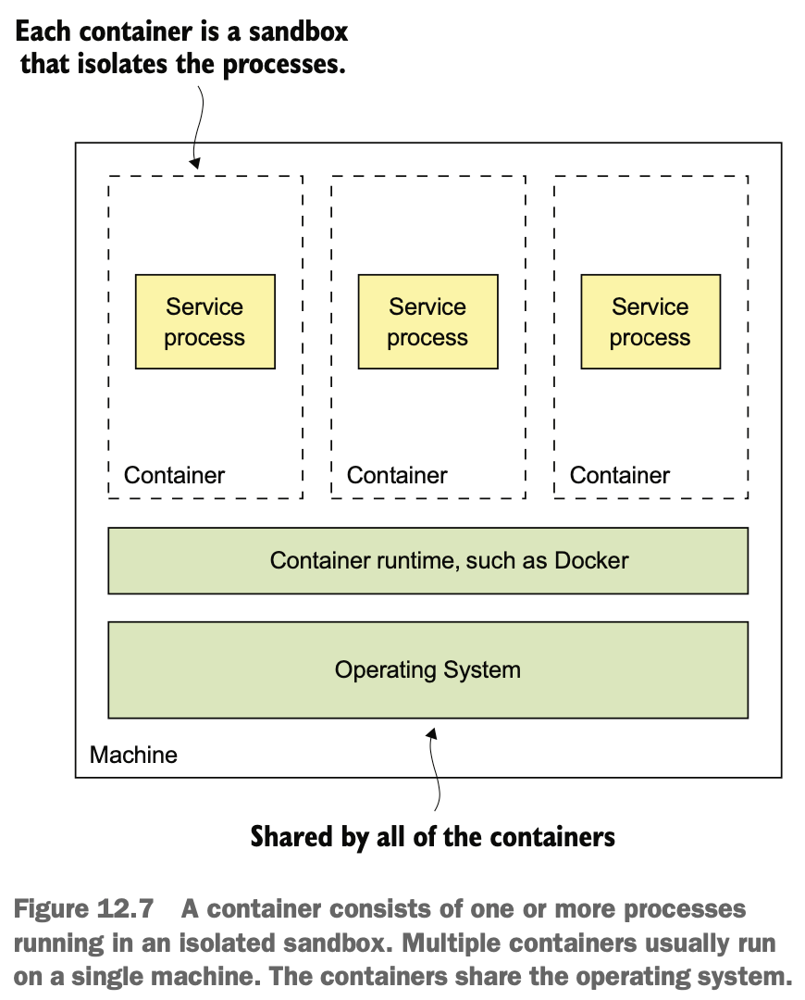

- 컨테이너 생성 시 CPU, 메모리, I/O 리소스를 지정할 수 있음
- 컨테이너 런타임은 컨테이너가 지정된 임계치를 초과하여 머신 리소스를 사용하지 않도록 감시함

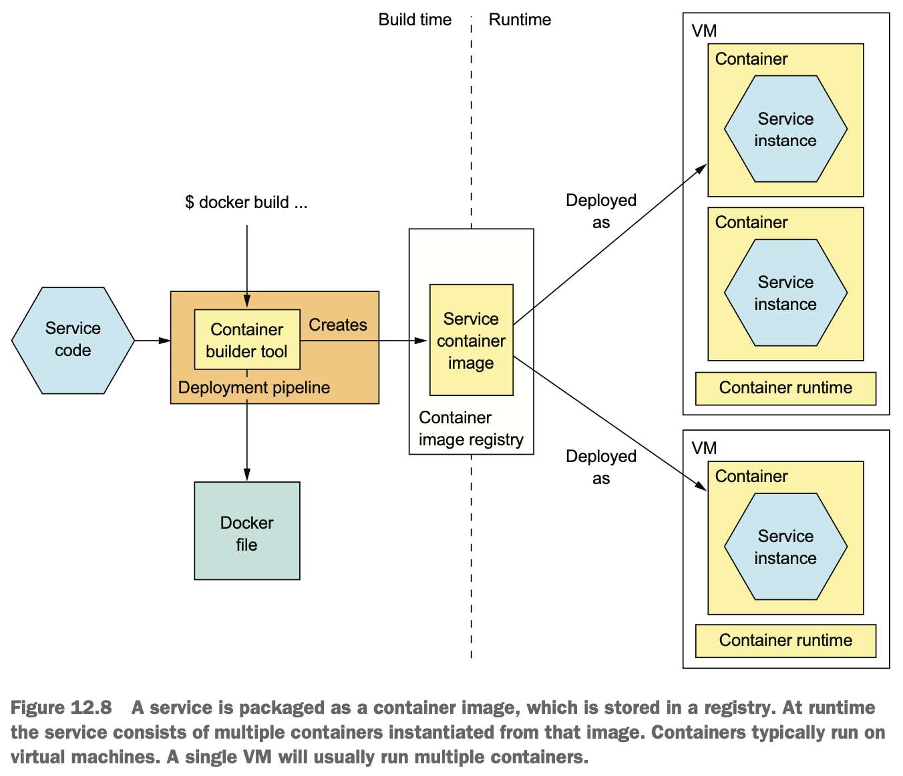

- 배포 파이프라인은 빌드 타임에 컨테이너 이미지 빌드 툴로 서비스 코드 및 이미지 디스크립션을 읽고 컨테이너 이미지를 생성한 후 레지스트리에 보관함
- 런타임에는 레지스트리에서 컨테이너 이미지를 당겨 와 컨테이너를 생성함

### 12.3.1 서비스를 도커로 배포

- 서비스를 컨테이너로 배포하려면 반드시 컨테이너 이미지로 묶어야 함
  - 컨테이너 이미지는 애플리케이션과 서비스 구동에 필요한 모든 소프트웨어로 구성된 파일 시스템 이미지

#### 도커 이미지 빌드

- 도커 컨테이너 이미지를 빌드하는 방법이 기술된 도커파일(Dockerfile) 생성
- 기초 컨테이너 이미지 지정, 소프트웨어 설치 및 컨테이너 구성에 관한 커맨드 나열, 컨테이너 생성 시 실행할 셸 커맨드 기재

```dockerfile
# The base image
FROM openjdk:8u171-jre-alpine
# Install curl for use by the health check.
RUN apk --no-cache add curl
# Configure Docker to run java -jar .. when the container is started.
CMD java ${JAVA_OPTS} -jar ftgo-restaurant-service.jar
HEALTHCHECK --start-period=30s --
     # Configure Docker to invoke the health check endpoint.
     interval=5s CMD curl http://localhost:8080/actuator/health || exit 1
# Copies the JAR in Gradle’s build directory into the image
COPY build/libs/ftgo-restaurant-service.jar .
```

- 도커 파일이 준비되면 이미지를 빌드 할 수 있음

```shell
cd ftgo-restaurant-service  # Change to the service’s directory.
../gradlew assemble # Build the service’s JAR.
docker build -t ftgo-restaurant-service . # Build the image.
```

- -t: 이미지명
- .: 컨텍스트, 도커파일 및 이미지를 빌드하기 위해 사용되는 파일들로 구성됨
- build 커맨드로 도커 데몬에 컨텍스트를 업로드하면 도커 데몬이 이미지를 빌드함

#### 도커 이미지를 레지스트리에 푸시

- 빌드된 도커 이미지를 레지스트리에 푸시
  - tag 커맨드로 이미지 앞에 호스트명과 레지스트리 포트(옵션) 설정
  ```shell
  docker tag ftgo-restaurant-service registry.acme.com/ftgo-restaurant-service:1.0.0.RELEASE
  ```
  - 도커 push 커맨드로 태그를 붙인 이미지를 레지스트리에 업로드
  ```shell
  docker push registry.acme.com/ftgo-restaurant-service:1.0.0.RELEASE
  ```

#### 도커 컨테이너 실행

- 컨테이너 인프라는 이미지를 레지스트리에서 프로덕션 서버로 당겨 오고, 이 이미지로부터 컨테이너를 만듦

```shell
docker run \
  # Runs it as a background daemon
  -d  \
  # The name of the container
  --name ftgo-restaurant-service  \
  # Binds port 8080 of the container to port 8082 of the host machine
  -p 8082:8080  \
  # Environment variables
  -e SPRING_DATASOURCE_URL=... -e SPRING_DATASOURCE_USERNAME=...  \
  -e SPRING_DATASOURCE_PASSWORD=... \
  # Image to run
  registry.acme.com/ftgo-restaurant-service:1.0.0.RELEASE
```

- run 커맨드는 필요 시 레지스트리에서 이미지를 당겨 오고, 컨테이너가 생성/시동되면 도커파일에 지정된 java -jar 커맨드가 실행됨
- run 커맨드의 문제
  - 단일 머신에서 실행되는 컨테이너를 생성하므로 서비스를 확실하게 배포할 수 있는 방법이 아님
  - 대부분 홀로 존재하는 서비스가 드물기 때문에, 디펜던시(DB, 메시지 브로커 등)까지 한 단위로 묶어 배포/배포해제 하는 것이 좋음
- 도커 컴포즈(Docker Compose)
  - 컨테이너를 YAML 파일에 선언적으로 정의할 수 있게 해주는 툴
  - 여러 컨테이너를 하나의 그룹으로 묶어 시동/중지할 수 있음
  - 다양한 외부화 구성 프로퍼티를 YAML 파일에 간편하게 지정할 수 있음
  - run 커맨드와 마찬가지로 단일 머신에 국한됨

### 12.3.2 컨테이너 패턴의 장점

- 기술 스택의 캡슐화, 서비스 관리 API가 곧 컨테이너 API
- 서비스 인스턴스가 격리됨
- 서비스 인스턴스의 리소스를 제한할 수 있음

### 12.3.3 컨테이너 패턴의 단점

- 이미지를 직접 관리해야 하는 부담이 있음
- OS와 런타임 패치를 정기적으로 해주어야 함
- 컨테이너 솔루션을 호스팅해서 쓰지 않는 한, 컨테이너 인프라 및 실행 기반인 VM 인프라를 직접 관리해야 함

## 12.4 FTGO 애플리케이션 배포: 쿠버네티스

- 도커 오케스트레이션 프레임워크
- 도커를 기반으로 여러 머신을 하나의 서비스 실행 리소스 풀로 전환하는 소프트웨어 계층
- 서비스 인스턴스나 머신이 깨지더라도 항상 서비스 인스턴스별 개수가 원하는 만큼 실행되도록 유지함

### 12.4.1 쿠버네티스 개요

- 도커가 실행되는 여러 머신을 하나의 리소스 풀로 취급하는 도커 오케스트레이션 프레임워크
- 도커 오케스트레이션 프레임워크의 주요 기능
  - 리소스 관리: 여러 머신을 CPU, 메모리, 스토리지 볼륨을 묶어 놓은 하나의 리소스 풀로 취급함
  - 스케줄링: 컨테이너의 리소스 요건 및 노드별 리소스 상황에 따라 컨테이너를 실행할 머신을 선택, 유사성을 찾아내 여러 컨테이너를 같은 노드에 배치하거나, 반유사성을 발견하여 컨테이너를 다른 노드에 옮김
  - 서비스 관리: 마이크로서비스에 직접 매핑되는 서비스를 명명하고 버저닝함, 정상 인스턴스를 항상 적정 개수만큼 가동시키고 요청 부하를 인스턴스에 고루 분산함

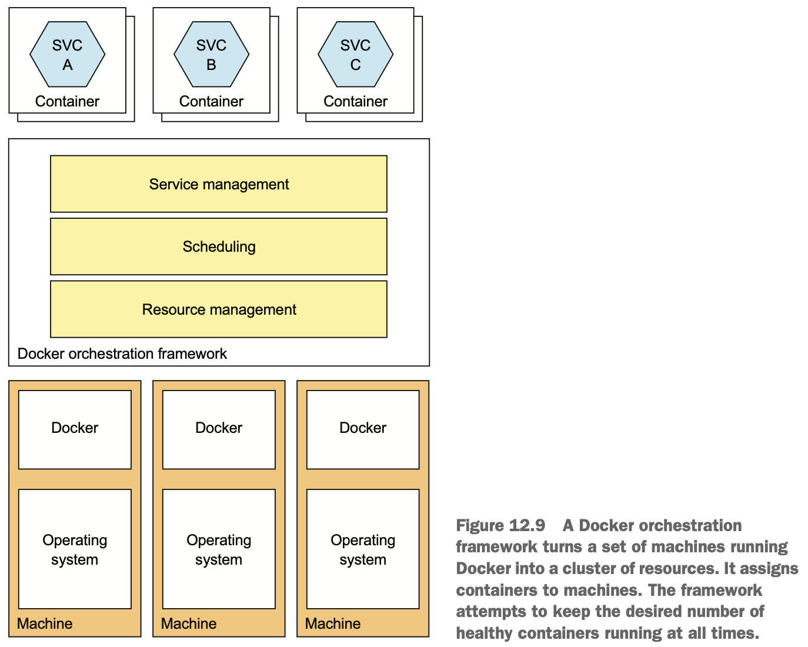

#### 쿠버네티스 아키텍처

- 쿠버네티스는 머신 클러스터에서 실행되며, 클러스터의 머신은 마스터, 노드 둘 중 하나
- 클러스터는 대부분 소수의(보통 하나의) 마스터와 하나 이상의 노드로 구성
- 마스터는 클러스터를 관장, 노드는 하나 이상의 파드를 실행시키는 워커
  - 파드: 여러 컨테이너로 구성된 쿠버네티스의 배포 단위
- 마스터가 실행하는 컴포넌트
  - API 서버: kubectl CLI에서 사용하는 서비스 배포/관리용 REST API
  - etcd: 클러스터 데이터를 저장하는 키-값 NoSQL DB
  - 스케줄러: 파드를 실행할 노드 선택
  - 컨트롤러 관리자: 컨트롤러를 실행, 클러스터가 원하는 상태가 되도록 제어

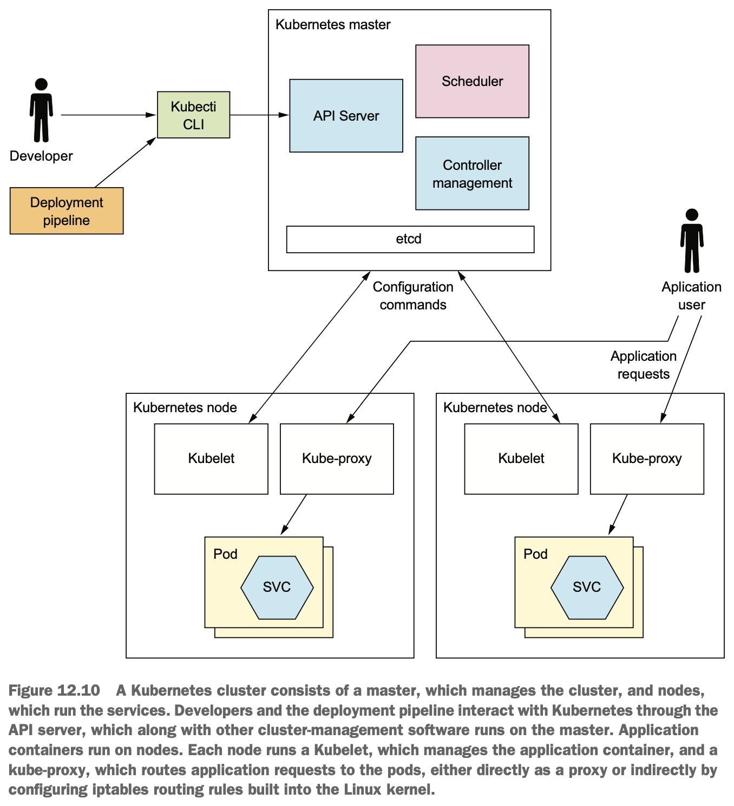

- 노드가 실행하는 컴포넌트
  - 큐블릿(kubelet): 노드에서 실행되는 파드를 생성/관리
  - 큐브 프록시(kube-proxy): 여러 파드에 부하를 분산하는 등 네트워킹 관리를 함
  - 파드: 애플리케이션 서비스

#### 쿠버네티스 핵심 개념

- 파드(pod)
  - 쿠버네티스의 기본 배포 단위
  - IP 주소, 스토리지 볼륨을 공유하는 하나 이상의 컨테이너로 구성
  - 보통 하나의 컨테이너로 구성하지만 지원 기능이 구현된 사이드카 컨테이너가 하나 이상 포함된 경우도 있음
  - 파드의 컨테이너와 파드가 실행하는 노드, 둘 중 하나는 언제라도 깨질 수 있기 때문에 일시적(ephemeral)임
- 디플로이먼트(deployment)
  - 파드의 선언형 명세
  - 파드 인스턴스를 원하는 개수만큼 실행시키는 컨트롤러
  - 롤링 업데이트/롤백 기능이 탑재된 버저닝 지원
- 서비스(service)
  - 클라이언트에 안정된 정적 네트워크 위치를 제공
  - IP 주소와 이 주소로 해석되는 DNS명이 할당된 서비스는 TCP/UDP 트래픽을 하나 이상의 파드에 고루 분산함
- 컨피그맵(ConfigMap)
  - 하나 이상의 애플리케이션 서비스에 대한 외부화 구성이 정의된 이름-값 쌍의 컬렉션
  - 파드 컨테이너의 데피니션은 컨테이너 환경 변수를 정의하기 위해 컨피그맵을 참조함

### 12.4.2 쿠버네티스 배포: 음식점 서비스

- 서비스를 배포하기 위해 디플로이먼트를 정의

```yaml
apiVersion: extensions/v1beta1
kind: Deployment  # Specifies that this is an object of type Deployment
 metadata:
  name: ftgo-restaurant-service # The name of the deployment
  spec:
    replicas: 2 # Number of pod replicas
      template:
        metadata:
          labels:
            app: ftgo-restaurant-service  # Gives each pod a label called app whose value is ftgo-restaurant-service
        spec: # The specification of the pod, which defines just one container
          containers:
            - name: ftgo-restaurant-service
              image: msapatterns/ftgo-restaurant-service:latest
              imagePullPolicy: Always
              ports:
              - containerPort: 8080 # The container’s port
                name: httpport
              env:  # The container’s environment variables, which are read by Spring Boot
                - name: JAVA_OPTS
                  value: "-Dsun.net.inetaddr.ttl=30"
                - name: SPRING_DATASOURCE_URL
                  value: jdbc:mysql://ftgo-mysql/eventuate
                - name: SPRING_DATASOURCE_USERNAME
                  valueFrom:
                    secretKeyRef:
                      name: ftgo-db-secret
                      key: username
                - name: SPRING_DATASOURCE_PASSWORD
                  valueFrom:
                    secretKeyRef:
                      name: ftgo-db-secret  # Sensitive values that are retrieved from the Kubernetes Secret called ftgo-db-secret
                      key: password
                - name: SPRING_DATASOURCE_DRIVER_CLASS_NAME
                  value: com.mysql.jdbc.Driver
                - name: EVENTUATELOCAL_KAFKA_BOOTSTRAP_SERVERS
                  value: ftgo-kafka:9092
                - name: EVENTUATELOCAL_ZOOKEEPER_CONNECTION_STRING
                  value: ftgo-zookeeper:2181
              livenessProbe:  # Configure Kubernetes to invoke the health check endpoint.
                httpGet:
                  path: /actuator/health
                  port: 8080
                initialDelaySeconds: 60
                periodSeconds: 20
              readinessProbe:
                httpGet:
                  path: /actuator/health
                  port: 8080
                initialDelaySeconds: 60
                periodSeconds: 20
```

- readinessProbe: 트래픽을 해당 서비스 인스턴스로 라우팅해도 괜찮은지 알아보는 헬스 체크
- livenessProbe: 쿠버네티스가 서비스 인스턴스를 중지/재시작해야 할지 판단할 수 있는 근거 제공
- kubectl apply 커맨드로 디플로이먼트 생성/수정

```shell
kubectl apply -f ftgo-restaurant-service/src/deployment/kubernetes/ftgo-restaurant-service.yml
```

- 쿠버네티스 시크릿 생성

```shell
kubectl create secret generic ftgo-db-secret \
--from-literal=username=mysqluser --from-literal=password=mysqlpw
```

- [시크릿을 안전하게 생성하는 방법](https://kubernetes.io/docs/concepts/configuration/secret/#creating-your-own-secrets)

#### 쿠버네티스 서비스 생성

- IP 주소 및 DNS명이 할당되며, 하나 이상의 파드 클라이언트에 안정된 끝점을 제공하는 쿠버네티스 오브젝트
- 자신의 IP 주소로 향하는 트래픽 부하를 여러 파드에 고루 분산함

```yaml
apiVersion: v1
kind: Service
metadata:
  name: ftgo-restaurant-service # The name of the service, also the DNS name
 spec:
  ports:
  - port: 8080  # The exposed port
     targetPort: 8080 # The container port to route traffic to
  selector:
    app: ftgo-restaurant-service  # Selects the containers to route traffic to
---
```

- 셀렉터(selector): 대상 파드를 선택, app 라벨의 값이 ftgo-restaurant-service인 파드를 선택
- kubectl apply 커맨드로 서비스 생성

```shell
kubectl apply -f ftgo-restaurant-service-service.yml
```

### 12.4.3 API 게이트웨이 배포

- 클러스터 외부에서도 접근 가능하게 하기 위해서 NodePort, LoadBalancer 등 다른 종류의 서비스를 사용
- NodePort 서비스
  - 광역 클러스터 포트(cluster-wide port)를 통해 클러스터의 모든 노드에 접근할 수 있음
  - 포트 번호는 30000~32767 중에서 택일해야 함

```yaml
apiVersion: v1
kind: Service
metadata:
  name: ftgo-api-gateway
spec:
  type: NodePort  # Specifies a type of NodePort
  ports:
  - nodePort: 30000 # The cluster-wide port
     port: 80
    targetPort: 8080
  selector:
    app: ftgo-api-gateway
---
```

- 클러스터 내부: http://ftgo-api-gateway
- 클러스터 외부: http://<node-ip-address>:30000
- NodePort 서비스를 구성한 후, 인터넷에서 들어온 요청을 노드에 부하 분산하도록 AWS ELB를 구성

### 12.4.4 무중단 배포

- 새 컨테이너 이미지를 빌드 후 레지스트리에 푸시
- 새 이미지를 참조하도록 YAML 파일의 서비스 디플로이먼트 부분 편집
- kubectl apply -f 커맨드로 디플로이먼트 업데이트
- 쿠버네티스는 파드를 롤링 업데이트하며, readinessProbe 헬스 체크를 통해 신 버전이 요청 처리 준비가 완료되면 구 버전을 중지함
- 파드 시동 실패 시 해결 방법
  - YAML 파일 정정 후 kubectl apply -f 재실행
  - 디플로이먼트 롤백
    - 디플로이먼트는 롤아웃 이력을 관리하므로 쉽게 이전 버전으로 롤백할 수 있음
    ```shell
    kubectl rollout undo deployment ftgo-restaurant-service
    ```

### 12.4.5 배포와 릴리스 분리: 서비스 메시

- 새 버전을 확실하게 시작하려면 배포와 릴리스를 따로 분리해야 함
  - 배포: 운영 환경에서 실행
  - 서비스 릴리스: 최종 사용자에게 서비스 제공
- 프로덕션 배포 단계
  - 최종 사용자 요청을 서비스에 라우팅하지 않고 새 버전의 서비스를 프로덕션에 배포
  - 프로덕션에서 새 버전 테스트
  - 소수의 최종 사용자에게 새 버전 릴리스
  - 모든 운영 트래픽을 소화할 때까지 점점 더 많은 사용자에게 새 버전 릴리스
  - 문제가 생길 경우 구 버전으로 되돌리고, 새 버전이 정확히 잘 동작하면 구 버전 삭제
- 서비스 메시
  - 한 서비스와 다른 서비스, 외부 애플리케이션의 모든 통신을 중재하는 네트워킹 인프라
  - 마이크로서비스 섀시 프레임워크의 일부 기능도 담당하지만 그와는 별도로 규칙 기반의 부하 분산 및 트래픽 라우팅 기능을 제공

#### 이스티오 서비스 메시 개요

- 마이크로서비스를 연결, 관리, 보안하는 오픈 플랫폼
- 모든 서비스 네트워크 트래픽이 통과하는 네트워킹 계층
- 이스티오 기능
  - 트래픽 관리: 서비스 디스커버리, 부하 분산, 라우팅 규칙, 회로 차단기 등
  - 보안: 전송 계층 보안(TLS)을 이용한 서비스 간 통신 보안
  - 텔레메트리(telemetry): 네트워크 트래픽 관련 지표 수집 및 분산 추적
  - 정책 집행: 쿼터 및 사용률 제한 정책 적용

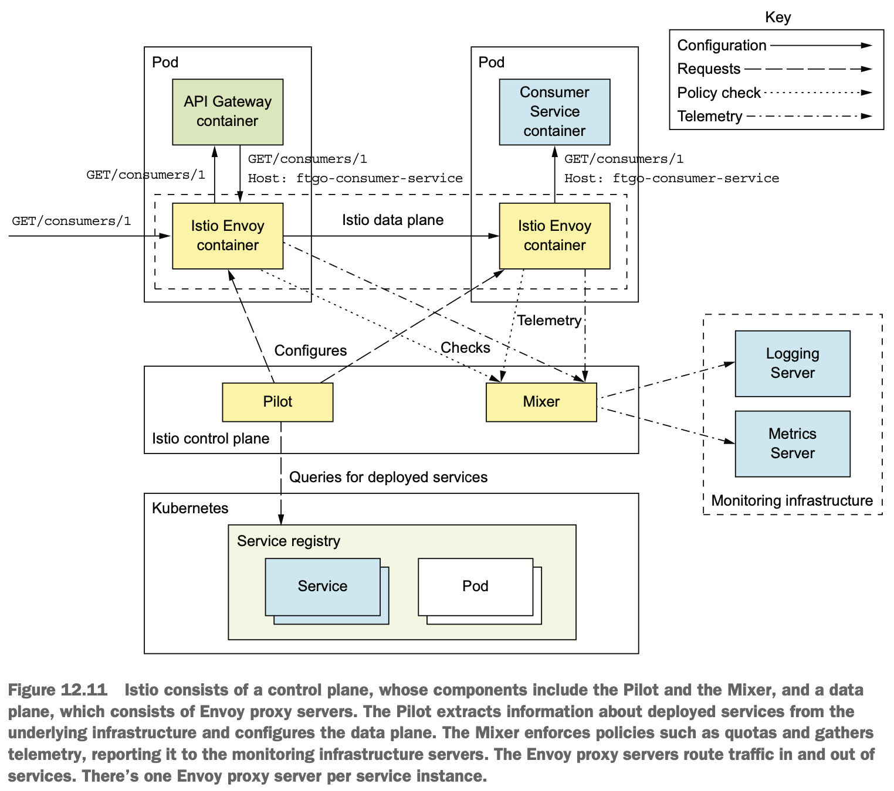

- 이스티오의 아키텍처는 컨트롤 플레인(control plane), 데이터 플레인(data plane)으로 구성
  - 컨트롤 플레인: 데이터 플레인이 트래픽을 라우팅하도록 구성하는 등의 관리 역할
    - 파일럿(pilot): 하부 인프라에서 배포된 서비스 관련 정보를 추출(예: 쿠버네티스라면 서비스와 정상 파드를 조회), 엔보이 프록시가 미리 정의된 라우팅 규칙에 따라 트래픽을 라우팅하도록 구성
    - 믹서(mixer): 엔보이 프록시에서 텔레메트리를 수집하고 정책을 집행
  - 데이터 플레인: 서비스 인스턴스별 엔보이 프록시(envoy proxy)로 구성
- 엔보이 프록시
  - 저수준 프로토콜(예: TCP)부터 고수준 프로토콜(예: HTTP/HTTPS)까지 다양한 프로토콜을 지원하는 고성능 프록시
  - 회로 차단기, 사용량 제한, 자동 재시도 등 서비스 간 통신을 확실하게 지원함
  - 사이드카로 서비스 인스턴스와 함께 실행되면서 횡단 관심사를 처리하는 프로세스 또는 컨테이너로 활용됨
  - 트래픽은 엔보이 프록시를 통해 흘러가며, 컨트롤 플레인에 명시된 규칙에 따라 트래픽이 라우팅됨(예: 직접 서비스 &rightarrow; 서비스 통신이 서비스가 됨 &rightarrow; 서비스 엔보이 &rightarrow; 목적지 엔보이 &rightarrow; 서비스)

> 패턴: 사이드카
> </br>횡단 관심사는 서비스 인스턴스와 함께 실행되는 사이드카 프로세스나 컨테이너에 구현한다.

#### 이스티오로 서비스를 배포

- 쿠버네티스 서비스 포트는 <프로토콜>[접미어] 포맷의 이스티오 명명 관례를 따라야 함, 익명 포트는 이스티오가 TCP 포트로 간주해서 규칙 기반의 라우팅을 적용하지 않음
- 분산 추적을 위해 파드에 app이라는 라벨을 붙여 서비스를 식별해야 함
- 여러 버전의 서비스를 동시에 실행하려면 쿠버네티스 디플로이먼트명에 버전을 넣어야 함, 디플로이먼트의 파드에는 version: v1처럼 버전 식별 라벨을 붙여야 이스티오가 해당 버전으로 라우팅함

```yaml
apiVersion: v1
kind: Service
metadata:
  name: ftgo-consumer-service
spec:
  ports:
  - name: http  # Named port
    port: 8080
    targetPort: 8080
  selector:
    app: ftgo-consumer-service
---
apiVersion: extensions/v1beta1
kind: Deployment
metadata:
  name: ftgo-consumer-service-v2  # Versioned deployment
  spec:
    replicas: 1
    template:
      metadata:
        labels:
          app: ftgo-consumer-service  # Recommended labels
          version: v2
      spec:
        containers:
        - image: image: ftgo-consumer-service:v2  # Image version
...
```

- 서비스 파드에 있는 엔보이 프록시 컨테이너 실행 방법(두 가지) - 이스티오가 파드 데피니션을 자동 수정해서 엔보이 프록시를 포함함
  - 수동으로 사이드카를 주입한 후 istioctl kube-inject 커맨드 실행
  ```shell
  istioctl kube-inject -f ftgo-consumer-service/src/deployment/kubernetes/ftgo-consumer-service.yml | kubectl apply -f -
  ```
  - 자동 사이드카 주입(automatic sidecar injection) 활용
    - 서비스를 kubectl apply로 배포할 수 있고, 쿠버네티스는 알아서 이스티오를 호출하여 엔보이 프록시를 포함하도록 파드 데피니션을 수정함
  ```shell
  $ kubectl describe po ftgo-consumer-service-7db65b6f97-q9jpr
  Name:           ftgo-consumer-service-7db65b6f97-q9jpr
  Namespace:      default
    ...
  Init Containers:
    istio-init: # Initializes the pod
      Image:      docker.io/istio/proxy_init:0.8.0
      ....
  Containers:
    ftgo-consumer-service:  # The service container
      Image:      msapatterns/ftgo-consumer-service:latest
      ...
    istio-proxy:
      Image:      docker.io/istio/proxyv2:0.8.0 # The Envoy container
  ...
  ```

#### v1 버전으로 보내는 라우팅 규칙 생성

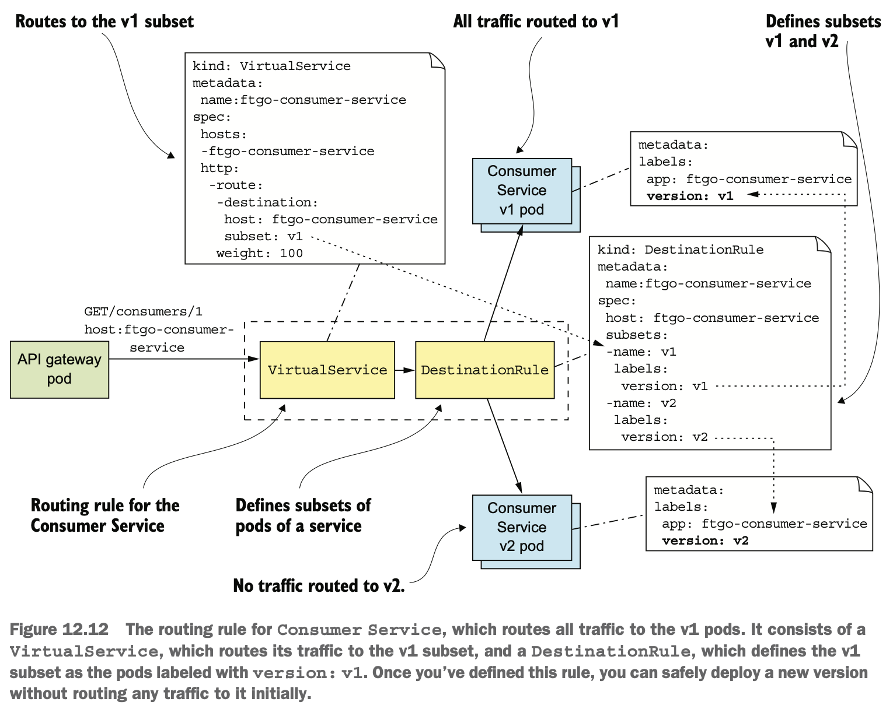

- 라우팅 규칙은 VirtualService, DestinationRule 두 이스티오 객체로 구성됨
  - VirtualService: 하나 이상의 호스트명에 대한 요청을 어떻게 라우팅할지 정의함
    - 서비스 파드의 v1 하위 집합에 대한 모든 요청을 라우팅
  ```yaml
  apiVersion: networking.istio.io/v1alpha3
  kind: VirtualService
  metadata:
    name: ftgo-consumer-service
  spec:
    hosts:
    - ftgo-consumer-service # Applies to the Consumer Service
    http:
      - route:
        - destination:
            host: ftgo-consumer-service # Routes to Consumer Service
            subset: v1  # The v1 subset
  ```
  - DestinationRule: 하나 이상의 서비스 파드에 대한 하위 집합을 정의, 부하 분산 알고리즘 등 트래픽 정책도 정의할 수 있음
    - v1, v2 두 파드 하위 집합이 정의됨, 이스티오는 version: v1 라벨이 붙은 파드에만 트래픽을 보냄
  ```yaml
  apiVersion: networking.istio.io/v1alpha3
  kind: DestinationRule
  metadata:
    name: ftgo-consumer-service
  spec:
    host: ftgo-consumer-service
    subsets:
    - name: v1  # The name of the subset
      labels:
        version: v1 # The pod selector for the subset
    - name: v2
      labels:
        version: v2
  ```

#### v2 소비자 서비스 배포

```yaml
apiVersion: extensions/v1beta1
kind: Deployment
metadata:
  name: ftgo-consumer-service-v2  # Version 2
spec:
  replicas: 1
  template:
    metadata:
      labels:
        app: ftgo-consumer-service
        version: v2 # Pod is labeled with the version
...
```

#### v2 트래픽 라우팅 테스트

- 테스트 사용자는 testuser라는 요청 헤더를 추가하기로 하고, 이 헤더를 붙인 요청은 v2 인스턴스로 향하도록 VirtualService 수정

```yaml
apiVersion: networking.istio.io/v1alpha3
kind: VirtualService
metadata:
  name: ftgo-consumer-service
spec:
  hosts:
  - ftgo-consumer-service
  http:
    - match:
      - headers:
          testuser:
            regex: "^.+$" # Matches a nonblank testuser header
      route:
      - destination:
          host: ftgo-consumer-service
          subset: v2  # Routes test users to v2
    - route:
      - destination:
          host: ftgo-consumer-service
          subset: v1  # Routes everyone else to v1
```

#### 운영 트래픽을 v2로 라우팅

- v1에 95%, v2에 5% 트래픽을 보내는 규칙

```yaml
apiVersion: networking.istio.io/v1alpha3
kind: VirtualService
metadata:
  name: ftgo-consumer-service
spec:
  hosts:
  - ftgo-consumer-service
  http:
    - route:
      - destination:
          host: ftgo-consumer-service
          subset: v1
        weight: 95
      - destination:
          host: ftgo-consumer-service
          subset: v2
        weight: 5
```

## 12.5 서비스 배포: 서버리스 패턴

### 12.5.1 AWS 람다를 이용한 서버리스 배포

> 패턴: 서버리스 배포
> </br>퍼블릭 클라우드에서 제공하는 서버리스 배포 메커니즘을 이용하여 서비스를 배포한다.

- 애플리케이션을 ZIP 또는 JAR 파일로 묶고 AWS 람다에 업로드
- 요청을 처리(하고 이벤트를 호출)할 함수명 지정
- AWS 람다는 들어온 요청을 처리하기에 충분한 개수만큼 마이크로서비스 인스턴스를 자동 실행
- 개발자와 개발 조직이 서버, 가상 머신, 컨테이너 관련 부분을 신경 쓸 필요가 없음

### 12.5.2 람다 함수 개발

- 자바 람다 함수는 AWS 람다의 자바 코어 라이브러리에 포함된 제네릭 인터페이스 RequestHandler를 구현한 클래스

```java
public interface RequestHandler<I, O> {
  public O handleRequest(I input, Context context);
}
```

- 입력 객체(input object)와 (요청 ID 등 람다 실행 환경에 접근할 수 있게 해주는) 컨텍스트(context)를 매개변수로 받고 출력 객체(output object)를 반환

### 12.5.3 람다 함수 호출

#### HTTP 요청 처리

- AWS API 게이트웨이가 HTTP 요청을 람다 함수로 라우팅

#### AWS 서비스에서 생성된 이벤트 처리

- S3 버킷에 객체가 생성됨
- DynamoDB 테이블의 데이터 항목이 생성, 수정 삭제됨
- 키네시스 스트림에서 메시지를 읽을 준비가 됨
- SES를 통해 이메일을 수신함

#### 람다 함수 스케줄링

- 리눅스 크론 같은 스케줄러로 람다 함수가 주기적으로 호출되도록 설정

#### 웹 서비스를 요청하여 람다 함수 호출

- 애플리케이션이 웹 서비스를 요청해서 람다 함수를 호출
- 람다 함수명과 입력 이벤트 데이터를 지정하고, 람다 함수를 동기/비동기 호출

### 12.5.4 람다 함수의 장점

- 다양한 AWS 서비스와의 연계: DynamoDB, 키네시스 등 풍부한 AWS 서비스의 이벤트를 소비할 수 있고, AWS API 게이트웨이를 통해 HTTP 요청을 처리하는 람다를 쉽게 작성할 수 있음
- 시스템 관리 업무가 많이 경감됨: OS, 런타임 패치는 신경 쓸 필요 없이 애플리케이션 개발에만 전념할 수 있음
- 탄력성: AWS 람다는 애플리케이션 부하 처리에 필요한 개수만큼 인스턴스를 실행함
- 사용량만큼 과금: 실제로 요청을 처리하기 위해 소비한 리소스만큼 비용을 지불

### 12.5.5 람다 함수의 단점

- 긴-꼬리 지연(long-tail latency): 코드를 동적 실행하므로 AWS가 애플리케이션 인스턴스를 프로비저닝하고 애플리케이션을 시동하기까지 시간이 걸림
- 제한된 이벤트/요청 기반 프로그래밍 모델: 처음부터 실행 시간이 긴 서비스(예: 서드파티 메시지 브로커에서 유입된 메시지를 소비하는 서비스)를 배포할 용도가 아님

## 12.6 REST 서비스 배포: AWS 람다 및 AWS 게이트웨이

### 12.6.1 음식점 서비스를 AWS 람다 버전으로 설계

- 표현 계층은 AWS 람다 함수가 HTTP 요청을 처리하기 위해 호출하는 요청 핸들러로 구성

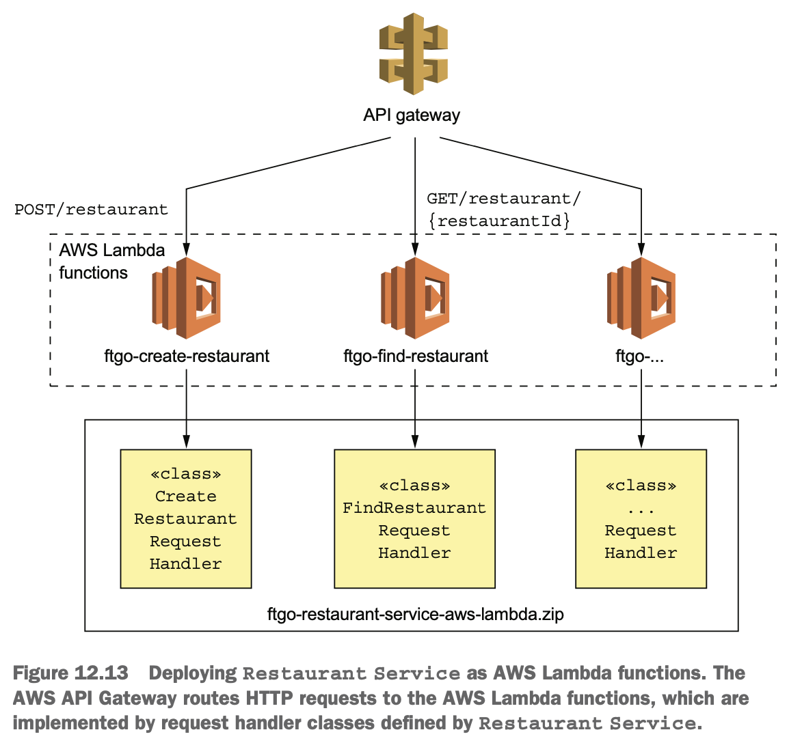

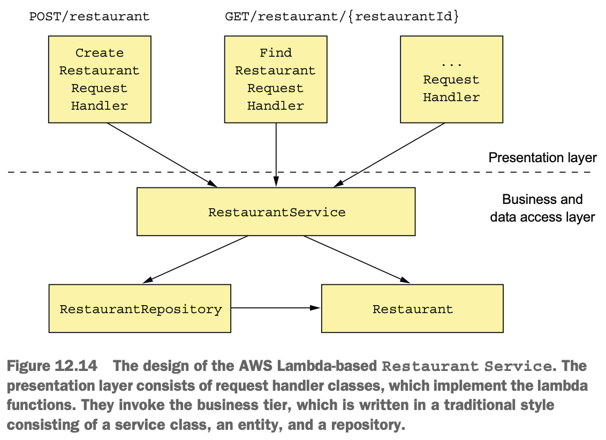

#### FindRestaurantRequestHandler 클래스

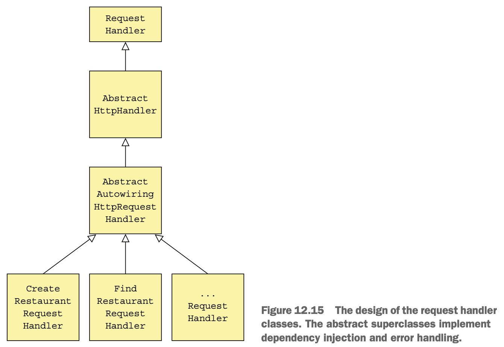

- AbstractHttpHandler: HTTP 요청 핸들러의 기초 추상 클래스, 요청 처리 도중 발생한 예외를 붙잡아 내부 서버 오류 응답(500) 반환
- AbstractAutowiringHttpRequestHandler: 요청 처리에 필요한 디펜던시 주입
- FindRestaurantRequestHandler: HTTP 요청을 나타낸 APIGatewayProxyRequestEvent를 매개변수로 받아 RestaurantService를 호출하여 음식점 정보 검색 후, HTTP 응답에 해당하는 APIGatewayProxyResponseEvent를 반환

```java
public class FindRestaurantRequestHandler
        extends AbstractAutowiringHttpRequestHandler {

  @Autowired
  private RestaurantService restaurantService;

  @Override
  protected Class<?> getApplicationContextClass() {
    return CreateRestaurantRequestHandler.class;  // The Spring Java configuration class to use for the application context
  }

  @Override
  protected APIGatewayProxyResponseEvent
  handleHttpRequest(APIGatewayProxyRequestEvent request, Context context) {
    long restaurantId;
    try {
      restaurantId = Long.parseLong(request.getPathParameters().get("restaurantId"));
    } catch (NumberFormatException e) {
      return makeBadRequestResponse(context); // Returns a 400 - bad request response if the restaurantId is missing or invalid
    }
    
    Optional<Restaurant> possibleRestaurant = restaurantService.findById(restaur
            antId);
    
    return possibleRestaurant.map(this::makeGetRestaurantResponse)  // Returns either the restaurant or a 404 - not found response
    orElseGet(() -> makeRestaurantNotFoundResponse(context, restaurantId));
  }

  private APIGatewayProxyResponseEvent makeBadRequestResponse(Context context) {
    ...
  }

  private APIGatewayProxyResponseEvent
  makeRestaurantNotFoundResponse(Context context, long restaurantId) { ... }

  private APIGatewayProxyResponseEvent
  makeGetRestaurantResponse(Restaurant restaurant) { ... }
}
```

#### AbstractAutowiringHttpRequestHandler 클래스로 디펜던시 주입

- 요청 핸들러에 필요한 디펜던시를 주입하는 클래스
- 이 클래스의 하위 클래스는 모두 getApplicationContextClass()를 구현해야 함

```java
public abstract class AbstractAutowiringHttpRequestHandler
        extends AbstractHttpHandler {

  private static ConfigurableApplicationContext ctx;
  private ReentrantReadWriteLock ctxLock = new ReentrantReadWriteLock();
  private boolean autowired = false;

  protected synchronized ApplicationContext getAppCtx() { // Creates the Spring Boot application context just once
    ctxLock.writeLock().lock();
    try {
      if (ctx == null) {
        ctx = SpringApplication.run(getApplicationContextClass());
      }
      return ctx;
    } finally {
      ctxLock.writeLock().unlock();
    }
  }

  @Override
  protected void
  beforeHandling(APIGatewayProxyRequestEvent request, Context context) {
    super.beforeHandling(request, context);
    if (!autowired) {
      getAppCtx().getAutowireCapableBeanFactory().autowireBean(this); // Injects dependencies into the request handler using autowiring before handling the first request
      autowired = true;
    }
  }

  protected abstract Class<?> getApplicationContextClass(); // Returns the @Configuration class used to create ApplicationContext
}
```

#### AbstractHttpHandler 클래스

- 요청 처리 시 발생한 예외를 붙잡아 에러 코드 500을 던짐

```java
public abstract class AbstractHttpHandler implements
        RequestHandler<APIGatewayProxyRequestEvent, APIGatewayProxyResponseEvent> {

  private Logger log = LoggerFactory.getLogger(this.getClass());

  @Override
  public APIGatewayProxyResponseEvent handleRequest(
          APIGatewayProxyRequestEvent input, Context context) {
    log.debug("Got request: {}", input);
    try {
      beforeHandling(input, context);
      return handleHttpRequest(input, context);
    } catch (Exception e) {
      log.error("Error handling request id: {}", context.getAwsRequestId(), e);
      return buildErrorResponse(new AwsLambdaError(
              "Internal Server Error",
              "500",
              context.getAwsRequestId(),
              "Error handling request: " + context.getAwsRequestId() + " "
                      + input.toString()));
    }
  }

  protected void beforeHandling(APIGatewayProxyRequestEvent request, Context context) {
    // do nothing
  }

  protected abstract APIGatewayProxyResponseEvent handleHttpRequest(APIGatewayProxyRequestEvent
          request, Context context);
}
```

### 12.6.2 ZIP 파일로 서비스 패키징

- 그래이들 태스크를 이용하여 ZIP 파일로 빌드

```groovy
task buildZip(type: Zip) {
  from compileJava
  from processResources
  into('lib') {
    from configurations.runtime
  }
}
```

### 12.6.3 서버리스 프레임워크로 람다 함수 배포

- 람다 함수와 REST 끝점이 기술된 serverless.yml 파일만 작성하면 서버리스가 대신 람다 함수를 배포하고 이 함수들로 요청을 라우팅하는 API 게이트웨이를 생성/구성함

```yaml
service: ftgo-application-lambda

provider:
  name: aws
  runtime: java8
  timeout: 35
  region: ${env:AWS_REGION}
  stage: dev
  environment:
    SPRING_DATASOURCE_DRIVER_CLASS_NAME: com.mysql.jdbc.Driver
    SPRING_DATASOURCE_URL: ...
    SPRING_DATASOURCE_USERNAME: ...
    SPRING_DATASOURCE_PASSWORD: ...
package:
  artifact: ftgo-restaurant-service-aws-lambda/build/distributions/
    ftgo-restaurant-service-aws-lambda.zip
functions:
  create-restaurant:
    handler: net.chrisrichardson.ftgo.restaurantservice.lambda
      .CreateRestaurantRequestHandler
    events:
      - http:
          path: restaurants
          method: post
  find-restaurant:
    handler: net.chrisrichardson.ftgo.restaurantservice.lambda
      .FindRestaurantRequestHandler
    events:
      - http:
          path: restaurants/{restaurantId}
          method: get
```

- YAML 파일을 읽어 람다 함수를 배포하고 AWS API 게이트웨이를 구성하는 서버리스 배포 커맨드를 실행

## 12.7 마치며

- 서비스 요건이 충족되는 가능한 한 가벼운 배포 패턴을 선택(서버리스 > 컨테이너 > 가상 머신 > 언어에 특정한 패키징)
- 서버리스 배포
  - 긴 꼬리 지연이 있고 요건상 이벤트/요청 기반의 프로그래밍 모델을 사용해야 하므로 모든 서비스에 맞지는 않음
  - OS, 런타임을 관리할 필요가 없고 탄력적인 자동화 프로비저닝, 요청 단위 과금 등 매력적인 요소가 있음
- 도커 컨테이너는 서버리스 배포보다 더 유연하며 지연 가측성(predictable latency)이 우수함
  - OS와 런타임, 도커 오케스트레이션 프레임워크와 그 하부 VM까지 직접 관리해야 하는 단점이 있음
- 가상 머신은 비교적 무거운 배포 수단이고 배포 자체가 느리고 컨테이너보다 리소스를 더 많이 사용함
- 서비스를 언어에 특정한 패키지로 배포하는 방법은 서비스가 아주 소수인 경우를 제외하면 삼가하는 것이 좋음
- 서비스 메시는 서비스를 드나드는 모든 네트워크 트래픽을 조율하는 네트워크 계층
  - 서비스를 프로덕션에 배포하고 테스트를 마친 후, 운영 트래픽을 서비스로 라우팅할 수 있음