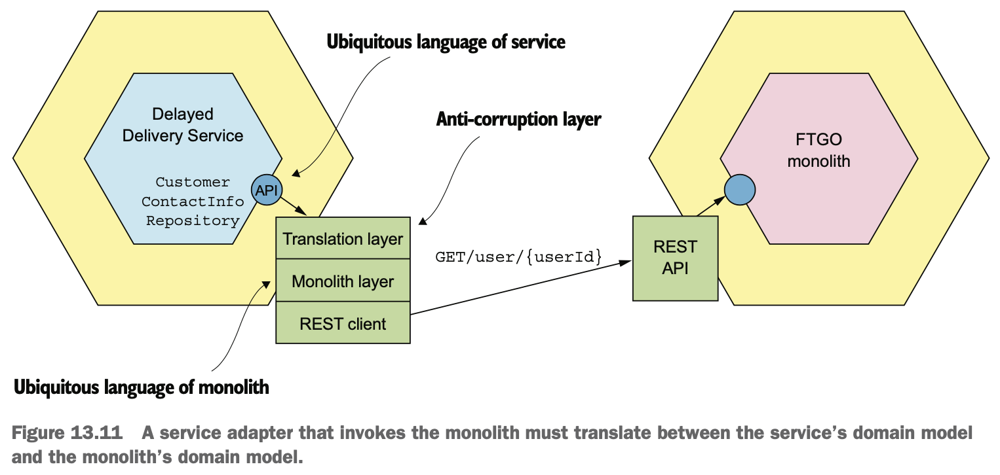

# 13장 마이크로서비스 리펙터링

## 이 장에서 다룰 핵심 내용

- 모놀리식 애플리케이션을 마이크로서비스 아키텍처로 전환하는 시점
- 모놀리식을 마이크로서비스로 단계적으로 리팩터링해야 하는 이유
- 새 기능을 서비스로 구현
- 모놀리스에서 서비스 추출
- 서비스와 모놀리스의 연계

## 13.1 마이크로서비스 리팩터링 개요

### 13.1.1 모놀리스를 왜 리팩터링하는가?

- 모놀리식에서의 비즈니스 문제
  - 느린 전달(slow delivery): 애플리케이션을 이해, 관리, 테스트하기가 어려워서 개발자 생산성이 떨어짐
  - 버그 투성이 소프트웨어 릴리스(buggy software release): 테스트성의 결여로 소프트웨어 릴리스가 버그가 많을 수 있음
  - 나쁜 확장성: 리소스 요건이 전혀 다른 모듈을 하나의 실행 가능한 컴포넌트로 조합하기 때문에 확장이 어려움

### 13.1.2 모놀리스 옥죄기

- 완전히 뜯어고치는 대신 모놀리식 애플리케이션을 단계적으로 리팩터링하는 것이 좋음
- 기존 애플리케이션과 함께 실행되면서 새로운 마이크로서비스 애플리케이션을 조금씩 빌드한 스트랭글러 애플리케이션을 개발


> 패턴: 스트랭글러 애플리케이션
> </br>레거시 애플리케이션에 새 (스트랭글러) 애플리케이션을 에둘러 단계적으로 개발하는 애플리케이션 현대화 패턴

#### 값을 조기에 자주 검증

- 모놀리스를 조금씩 리팩터링하면서 새로운 기술 스택과 고속의 최신 데브옵스 스타일로 신규 서비스를 각각 개발/전달
- 애플리케이션에서 가치가 큰 부분을 먼저 마이크로서비스로 이전

#### 모놀리스 변경 최소화

- 많은 변경은 시간이 많이 걸리고, 비싸고, 위험함
- 추출된 서비스에 있는 데이터를 모놀리스 DB에 도로 복제하거나, 모놀리스에 미치는 영향을 줄이기 위해 서비스 추출 순서를 조정

#### 기술 배포 인프라: 모든 것이 다 필요한 것은 아니다

- 마이크로서비스 아키텍처를 도입해서 실제로 경험해보기 전까지는 막대한 투자가 필요한 기술 인프라에 관한 의사 결정은 나중에 하는 것이 좋음

## 13.2 모놀리스 &rightarrow; 마이크로서비스 리팩터링 전략

### 13.2.1 새 기능을 서비스로 구현한다

#### 새 서비스를 모놀리스에 연계


- API 게이트웨이: 새 기능의 요청은 새 서비스로, 기존 요청은 모놀리스로 각각 라우팅
- 통합 글루 코드(integration glue code): 서비스가 모놀리스 데이터에 접근하고 모놀리스에 구현된 기능을 호출할 수 있게 서비스를 모놀리스에 통합
  - 모놀리스에 있는 어댑터 및 하나 이상의 IPC를 사용하는 서비스로 구성

#### 새 기능을 서비스로 구현하는 시점

- 새 기능을 서비스로 구현할 수 없다면, 일단 모놀리스에 새로운 기능을 구현하고 나중에 다른 관련 기능과 함께 해당 기능을 자체 서비스로 추출

### 13.2.2 표현 계층과 백엔드를 분리한다

- 엔터프라이즈 애플리케이션의 계층 구성
  - 표현 계층: HTTP 요청을 처리해서 웹 UI에 전달할 HTML 페이지를 생성하는 모듈로 구성
  - 비즈니스 로직: 복잡한 비즈니스 규칙이 구현된 모듈로 구성
  - 데이터 접근 로직: DB, 메시지 브로커 등 인프라 서비스에 접근하는 모듈
- 비즈니스 계층에는 비즈니스 로직을 캡슐화한, 하나 이상의 퍼사드로 구성된 대단위(coarse-grained) API를 더 작은 애플리케이션으로 쪼갤 수 있음
  - 표현 계층이 포함된 애플리케이션 A와 비즈니스/데이터 접근 로직이 포함된 애플리케이션 B로 나눔


### 13.2.3 기능을 여러 서비스로 추출한다

- 모놀리스가 가진 비즈니스 능력을 하나씩 서비스로 옮기는 분해 전략이 필요
- 모놀리스를 서비스로 추출해야 할 기능
  - API 끝점이 구현된 인바운드 어댑터
  - 도메인 로직
  - DB 접근 로직 등이 구현된 아웃바운드 어댑터
  - 모놀리스의 DB 스키마
- 모놀리스에서 코드를 추출해서 스탠드얼론 서비스로 이전
  - API 게이트웨이는 추출된 비즈니스 능력을 호출하는 요청은 해당 서비스로, 나머지 요청은 모놀리스로 각각 라우팅


#### 도메인 모델 분리

- 모놀리스 도메인 모델에서 서비스의 도메인 모델 추출
- 모놀리스의 클래스가 서비스로 이전한 클래스를 참조하거나, 그 반대의 경우처럼 서비스 경계를 넘나드는 객체 레퍼런스는 솎아내야 함


- 애그리거트는 객체 레퍼런스 대신 기본키로 서로를 참조하므로, 레퍼런스를 기본키 필드로 대체


#### DB 리팩터링

- 모놀리스에서 서비스를 추출할 때 모놀리스에 있던 DB 테이블도 서비스 DB로 옮겨야 함
- 엔터티를 나누려면 해당 DB 테이블도 분리해서 서비스로 이전해야 함

#### 변경 범위를 줄이기 위해 데이터를 복제

- 도메인 모델 변경 등으로 인해 전체 DB 클라이언트가 새 스키마를 사용하도록 바꾸는 일과 같이 값비싼 변경 작업을 나중으로 미루거나 우회
- 전이 기간 동안에는 원본 스키마를 유지하되, 원본 스키마와 신규 스키마를 동기화하는 트리거 사용


#### 어떤 서비스를 언제 추출하나

- 추출 시 가장 혜택이 큰 서비스에 집중
- 시간별로 구획된 아키텍처 정의(time-boxed architecture)부터 시작하는 것이 좋음
- 서비스 추출 순서를 정하는 전략
  - 모놀리스 개발을 사실상 동결하고 요건이 있을 때마다 서비스를 추출
  - 서비스 추출 시 기대되는 혜택을 애플리케이션 모듈별로 순위를 정함
    - 개발 가속화: 애플리케이션 개발 분량이 많을 것으로 예상되는 파트는 서비스로 전환하면 개발 속도가 빨라짐
    - 성능, 확장성, 신뢰성 문제 해결: 애플리케이션 성능, 확장성에 문제가 있거나 미덥지 못한 부분을 서비스로 전환
    - 다른 서비스로 추출할 수 있게 만듦: 한 서비스를 추출하면 모듈 간 디펜던시 때문에 다른 서비스의 추출이 단순해지는 경우도 있음

## 13.3 서비스와 모놀리스 간 협동 설계

- 서비스와 모놀리스 사이의 데이터 일관성 유지 필요
- 서비스와 모놀리스의 상호 작용은 통합 글루 코드가 관장


### 13.3.1 통합 글루 설계

- 특정 IPC를 이용하는 코드를 서비스 및 모놀리스 양쪽에 구성
  - 서비스가 모놀리스를 REST 호출할 경우: 서비스에는 REST 클라이언트, 모놀리스에는 웹 컨트롤러가 위치한 통합 글루 구성
  - 서비스가 발행한 도메인 이벤트를 모놀리스가 구독하는 구조: 서비스에 이벤트 발행 어댑터, 모놀리스에 이벤트 핸들러를 가진 통합 글루 구성

#### 통합 글루 API 설계

- 도메인 로직에 어떤 API를 제공할 지 결정
- 통합 글루가 어떤 IPC를 사용하는지 알 필요가 없으므로 인터페이스로 캡슐화

```java
interface CustomerContactInfoRepository {
  CustomerContactInfo findCustomerContactInfo(long customerId)
}
```

```java
interface DeliveryService {
  void scheduleDelivery(...);
  void rescheduleDelivery(...);
  void cancelDelivery(...);
}
```

#### 상호 작용 스타일과 IPC 선택

- 서비스와 모놀리스, 어느 한쪽이 다른 쪽을 조회/수정하기 위해 무엇이 필요한가에 따라 상호 작용 스타일과 IPC를 선택
- 조회 시 처리 방법
  - 리포지터리 인터페이스를 구현한 어댑터로 데이터 프로바이더의 API를 호출하는 방법
  - 데이터 컨슈머가 데이터 레플리카(즉, CQRS 뷰)를 유지하는 방법


- 수정 시 처리 방법
  - 데이터를 수정할 때에는 서비스와 모놀리스 모두 데이터 일관성을 유지해야 함
  - 이벤추에이트 트램 같은 프레임워크에 구현된 트랜잭셔널 메시징으로 통신하는 방법

#### 부패-방지 계층 구현

> 패턴: 부패-방지 계층
> </br>상이한 두 도메인 모델이 서로 상대편을 더럽히지 않도록 변환해 주는 소프트웨어 계층

- 성격 자체가 다른 도메인 모델이 소통하기 위해 ACL(Anti-Corruption Layer, 부패-방지 계층)을 구현해야 함
- ACL
  - 서로 다른 두 도메인 모델 간의 변환을 담당하는 코드 계층
  - 레거시 모놀리스의 도메인 모델이 서비스 도메인 모델을 더럽히지 못하게 함




#### 모놀리스가 도메인 이벤트를 발행/구독하는 방법

- 모놀리스가 도메인 이벤트를 발행하는 방법
  - 서비스가 사용하는 것과 동일한 이벤트 발행 장치를 적용하는 방법
    - 특정 엔터티를 변경하는 코드를 모두 찾아 이벤트 발행 API를 호출하는 코드를 추가
    - 대부분 위와 같이 변경이 어렵고 저장 프로시저 형태로 비즈니스 로직이 구현된 경우도 있음
  - DB 수준에서 도메인 이벤트를 발행하는 방법
    - 트랜잭션 로그 테일링이나 폴링 사용
    - 업데이트 사유를 식별하고 적절한 고수준의 비즈니스 이벤트를 발행하기 어려움
- 모놀리스가 도메인 이벤트를 구독하는 방법
  - 이벤추에이트 트램 같은 프레임워크로 이벤트 핸들러를 작성하는 방법
  - 메시지 브로커 클라이언트를 지원하지 않는 언어로 개발되었다면, 이벤트를 구독하는 작은 '헬퍼(helper)' 애플리케이션을 작성해서 모놀리스 DB를 업데이트

### 13.3.2 서비스와 모놀리스에 걸처 데이터 일관성 유지

> 사가 핵심 용어
> </br>사가(saga): 비동기 메시징을 통해 편성되는 일련의 로컬 트랜잭션
> </br>보상 트랜잭션(compensating transaction): 로컬 트랜잭션이 업데이트한 내용을 언두하는 트랜잭션
> </br>대책(countermeasure): 사가 간 비격리 문제를 해결하는 데 사용되는 대체 설계 기법
> </br>시맨틱 락(semantic lock): 사가에 의해 업데이트되는 레코드에 플래그를 세팅하는 대책
> </br>보상 가능 트랜잭션(compensatable transaction): 사가의 후속 트랜잭션 중 하나가 실패할 가능성이 있어서 보상 트랜잭션이 필요한 트랜잭션
> </br>피봇 트랜잭션(pivot transaction): 사가의 진행/중단 지점에 위치한 트랜잭션. 피봇 트랜잭션이 성공하는 사가는 완료될 때까지 실행됨
> </br>재시도 가능 트랜잭션(retriable transaction): 피봇 트랜잭션 다음에 나오는 트랜잭션으로 반드시 성공함

- 사가로 서비스와 모놀리스에 걸쳐 데이터 일관성을 유지하기 위해서는 많은 코드를 고쳐야 하고 시간도 많이 걸림

#### 보상 트랜잭션을 지원하도록 모놀리스를 고치기는 어렵다

- 모놀리스에 구현된 createOrder() 커맨드의 ACID 트랜잭션 실행 단계
  1. 주문 내역을 확인
  2. 주문 가능한 소비자인지 확인
  3. 소비자 신용카드를 승인
  4. 주문 생성
- 사가로 대체 시
  1. 모놀리스
     - 주문을 APPROVAL_PENDING 상태로 생성
     - 주문 가능한 소비자인지 확인
  2. 주방 서비스
     - 주문 내역을 확인
     - 티켓을 CREATE_PENDING 상태로 생성
  3. 모놀리스
     - 소비자 신용카드를 승인
     - 주문 상태를 APPROVED로 변경
  4. 주방 서비스
     - 티켓 상태를 AWAITING_ACCEPTANCE 상태로 변경
- 첫 번째 트랜잭션을 보상 가능 트랜잭션으로 만들어야 하기 때문에 구현이 어려움
  - 두 번째 로컬 트랜잭션이 실패할 경우 첫 번째 로컬 트랜잭션이 수행한 업데이트를 모놀리스가 언두해야 함
  - 따라서 엔터티에 상태를 추가해야 하며, 엔터티를 건드리는 코드를 모두 찾아 고쳐야 함

#### 사가 적용 시 모놀리스는 보상 트랜잭션을 지원할 필요가 없다

- 서비스를 추출할 때 각 트랜잭션이 피봇/재시도 가능 트랜잭션이라면 보상 트랜잭션이 실행될 일이 없으므로 모놀리스 변경 작업을 최소화할 수 있음
  1. 주문 서비스
     - 주문을 APPROVAL_PENDING 상태로 생성
  2. 모놀리스
     - 주문 가능한 소비자인지 확인
     - 주문 내역을 확인하고 티켓을 생성
     - 소비자 신용카드를 승인
  3. 주문 서비스
     - 주문 상태를 APPROVED로 변경
- 모놀리스 트랜잭션이 사가의 피봇 트랜잭션이고, 세 번째 트랜잭션은 실패할 일이 없으므로 두 번째 모놀리스 트랜잭션은 롤백시킬 필요가 없음

#### 서비스 추출 순서를 조정하면 보상 트랜잭션을 모놀리스에 구현하지 않아도 된다

- 서비스 추출 순서를 잘 조정하면 보상 트랜잭션 지원을 위해 모놀리스를 광범위하게 수정하지 않아도 됨
- 소비자 서비스 추출 시 사가
  1. 주문 서비스: 주문을 APPROVAL_PENDING 상태로 생성
  2. 소비자 서비스: 주문 가능한 소비자인지 확인
  3. 모놀리스
     - 주문 내역을 확인하고 티켓을 생성
     - 소비자 신용카드를 승인
  4. 주문 서비스: 주문 상태를 APPROVED로 변경
  - 모놀리스 트랜잭션이 피봇 트랜잭션, 주문 서비스에는 보상 트랜잭션을 구현
- 주방 서비스 추출 시 사가
  1. 주문 서비스: 주문을 APPROVAL_PENDING 상태로 생성
  2. 소비자 서비스: 주문 가능한 소비자인지 확인
  3. 주방 서비스: 주문 내역을 확인하고 티켓을 CREATE_PENDING 상태로 생성
  4. 모놀리스: 소비자 신용카드를 승인
  5. 주방 서비스: 티켓 상태를 APPROVED로 변경
  6. 주문 서비스: 주문 상태를 APPROVED로 변경
  - 모놀리스 트랜잭션이 피봇 트랜잭션, 주문 서비스, 주방 서비스에는 보상 트랜잭션을 구현
- 회계 서비스 추출 시 사가
  1. 주문 서비스: 주문을 APPROVAL_PENDING 상태로 생성
  2. 소비자 서비스: 주문 가능한 소비자인지 확인
  3. 주방 서비스: 주문 내역을 확인하고 티켓을 CREATE_PENDING 상태로 생성
  4. 회계 서비스: 소비자 신용카드를 승인
  5. 주방 서비스: 티켓 상태를 APPROVED로 변경
  6. 주문 서비스: 주문 상태를 APPROVED로 변경

### 13.3.3 인증/인가 처리

- 모놀리식 보안 메커니즘과 JWT 기반의 보안 메커니즘을 동시 지원해야 함


1. 클라이언트가 사용자 자격증명을 포함시켜 로그인 요청
2. API 게이트웨이는 로그인 요청을 FTGO 모놀리스에 보냄
3. 모놀리스는 JSESSIONID 세션 쿠키, USERINFO 쿠키가 포함된 응답을 반환, ID/역할 등의 사용자 정보는 USERINFO 쿠키에 있음
4. 클라이언트는 USERINFO 쿠키가 포함된 요청을 보내 서비스를 호출
5. API 게이트웨이는 USERINFO 쿠키를 검증 후 Authorization 요청 헤더에 넣어 서비스를 호출, 서비스는 USERINFO 쿠키 검증 후 사용자 정부 추출

#### 모놀리스의 LoginHandler는 USERINFO 쿠키를 세팅한다

- 마이크로서비스로 전환하려면 LoginHandler가 USERINFO 쿠키도 함께 세팅하도록 변경해야 함

#### API 게이트웨이는 USERINFO 쿠키를 Authorization 헤더에 매핑한다

- API 게이트웨이는 USERINFO 쿠키를 검증 후 이 쿠키를 Authorization 요청 헤더에 넣어 서비스에 전달
  - 쿠키를 Authorization 헤더에 매핑시켜 클라이언트 종류와 상관없이 표준 방식으로 확실하게 사용자 신원을 서비스에 전달함

## 13.4 새 기능을 서비스로 구현: 배달 실패한 주문 처리

1. 주문이 제시간에 배달되지 못하면 이 사실을 고객에게 알림
2. 음식점 영업 종료 전에 주문 픽업을 할 수 없어 배달 자체가 불가능한 경우, 이 사실을 고객에게 알림
3. 주문을 제시간에 배달할 수 없을 경우, 고객 서비스 센터에 연락해서 미리 고객에게 보상책을 제시하는 식으로 상황을 해결하도록 함
4. 배달 통계를 추적

### 13.4.1 배달 지연 서비스 설계


- getDelayedOrders() 요청을 통해 현재 지연 중이거나 배달 불가한 주문 목록을 조회
- DelayedOrderService
  - 타이머로 주기적으로 호출해서 제시간에 배달되지 못할 것으로 예상되는 주문 목록을 검색
  - DelayedOrderService는 제시간에 배달할 수 없는 주문 정보를 고객 및 고객 서비스 센터에 알림

### 13.4.2 배달 지연 서비스를 위한 통합 글루 설계


- 모놀리스는 Order, Restaurant 도메인 이벤트를 발행하고, 배달 지연 서비스는 이 이벤트를 수신하여 각 엔터티별 레플리카를 업데이트
- 주문을 제시간에 배달할 수 없을 경우, 고객 연락처를 조회하는 모놀리스의 REST 끝점을 호출해서 해당 고객에게 지연 사실을 알림

#### CustomerContactInfoRepository로 고객 연락처 조회

- 배달 지연 서비스에서 고객 연락처를 조회하는 인터페이스
- 모놀리스의 getCustomerContactInfo()를 호출하여 고객 정보를 조회하는 CustomerContactInfoProxy가 구현

#### 주문/음식점 도메인 이벤트의 발행과 소비

- 네트워크로 대량 데이터를 반복적으로 전송하는 것은 비효율적이기 때문에, 모놀리스가 발행한 이벤트를 구독해서 Order, Restaurant 레플리카를 유지
- 모놀리스가 Order, Restaurant 도메인 이벤트를 발행하도록 변경하는 방법
  - Order, Restaurant이 등장하는 코드를 모두 찾아 고수준 도메인 이벤트를 발행하도록 변경하는 방법
  - 트랜잭션 로그 테일링으로 변경된 내용을 이벤트로 복제하는 방법
- 배달 지연 서비스에서는 모놀리스에서 발행한 이벤트를 구독하면서 Order, Restaurant 엔터티를 수정하는 이벤트 핸들러를 구현
  - 이벤트 핸들러는 (모놀리스에 바인딩된 컨텍스트의) 이벤트를 (서비스에 바인딩된 컨텍스트의) 엔터티의 업데이트로 변환

## 13.5 모놀리스 분해: 배달 관리 추출

### 13.5.1 현행 배달 관리 기능


- 배달 관리 호출 시 사용하는 커맨드
  - acceptOrder(): 음식점이 주문을 접수하고 언제까지 준비하겠다고 밝힌 시점에 호출, 배달 관리를 호출해서 배달 스케줄을 잡음
  - cancelOrder(): 소비자가 주문을 취소할 때 호출됨, 필요한 경우 배달을 취소함
  - noteCourierLocationUpdated(): 배달원의 모바일 앱이 호출, 배달원의 위치를 업데이트하고 배달 스케줄을 재조정함
  - noteCourierAvailabilityChanged(): 배달원의 모바일 앱이 호출, 배달원의 가용성을 업데이트하고 배달 스케줄을 재조정함
- 배달 관리에 필요한 데이터를 조회하는 쿼리
  - getCourierPlan(): 배달원의 모바일 앱이 호출, 배달원의 계획을 반환함
  - getOrderStatus(): 배정된 배달원, 도착 예정 시각 등 배달 관련 정보 및 주문 상태를 반환함
  - getOrderHistory(): 여러 주문을 대상으로 한다는 점만 제외하고 getOrderStatus()와 같음

### 13.5.2 배달 서비스 개요


- 도메인 모델을 결정하기 위해 고려할 점
  - 어떤 동작과 데이터를 배달 서비스로 이전할까?
  - 배달 서비스는 어떤 API를 모놀리스에 표출하는가?
  - 모놀리스는 어떤 API를 배달 서비스에 표출하는가?

### 13.5.3 배달 서비스의 도메인 모델 설계

#### 배달 관리를 구성할 엔터티/필드 식별


- 배달 스케줄링 알고리즘은 주문한 음식점(Restaurant), 약속한 배달 시간(promisedDeliveryTime), 배달 주소(deliveryAddress), 배달원 위치(location), 가용성(availability), 현재 계획(plan) 등 다양한 속성을 읽어 배달원 계획(Plan), 예정 주문 픽업 시간(scheduledPickupTime), 예정 배달 시간(scheduledDeliveryTime)을 업데이트함

#### 배달 서비스로 이전할 데이터 결정

- 어떤 데이터를 서비스로 옮길지 결정할 때 고민할 것들
  - 서비스는 어떻게 모놀리스에 잔류한 데이터에 접근할 것인가?
  - 모놀리스는 어떻게 서비스로 이전된 데이터에 접근할 것인가?
  - 서비스와 모놀리스 간 데이터 일관성을 어떻게 유지할 것인가?
- 배달 서비스는 Order 테이블의 scheduledPicupTime, scheduledDeliveryTime을 업데이트하므로 두 필드는 배달 서비스로 이전

#### 배달 서비스 도메인 로직 설계

- DeliveryServiceImpl
  - 배달 관리 비즈니스 로직의 진입점
  - DeliveryServiceEventsHandler, DeliveryServiceNotificationsHandler에 의해 호출되는 DeliveryService, CourierService 인터페이스를 구현한 클래스


### 13.5.4 배달 서비스의 통합 글루 설계

#### 배달 서비스 API 설계

- 배달 서비스는 모놀리스가 배달 스케줄을 잡거나 변경/취소할 수 있는 API를 제공해야 함


#### 배달 서비스가 모놀리스 데이터에 접근하는 방법

- 배달 서비스가 데이터를 복제해 갈 수 있도록 모놀리스가 Courier 도메인 이벤트를 발행
- 배달 서비스는 CourierEventSubscriber가 도메인 이벤트를 구독하여 Courier 버전을 업데이트하고, 배달 재스케줄링을 트리거함

#### 모놀리스가 배달 서비스 데이터에 접근하는 방법

- 배달 서비스가 Courier, Delivery 도메인 이벤트를 발행
- 모놀리스는 이 도메인 이벤트를 소비해서 자신의 DB를 업데이트함

### 13.5.5 배달 서비스와 상호 작용할 수 있게 모놀리스를 변경

#### DeliveryService 인터페이스 정의

- 배달 스케줄을 잡고, 변경/취소하는 메서드가 있는 인터페이스로 캡슐화


#### DeliveryService 인터페이스를 호출하도록 모놀리스를 리팩터링

- 배달 관리를 호출하는 코드를 모놀리스에서 모두 찾아 DeliveryService 인터페이스를 사용하도록 변경


#### DeliveryService 인터페이스 구현

- DeliveryServiceImpl 클래스를 배달 서비스에 알림 메시지를 보내는 프록시로 교체
- 기존 구현 코드를 호출할지, 배달 서비스를 호출할지 결정하는 동적 피처 토글(feature toggle)을 사용한 클래스로 구현
  - 배달 서비스에 오류가 있을 경우 옛 구현 코드로 되돌리기 위함


> 피처 토글(또는 피처 플래그(feature flag))
> </br>코드 변경분을 사용자에게 릴리스하지 않고 배포하기 위해 사용
> </br>새 코드를 배포해서 애플리케이션의 동작을 동적으로 변경 가능

## 13.6 마치며

- 소프트웨어 전달 문제의 주원인이 무엇인지에 따라 마이크로서비스 아키텍처로 전환을 결정해야 함
  - 모놀리식 아키텍처의 비대화, 소프트웨어 개발 프로세스의 문제
- 스트랭글러 애플리케이션을 개발하여 마이크로서비스를 단계적으로 전환
- 마이크로서비스를 도입하는 가장 좋은 방법은 새 기능을 서비스로 구현하는 것
- 표현 계층을 백엔드와 분리해서 2개의 작은 모놀리스로 분해
- 모놀리스를 분해하는 주된 방법은 여러 서비스로 단계적으로 전환하는 것
- 새로 개발된 서비스와 모놀리스 간 통합 글루를 이용하여 협동
- 모놀리스 도메인 모델이 서비스 도메인 모델을 오염시키지 않게 하기 위해 부패 방지 계층을 통합 글루에 적용
- 서비스 추출 시 모놀리스에 미치는 영향을 최소화하기 위해 서비스로 이전된 데이터를 모놀리스 DB에 복제
- 모놀리스의 변경이 많은 보상 트랜잭션은 구현이 쉽지 않으므로, 서비스 추출 순서를 조정하여 되도록 모놀리스에 보상 트랜잭션을 구현하지 않도록 함
- 마이크로서비스 아키텍처로 전환 시 세션 기반의 보안 메커니즘과 토큰 기반의 보안 메커니즘을 동시 지원해야 함

## 궁금했던 점 정리

- 모놀리스 - 서비스 간 통합 글루 코드와 서비스 - 서비스 간 IPC의 다른 점
  - 모놀리스 - 서비스 간 IPC라는 점을 표현하기 위해 '통합 글루 코드'라는 단어가 사용되었을 뿐 서비스 - 서비스 간 IPC와 크게 다르지 않은 것 같음